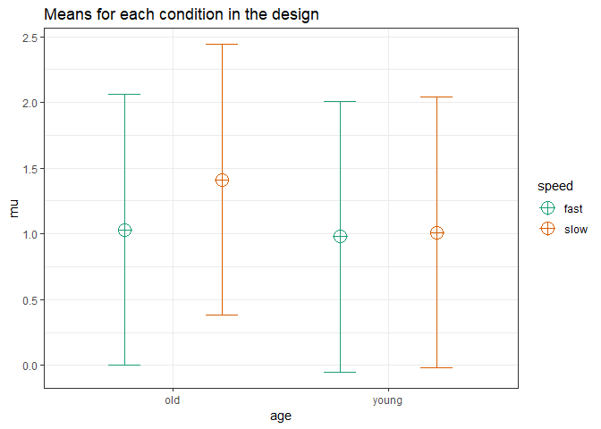

Overview
--------

THIS IS AN UNTESTED ALPHA VERSION - TAKE GREAT CARE IN USING THESE FUNCTIONS

This code allows you to simulate factorial ANOVA's and calculate the power of main effects, interactions, and follow up contrasts.

It is work in progress.

I've created some validation files that suggest the simulations work for [One-Way ANOVA designs](https://github.com/Lakens/ANOVA_power_simulation/blob/master/validation_files/validation_power_between.md) and one factor [within ANOVA designs](https://github.com/Lakens/ANOVA_power_simulation/blob/master/validation_files/validation_power_within.md). More validation work is needed.

Installation functions and packages
-----------------------------------

Run the code below to download the functions, and load the packages. Make sure to install these packages if needed.

``` r
# Install the two functions from GitHub by running the code below:
# You need to be connected to the internet.

source("https://raw.githubusercontent.com/Lakens/ANOVA_power_simulation/master/ANOVA_design.R")
source("https://raw.githubusercontent.com/Lakens/ANOVA_power_simulation/master/ANOVA_power.R")

###############
# Load libraries ----
###############

library(mvtnorm)
#Developmental version of afex is needed for now
devtools::install_github("singmann/afex@master") 
library(afex)
library(ggplot2)
library(RColorBrewer)
library(gridExtra)
library(reshape2)
```

As you can see in your R environment, you will now have two functions, ANOVA\_design and ANOVA\_power. *ANOVA\_design* can be used to specify the design of the study you want to simulate. *ANOVA\_power* then uses the result from the ANOVA\_design function to simulate studies and return the power (based on simulations) for the ANOVA (main effects and interactions) and the contrasts.

The ANOVA\_design function
--------------------------

Currently the ANOVA\_design function can create designs up three factors, for both within, between, and mixed designs. It requires the following input: string, n, mu, sd, r, and p\_adjust, and labelnames.

1.  string: string that specifies the design (see below).
2.  n: the sample size for each between subject condition.
3.  mu: a vector with the means for each condition.
4.  sd: the population standard deviation. Currenlty assumes homogeneity of variances (only one sd can be provided).
5.  r: the correlation for within designs (or 0 for between designs).
6.  p\_adjust: adjustment method for multiple comparisons. E.g., "none" or "holm".
7.  labelnames: This is a number of words that indicate factor names and level names (see below).

### specifying the design using string

"string" is used to specify the design. Add numbers for each factor that specify the number of levels in the factors (e.g., 2 for a factor with 2 levels). Add a "w"" after the number for within factors, and a "b"" for between factors. Seperate factors with a \* (asteriks). Thus "2b\*3w" is a design with two factors (a 2b factor and a 3w factor), the first of which has 2 between levels (2b), and the second of which has 3 within levels (3w). An example of such a design is a group of people in one condition who get a drug, and a group of people in another condition who get a placebo, and we measure their health before they take the pill, one day after they take the pill, and a week after they take the pill.

### specifying the means using mu

Note that for each cell in the design, a mean must be provided. Thus, for a "2b\*3w" design, 6 means need to be entered.

Means need to be entered in the correct order. ANOVA\_design outputs a plot so you can check if you entered all means as you intended. Always carefully check if the plot that is generated matches your expectations.

The general principle is that the code generates factors, indicated by the factor names you entered in the labelnames variable, (i.e., *condition* and *time*). Levels are indicated by factor names and levels (e.g., control\_time1, control\_time2, control\_time3, etc).

If your design ha just one factor, just enter the means in the same order as the labelnames (see below). For more factors, note the general pattern in the example below. Means are entered in the following order for a 3 factors design (each with 2 levels):

1.  a1 b1 c1
2.  a1 b1 c2
3.  a1 b2 c1
4.  a1 b2 c2
5.  a2 b1 c1
6.  a2 b1 c2
7.  a2 b2 c1
8.  a2 b2 c2

So if you enter the means 1, 2, 3, 4, 5, 6, 7, 8 the first 4 means correspond to level 1 of factor 1, the second 4 means correspond to level 2 of factor 1. Within the first 4 means, the first 2 correspond to level 1 of factor 2, and within those 2 means, the first corresponds to level 1 of factor 3.

The plot below visualizes means from 1 to 8 being entered in a vector: mu = c(1, 2, 3, 4, 5, 6, 7, 8) so you can see how the basic ordering works.


    ## $df
    ##    subject cond           y    factor1    factor2    factor3
    ## 1        1   V1  2.09979269 factor1_a1 factor2_b1 factor3_c1
    ## 2        2   V1  0.29666197 factor1_a1 factor2_b1 factor3_c1
    ## 3        3   V1  0.09508885 factor1_a1 factor2_b1 factor3_c1
    ## 4        4   V1  1.16709672 factor1_a1 factor2_b1 factor3_c1
    ## 5        5   V1  3.40231907 factor1_a1 factor2_b1 factor3_c1
    ## 6        6   V1  1.49029434 factor1_a1 factor2_b1 factor3_c1
    ## 7        7   V1  0.79319521 factor1_a1 factor2_b1 factor3_c1
    ## 8        8   V1  0.81582446 factor1_a1 factor2_b1 factor3_c1
    ## 9        9   V1  2.03006011 factor1_a1 factor2_b1 factor3_c1
    ## 10      10   V1  0.08240333 factor1_a1 factor2_b1 factor3_c1
    ## 11      11   V2  2.85137590 factor1_a1 factor2_b1 factor3_c2
    ## 12      12   V2  1.18032672 factor1_a1 factor2_b1 factor3_c2
    ## 13      13   V2  1.02309001 factor1_a1 factor2_b1 factor3_c2
    ## 14      14   V2  1.85015356 factor1_a1 factor2_b1 factor3_c2
    ## 15      15   V2  4.69480957 factor1_a1 factor2_b1 factor3_c2
    ## 16      16   V2  2.74279298 factor1_a1 factor2_b1 factor3_c2
    ## 17      17   V2  1.58735032 factor1_a1 factor2_b1 factor3_c2
    ## 18      18   V2  2.17836472 factor1_a1 factor2_b1 factor3_c2
    ## 19      19   V2  2.97303804 factor1_a1 factor2_b1 factor3_c2
    ## 20      20   V2  1.16688091 factor1_a1 factor2_b1 factor3_c2
    ## 21       1   V3  3.70868119 factor1_a1 factor2_b2 factor3_c1
    ## 22       2   V3  2.08086200 factor1_a1 factor2_b2 factor3_c1
    ## 23       3   V3  2.35086443 factor1_a1 factor2_b2 factor3_c1
    ## 24       4   V3  2.94617592 factor1_a1 factor2_b2 factor3_c1
    ## 25       5   V3  5.38598157 factor1_a1 factor2_b2 factor3_c1
    ## 26       6   V3  2.72523798 factor1_a1 factor2_b2 factor3_c1
    ## 27       7   V3  2.84979253 factor1_a1 factor2_b2 factor3_c1
    ## 28       8   V3  3.58188953 factor1_a1 factor2_b2 factor3_c1
    ## 29       9   V3  4.09231354 factor1_a1 factor2_b2 factor3_c1
    ## 30      10   V3  2.66031827 factor1_a1 factor2_b2 factor3_c1
    ## 31      11   V4  5.17538591 factor1_a1 factor2_b2 factor3_c2
    ## 32      12   V4  3.29179733 factor1_a1 factor2_b2 factor3_c2
    ## 33      13   V4  2.98655691 factor1_a1 factor2_b2 factor3_c2
    ## 34      14   V4  4.09490712 factor1_a1 factor2_b2 factor3_c2
    ## 35      15   V4  6.57327252 factor1_a1 factor2_b2 factor3_c2
    ## 36      16   V4  4.53307225 factor1_a1 factor2_b2 factor3_c2
    ## 37      17   V4  3.48477151 factor1_a1 factor2_b2 factor3_c2
    ## 38      18   V4  4.62406736 factor1_a1 factor2_b2 factor3_c2
    ## 39      19   V4  4.97543361 factor1_a1 factor2_b2 factor3_c2
    ## 40      20   V4  3.70387730 factor1_a1 factor2_b2 factor3_c2
    ## 41      21   V5  6.40444389 factor1_a2 factor2_b1 factor3_c1
    ## 42      22   V5  4.13012985 factor1_a2 factor2_b1 factor3_c1
    ## 43      23   V5  4.53241839 factor1_a2 factor2_b1 factor3_c1
    ## 44      24   V5  5.83390248 factor1_a2 factor2_b1 factor3_c1
    ## 45      25   V5  7.33682922 factor1_a2 factor2_b1 factor3_c1
    ## 46      26   V5  5.28866931 factor1_a2 factor2_b1 factor3_c1
    ## 47      27   V5  4.20327171 factor1_a2 factor2_b1 factor3_c1
    ## 48      28   V5  5.13722280 factor1_a2 factor2_b1 factor3_c1
    ## 49      29   V5  5.83835545 factor1_a2 factor2_b1 factor3_c1
    ## 50      30   V5  4.22656713 factor1_a2 factor2_b1 factor3_c1
    ## 51      31   V6  7.25310630 factor1_a2 factor2_b1 factor3_c2
    ## 52      32   V6  4.70358531 factor1_a2 factor2_b1 factor3_c2
    ## 53      33   V6  4.92643605 factor1_a2 factor2_b1 factor3_c2
    ## 54      34   V6  6.07795326 factor1_a2 factor2_b1 factor3_c2
    ## 55      35   V6  8.58224721 factor1_a2 factor2_b1 factor3_c2
    ## 56      36   V6  6.25572645 factor1_a2 factor2_b1 factor3_c2
    ## 57      37   V6  5.81046496 factor1_a2 factor2_b1 factor3_c2
    ## 58      38   V6  5.86547934 factor1_a2 factor2_b1 factor3_c2
    ## 59      39   V6  7.53094465 factor1_a2 factor2_b1 factor3_c2
    ## 60      40   V6  5.48320017 factor1_a2 factor2_b1 factor3_c2
    ## 61      21   V7  7.94229558 factor1_a2 factor2_b2 factor3_c1
    ## 62      22   V7  6.02442914 factor1_a2 factor2_b2 factor3_c1
    ## 63      23   V7  6.17362190 factor1_a2 factor2_b2 factor3_c1
    ## 64      24   V7  7.21500010 factor1_a2 factor2_b2 factor3_c1
    ## 65      25   V7  9.52972836 factor1_a2 factor2_b2 factor3_c1
    ## 66      26   V7  7.17327435 factor1_a2 factor2_b2 factor3_c1
    ## 67      27   V7  6.30728341 factor1_a2 factor2_b2 factor3_c1
    ## 68      28   V7  6.92211491 factor1_a2 factor2_b2 factor3_c1
    ## 69      29   V7  8.05372558 factor1_a2 factor2_b2 factor3_c1
    ## 70      30   V7  6.14974945 factor1_a2 factor2_b2 factor3_c1
    ## 71      31   V8  8.90430357 factor1_a2 factor2_b2 factor3_c2
    ## 72      32   V8  6.90399144 factor1_a2 factor2_b2 factor3_c2
    ## 73      33   V8  7.14917767 factor1_a2 factor2_b2 factor3_c2
    ## 74      34   V8  8.39632528 factor1_a2 factor2_b2 factor3_c2
    ## 75      35   V8 10.64466915 factor1_a2 factor2_b2 factor3_c2
    ## 76      36   V8  7.72016935 factor1_a2 factor2_b2 factor3_c2
    ## 77      37   V8  7.26969303 factor1_a2 factor2_b2 factor3_c2
    ## 78      38   V8  7.93340280 factor1_a2 factor2_b2 factor3_c2
    ## 79      39   V8  8.77979210 factor1_a2 factor2_b2 factor3_c2
    ## 80      40   V8  7.39393674 factor1_a2 factor2_b2 factor3_c2
    ## 
    ## $design
    ## [1] 0 1 0
    ## 
    ## $design_list
    ## [1] "factor1_a1_factor2_b1_factor3_c1" "factor1_a1_factor2_b1_factor3_c2"
    ## [3] "factor1_a1_factor2_b2_factor3_c1" "factor1_a1_factor2_b2_factor3_c2"
    ## [5] "factor1_a2_factor2_b1_factor3_c1" "factor1_a2_factor2_b1_factor3_c2"
    ## [7] "factor1_a2_factor2_b2_factor3_c1" "factor1_a2_factor2_b2_factor3_c2"
    ## 
    ## $factors
    ## [1] 3
    ## 
    ## $frml1
    ## y ~ factor1 * factor2 * factor3 + Error(subject/factor2)
    ## <environment: 0x000000000c6076c8>
    ## 
    ## $frml2
    ## ~factor1 + factor2 + factor3
    ## <environment: 0x000000000c6076c8>
    ## 
    ## $mu
    ## [1] 1 2 3 4 5 6 7 8
    ## 
    ## $sd
    ## [1] 1
    ## 
    ## $r
    ## [1] 0.9
    ## 
    ## $n
    ## [1] 10
    ## 
    ## $p_adjust
    ## [1] "none"
    ## 
    ## $sigmatrix
    ##    X1  X2  X3  X4  X5  X6  X7  X8
    ## 1 1.0 0.0 0.9 0.0 0.0 0.0 0.0 0.0
    ## 2 0.0 1.0 0.0 0.9 0.0 0.0 0.0 0.0
    ## 3 0.9 0.0 1.0 0.0 0.0 0.0 0.0 0.0
    ## 4 0.0 0.9 0.0 1.0 0.0 0.0 0.0 0.0
    ## 5 0.0 0.0 0.0 0.0 1.0 0.0 0.9 0.0
    ## 6 0.0 0.0 0.0 0.0 0.0 1.0 0.0 0.9
    ## 7 0.0 0.0 0.0 0.0 0.9 0.0 1.0 0.0
    ## 8 0.0 0.0 0.0 0.0 0.0 0.9 0.0 1.0
    ## 
    ## $string
    ## [1] "2b*2w*2b"
    ## 
    ## $labelnames
    ## [1] "factor1" "a1"      "a2"      "factor2" "b1"      "b2"      "factor3"
    ## [8] "c1"      "c2"     
    ## 
    ## $factornames
    ## [1] "factor1" "factor2" "factor3"
    ## 
    ## $meansplot


### specifying label names

To make sure the plots and tables with simulation results are easy to interpret, it really helps to name all factors and levels. You can enter the labels in the 'labelnames' variable.

For the 2x3 design we have been using as an example, where there are 2 factors (condition and time of measurement), the first with 2 levels (placebo vs. medicine) and the second with three levels (time1, time2, and time3) we would enter the labels as follows:

c("condition", "placebo", "medicine", "time", "time1", "time2", "time3")

As you can see, you follow the order of the design (2b\*3w), and first write the FACTOR label (condition) followed by the levels of that factor (placebo and medicine). Then you write the second factor name (time) followed by the three labels for each level (time1, time2, time3). Do not use spaces in the names (so not "time 1" but "time1" or "time\_1").

The covariance matrix
=====================

Depending on whether factors are manipulated within or between, variables are correlated, or not. The covariance matrix is:

``` r
design_result$sigmatrix
```

    ##    X1  X2  X3  X4  X5  X6  X7  X8
    ## 1 1.0 0.0 0.9 0.0 0.0 0.0 0.0 0.0
    ## 2 0.0 1.0 0.0 0.9 0.0 0.0 0.0 0.0
    ## 3 0.9 0.0 1.0 0.0 0.0 0.0 0.0 0.0
    ## 4 0.0 0.9 0.0 1.0 0.0 0.0 0.0 0.0
    ## 5 0.0 0.0 0.0 0.0 1.0 0.0 0.9 0.0
    ## 6 0.0 0.0 0.0 0.0 0.0 1.0 0.0 0.9
    ## 7 0.0 0.0 0.0 0.0 0.9 0.0 1.0 0.0
    ## 8 0.0 0.0 0.0 0.0 0.0 0.9 0.0 1.0

The ANOVA\_power function
-------------------------

The ANOVA\_power function takes the result from the ANOVA\_design function, and simulates data nsims times using a specified alpha level. As output, it provides a table for the ANOVA results, and the results for all simple contrasts.

Simulations typically take some time. Larger numbers of simulations yield more accurate results, but also take a long time. I recommend testing the set up with 10 simulations, and run 1000 if the set-up is correct (or 10000 if you are getting a coffee).

An Example
----------

In the example below, 1000 simulations for a 2\*2 mixed design (first factor between, second factor within) is performed. The sample size is 80 in each between subject condition (so 160 participants in total), the sd is 1.03, the correlation for the within factors is 0.87, and the means are 1.03, 1.21, 0.98, 1.01. No correction for multiple comparisons is made.

The alpha level used as a significance threshold can be specified, and is set to 0.05 for this simulation.

``` r
design_result <- ANOVA_design(string = "2b*2w",
                   n = 80, 
                   mu = c(1.03, 1.41, 0.98, 1.01), 
                   sd = 1.03, 
                   r=0.87, 
                   p_adjust = "none",
                   labelnames = c("age", "old", "young", "speed", "fast", "slow"))
```



``` r
set.seed(1) #set seed to get reproducible results
simulation_result <- ANOVA_power(design_result, alpha = 0.05, nsims = 1000)
```

    ## Warning: package 'emmeans' was built under R version 3.5.1

    ## NOTE: As of emmeans versions > 1.2.3,
    ##       The 'cld' function will be deprecated in favor of 'CLD'.
    ##       You may use 'cld' only if you have package:multcomp attached.

    ## Power and Effect sizes for ANOVA tests
    ##                 power effect size
    ## anova_age        27.8      0.0131
    ## anova_speed      99.9      0.1361
    ## anova_age:speed  98.9      0.1035
    ## 
    ## Power and Effect sizes for contrasts
    ##                                             power effect size
    ## p_age_old_speed_fast_age_old_speed_slow     100.0      0.7387
    ## p_age_old_speed_fast_age_young_speed_fast     5.2     -0.0450
    ## p_age_old_speed_fast_age_young_speed_slow     5.2     -0.0150
    ## p_age_old_speed_slow_age_young_speed_fast    74.2     -0.4198
    ## p_age_old_speed_slow_age_young_speed_slow    68.7     -0.3900
    ## p_age_young_speed_fast_age_young_speed_slow   8.3      0.0593

The result for the power simulation has two sections. The first table provides power (from 0 to 100%) and effect sizes (partial eta-squared) for the ANOVA result. We see the results for the main effects of factor a, b and the interaction between a and b.

The result for the power simulation reveal power is very high for the main effect of b - remember that this is the within-subjects factor, and the means are highly correlated (0.87) - so we have high power for within comparisons. Power is lower for the interaction.

An ANOVA is typically followed up with contrasts. A statistical hypothesis often predicts not just an interaction, but also the shape of an interaction. For example, when looking at the plot of our design above, we might be specifically interested in comparing the mean in condition a1,b2 against a1,b1 and a2,b2 in simple contrasts.

The second table provides the power for all contrasts, and the effect sizes. Effect sizes are provided in Cohen's d for between-subject contrasts, and in Cohen's dz for within-subject contrasts (see Lakens, 2013). These are the effect sizes used in a-priori power analysis. Note that Cohen's d is slightly upwardly biased when calculated from observed data (as in these simulations).

Power is relatively high for the contrast comparing a1,b2-a1,b1 - remember this is the within-subject contrast where means differ, and the correlation between dependent observations is large (r = 0.87). Power for the contrast a1,b2-a2,b2 is much lower, because this is a between subjects comparison.

Power is very low for the minor differences among the three similar means (1.03, 0.98, 1.01) as can be seen from second, third, and seventh lines in the contrast output.

Note the difference in the effect size estimates. For the contrast age\_old\_speed\_fast - age\_old\_speed\_slow Cohen's dz is much larger (due to the strong positive correlation) than Cohen's d reported for the contrast age\_old\_speed\_fast - age\_young\_speed\_slow, even though the raw mean differences are almost identical. This is because Cohen's dz takes the correlation into account.

In addition to the two tables, the ANOVA\_power function returns the raw simulation data (all p-values and effect sizes for each simulation, use simulation\_result$sim\_data) and a plot showing the p-value distributions for all tests in the ANOVA.

``` r
simulation_result$plot1
```


