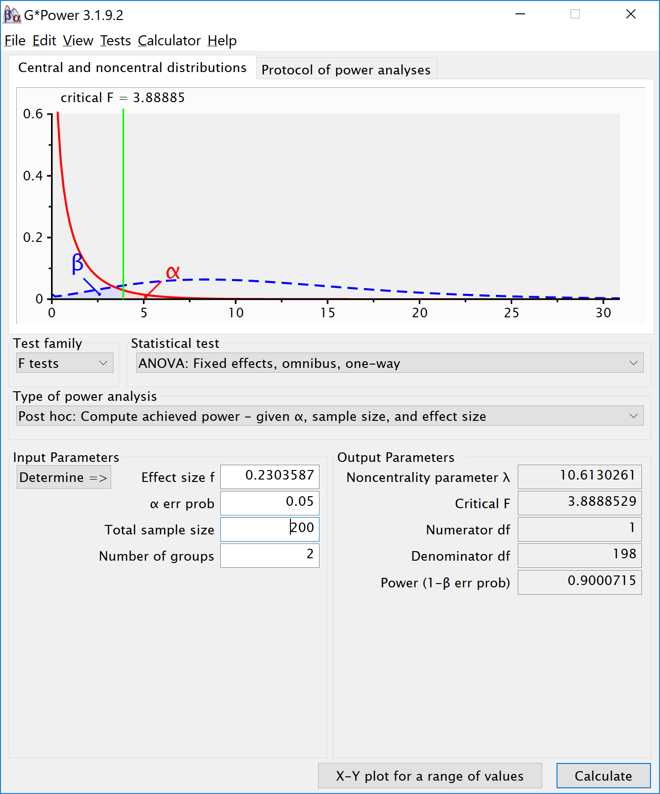

```{r setup, include=TRUE}
knitr::opts_chunk$set(echo = TRUE)
nsims <- 100 #set number of simulations
library(mvtnorm)
library(afex)
library(emmeans)
library(ggplot2)
library(gridExtra)
library(reshape2)
library(pwr)

# Install functions from GitHub by running the code below:
source("https://raw.githubusercontent.com/Lakens/ANOVA_power_simulation/master/ANOVA_design.R")
source("https://raw.githubusercontent.com/Lakens/ANOVA_power_simulation/master/ANOVA_power.R")
source("https://raw.githubusercontent.com/Lakens/ANOVA_power_simulation/master/mu_from_ES.R")

```

## Validation of Power in One-Way ANOVA

Using the formula also used in Albers & Lakens (2018), we can determine the means that should yield a specified effect sizes (expressed in Cohen's f). Eta-squared (identical to partial eta-squared for One-Way ANOVA's) has benchmarks of .0099, .0588, and .1379 for small, medium, and large effect sizes (Cohen, 1988). Athough these benchmarks are quite random, and researchers should only use such benchmarks for power analyses as a last resort, we will demonstrate a-priori power analysis for these values. 

## Two conditions

Imagine we aim to design a study to test the hypothesis that giving people a pet to take care of will increase their life satisfation. We have a control condition, and a condition where people get a pet, and randomly assign participants to either condition. We can simulate a One-Way ANOVA with a specified alpha, sample size, and effect size, on see the statistical power we would have for the ANOVA and the follow-up comparisons. We expect pets to increase life-satisfaction compared to the control condition. Based on work by Pavot and Diener (1993) we believe that we can expect responses on the life-satifaction scale to have a mean of approximately 24 in our population, with a standard deviation of 6.4. We expect having a pet increases life satisfaction with approximately 2.2 scale points for participants who get a pet. 200 participants in total, with 100 participants in each condition. But before we proceed with the data collection, we examine the statistical power our design would have to detect the differences we predict.

```{r}

string <- "2b"
n <- 100
# We are thinking of running 50 peope in each condition
mu <- c(24, 26.2)
# Enter means in the order that matches the labels below.
# In this case, control, cat, dog. 
sd <- 6.4
r <- 0 
# (note that since we simulate a between design, the correlation between variables 
# will be 0, regardless of what you enter here, but the value must be set).
p_adjust = "none"
# "none" means we do not correct for multiple comparisons
labelnames <- c("condition", "control", "pet") #
# the label names should be in the order of the means specified above.

design_result <- ANOVA_design(string = string,
                   n = n, 
                   mu = mu, 
                   sd = sd, 
                   r = r, 
                   p_adjust = p_adjust,
                   labelnames = labelnames)

alpha_level <- 0.05
# You should think carefully about how to justify your alpha level.
# We will give some examples later, but for now, use 0.05.

ANOVA_power(design_result, alpha_level = alpha_level, nsims = nsims)

```

The result shows that we have exactly the same power for the ANOVA, as we have for the *t*-test. This is because when there are only two groups, these tests are mathematically identical. In a study with 100 participants, we would have quite low power (around 67.7%). An ANOVA with 2 groups is identical to a *t*-test. For our example, Cohen's d (the standardized mean difference) is 2.2/6.4, or d = 0.34375 for the difference between the control condition and pets, which we can use to easily compute the expected power for these simple comparisons using the pwr package.

```{r}
pwr.t.test(d = 2.2/6.4,
           n = 100,
           sig.level = 0.05,
           type="two.sample",
           alternative="two.sided")$power

```

We can also directly compute Cohen's f from Cohen's d for two groups, as Cohen (1988) describes, because f = 1/2d. So f = 0.5*0.34375 = 0.171875. And indeed, power analysis using the pwr package yields the same result using the pwr.anova.test as the power.t.test.

```{r}
K <- 2
n <- 100
f <- 0.171875

pwr.anova.test(n = n,
               k = K,
               f = f,
               sig.level = alpha_level)$power
```

This analysis tells us that running the study with 100 participants in each condition is too likely to *not* yield a significant test result, even if our expected pattern of differences is true.  This is not optimal. 

Let's mathematically explore which pattern of means we would need to expect to habe 90% power for the ANOVA with 50 participants in each group. We can use the pwr package in R to compute a sensitivity analysis that tells us the effect size, in Cohen's f, that we are able to detect with 3 groups and 50 partiicpants in each group, in order to achive 90% power with an alpha level of 5%. 

```{r}
K <- 2
n <- 100
sd <- 6.4
r <- 0

#Calculate f when running simulation
f <- pwr.anova.test(n = n,
                    k = K,
                    power = 0.9,
                    sig.level = alpha_level)$f
f
```
This sensitivity analysis shows we have 90% power in our planned design to detect effects of Cohen's f of 0.2303587. Benchmarks by Cohen (1988) for small, medium, and large Cohen's f values are 0.1, 0.25, and 0.4, which correspond to eta-squared values of small (.0099), medium (.0588), and large (.1379), in line with d = .2, .5, or .8. So, at least based on these benchmarks, we have 90% power to detect effects that are slightly below a medium effect benchmark.

```{r}
f2 <- f^2
ES <- f2/(f2+1)
ES
```
Expressed in eta-squared, we can detect values of eta-squared = 0.05 or larger. 

```{r}
mu <- mu_from_ES(K = K, ES = ES)
mu <- mu * sd
mu
```
We can compute a pattern of means, given a standard deviation of 6.4, that would give us an effect size of f = 0.23, or eta-squared of 0.05. We should be able to accomplish this is the means are -1.474295 and 1.474295. We can use these values to confirm the ANOVA has 90% power.

```{r}
design_result <- ANOVA_design(string = string,
                   n = n, 
                   mu = mu, 
                   sd = sd, 
                   r = r, 
                   p_adjust = p_adjust,
                   labelnames = labelnames)

ANOVA_power(design_result, alpha_level = alpha_level, nsims = nsims)

```

The simulation confirms that for the *F*-test for the ANOVA we have 90% power. This is also what g*power tells us what would happen based on a post-hoc power analysis with an f of 0.2303587, 2 groups, 200 participants in total (100 in each between subject condition), and an alpha of 5%. 


If we return to our expected means, how many participants do we need for sufficient power? Given the expected difference and standard deviation, d = 0.34375, and f = 0.171875. We can perform an a-priori power analysis for this simple case, which tells us we need 179 participants in each group (we can't split people in parts, and thus always round a power analysis upward), or 358 in total.

```{r}
K <- 2
power <- 0.9
f <- 0.171875

pwr.anova.test(power = power,
               k = K,
               f = f,
               sig.level = alpha_level)
```
If we re-run the simulation with this sample size, we indeed have 90% power.

```{r}
string <- "2b"
n <- 179
mu <- c(24, 26.2)
# Enter means in the order that matches the labels below.
# In this case, control, pet. 
sd <- 6.4
r <- 0 
# (note that since we simulate a between design, the correlation between variables 
# will be 0, regardless of what you enter here, but the value must be set).
p_adjust = "none"
# "none" means we do not correct for multiple comparisons
labelnames <- c("condition", "control", "pet") #
# the label names should be in the order of the means specified above.

design_result <- ANOVA_design(string = string,
                   n = n, 
                   mu = mu, 
                   sd = sd, 
                   r = r, 
                   p_adjust = p_adjust,
                   labelnames = labelnames)

alpha_level <- 0.05
power_result <- ANOVA_power(design_result, alpha_level = alpha_level, nsims = nsims)
```
We stored the result from the power analysis in an object. This allows us to request plots (which are not printed automatically) showing the *p*-value distribution. If we request power_result$plot1 we get the p-value distribution for the ANOVA:

```{r}
power_result$plot1
```
If we request power_result$plot2 we get the p-value distribution for the paired comparisons (in this case only one):
```{r}
power_result$plot2
```
