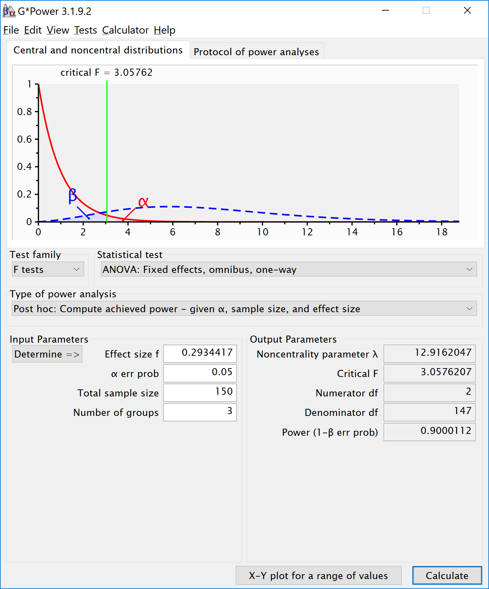

``` r
knitr::opts_chunk$set(echo = TRUE)
nsims <- 100000 #set number of simulations
library(mvtnorm)
library(afex)
library(emmeans)
library(ggplot2)
library(gridExtra)
library(reshape2)
library(pwr)

# Install functions from GitHub by running the code below:
source("https://raw.githubusercontent.com/Lakens/ANOVA_power_simulation/master/ANOVA_design.R")
source("https://raw.githubusercontent.com/Lakens/ANOVA_power_simulation/master/ANOVA_power.R")
source("https://raw.githubusercontent.com/Lakens/ANOVA_power_simulation/master/mu_from_ES.R")
```

Validation of Power in One-Way ANOVA
------------------------------------

Using the formula also used in Albers & Lakens (2018), we can determine the means that should yield a specified effect sizes (expressed in Cohen's f). Eta-squared (identical to partial eta-squared for One-Way ANOVA's) has benchmarks of .0099, .0588, and .1379 for small, medium, and large effect sizes (Cohen, 1988). Athough these benchmarks are quite random, and researchers should only use such benchmarks for power analyses as a last resort, we will demonstrate a-priori power analysis for these values.

Three conditions
----------------

Imagine we aim to design a study to test the hypothesis that giving people a pet to take care of will increase their life satisfation. We have a control condition, a 'cat' pet condition, and a 'dog' pet condition. We can simulate a One-Way ANOVA with a specified alpha, sample size, and effect size, on see the statistical power we would have for the ANOVA and the follow-up comparisons. We expect all pets to increase life-satisfaction compared to the control condition. Obviously, we also expect the people who are in the 'dog' pet condition to have even greater life-satisfaction than people in the 'cat' pet condition. Based on work by Pavot and Diener (1993) we believe that we can expect responses on the life-satifaction scale to have a mean of approximately 24 in our population, with a standard deviation of 6.4. We expect having a pet increases life satisfaction with approximately 2.2 scale points for participants who get a cat, and 2.6 scale points for participants who get a dog. We initially consider collecting data from 150 participants in total, with 50 participants in each condition. But before we proceed with the data collection, we examine the statistical power our design would have to detect the differences we predict.

``` r
string <- "3b"
n <- 50
# We are thinking of running 50 peope in each condition
mu <- c(24, 26.2, 26.6)
# Enter means in the order that matches the labels below.
# In this case, control, cat, dog. 
sd <- 6.4
r <- 0 
# (note that since we simulate a between design, the correlation between variables 
# will be 0, regardless of what you enter here, but the value must be set).
p_adjust = "none"
# "none" means we do not correct for multiple comparisons
labelnames <- c("condition", "control", "cat", "dog") #
# the label names should be in the order of the means specified above.

design_result <- ANOVA_design(string = string,
                   n = n, 
                   mu = mu, 
                   sd = sd, 
                   r = r, 
                   p_adjust = p_adjust,
                   labelnames = labelnames)
```


``` r
alpha_level <- 0.05
# You should think carefully about how to justify your alpha level.
# We will give some examples later, but for now, use 0.05.

ANOVA_power(design_result, alpha_level = alpha_level, nsims = nsims)
```

    ## Power and Effect sizes for ANOVA tests
    ##                  power effect size
    ## anova_condition 47.852      0.0383
    ## 
    ## Power and Effect sizes for contrasts
    ##                                    power effect size
    ## p_condition_control_condition_cat 40.118      0.3474
    ## p_condition_control_condition_dog 52.139      0.4101
    ## p_condition_cat_condition_dog      6.110      0.0628

``` r
#should yield
#0.3983064
#0.5205162
#0.06104044
```

The result shows that you would have quite low power with 50 participants, both for the overall ANOVA (just around 50% power), as for the follow up comparisons (approximately 40% power for the control vs cat condition, around 50% for the control vs dogs condition, and a really low power (around 6%, just above the Type 1 error rate of 5%) for the expected difference between cats and dogs.

Power for simple effects
------------------------

We are typically not just interested in the ANOVA, but also in follow up comparisons. In this case, we would perform a *t*-test comparing the control condition against the cat and dog condition, and we would compare the cat and dog conditions against each other, in independent *t*-tests.

For our example, Cohen's d (the standardized mean difference) is 2.2/6.4, or d = 0.34375 for the difference between the control condition and cats, 2.6/6.4 of d = 0.40625 for the difference between the control condition and dogs, and 0.4/6.4 or d = 0.0625 for the difference between cats and dogs as pets.

We can easily compute the expected power for these simple comparisons using the pwr package.

``` r
pwr.t.test(d = 2.2/6.4,
           n = 50,
           sig.level = 0.05,
           type="two.sample",
           alternative="two.sided")$power
```

    ## [1] 0.3983064

``` r
pwr.t.test(d = 2.6/6.4,
           n = 50,
           sig.level = 0.05,
           type="two.sample",
           alternative="two.sided")$power
```

    ## [1] 0.5205162

``` r
pwr.t.test(d = 0.4/6.4,
           n = 50,
           sig.level = 0.05,
           type="two.sample",
           alternative="two.sided")$power
```

    ## [1] 0.06104044

This analysis tells us that running the study with 50 participants in each condition is more likely to *not* yield a significant test result, even if our expected pattern of differences is true, than that we will observe a *p*-value smaller than our alpha level. This is not optimal.

Let's mathematically explore which pattern of means we would need to expect to habe 90% power for the ANOVA with 50 participants in each group. We can use the pwr package in R to compute a sensitivity analysis that tells us the effect size, in Cohen's f, that we are able to detect with 3 groups and 50 partiicpants in each group, in order to achive 90% power with an alpha level of 5%.

``` r
K <- 3
n <- 50
sd <- 6.4
r <- 0

#Calculate f when running simulation
f <- pwr.anova.test(n = n,
                    k = K,
                    power = 0.9,
                    sig.level = alpha_level)$f
f
```

    ## [1] 0.2934417

This sensitivity analysis shows we have 90% power in our planned design to detect effects of Cohen's f of 0.2934417. Benchmarks by Cohen (1988) for small, medium, and large Cohen's f values are 0.1, 0.25, and 0.4, which correspond to eta-squared values of small (.0099), medium (.0588), and large (.1379), in line with d = .2, .5, or .8. So, at least based on these benchmarks, we have 90% power to detect effects that are somewhat sizeable.

``` r
f2 <- f^2
ES <- f2/(f2+1)
ES
```

    ## [1] 0.07928127

Expressed in eta-squared, we can detect values of eta-squared = 0.0793 or larger.

``` r
mu <- mu_from_ES(K = K, ES = ES)
mu <- mu * sd
mu
```

    ## [1] -2.300104  0.000000  2.300104

We can compute a pattern of means, given a standard deviation of 6.4, that would give us an effect size of f = 0.2934, or eta-squared of 0.0793. We should be able to accomplish this is the means are -2.300104, 0.000000, and 2.300104. We can use these values to confirm the ANOVA has 90% power.

``` r
design_result <- ANOVA_design(string = string,
                   n = n, 
                   mu = mu, 
                   sd = sd, 
                   r = r, 
                   p_adjust = p_adjust,
                   labelnames = labelnames)
```


``` r
ANOVA_power(design_result, alpha_level = alpha_level, nsims = nsims)
```

    ## Power and Effect sizes for ANOVA tests
    ##                 power effect size
    ## anova_condition 90.08      0.0869
    ## 
    ## Power and Effect sizes for contrasts
    ##                                    power effect size
    ## p_condition_control_condition_cat 43.006      0.3632
    ## p_condition_control_condition_dog 94.499      0.7254
    ## p_condition_cat_condition_dog     42.732      0.3618

The simulation confirms that for the *F*-test for the ANOVA we have 90% power. This is also what g\*power tells us what would happen based on a post-hoc power analysis with an f of 0.2934417, 3 groups, 150 participants in total (50 in each between subject condition), and an alpha of 5%.



We can also compute the power for the ANOVA and simple effects in R with the pwr package. The calculated effect sizes and power match those from the simulation.

``` r
K <- 3
n <- 50
sd <- 6.4
f <- 0.2934417

pwr.anova.test(n = n,
               k = K,
               f = f,
               sig.level = alpha_level)$power
```

    ## [1] 0.9000112

``` r
d <- 2.300104/6.4
d
```

    ## [1] 0.3593912

``` r
pwr.t.test(d = 2.300104/6.4,
           n = 50,
           sig.level = 0.05,
           type="two.sample",
           alternative="two.sided")$power
```

    ## [1] 0.4284243

``` r
d <- 2*2.300104/6.4
d
```

    ## [1] 0.7187825

``` r
pwr.t.test(d = d,
           n = 50,
           sig.level = 0.05,
           type="two.sample",
           alternative="two.sided")$power
```

    ## [1] 0.9450353
