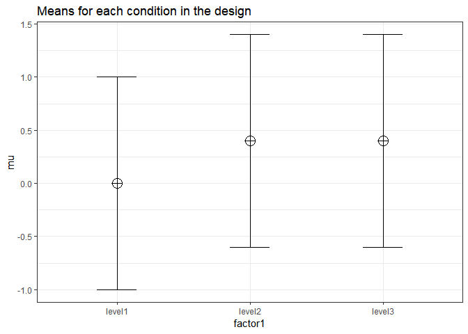
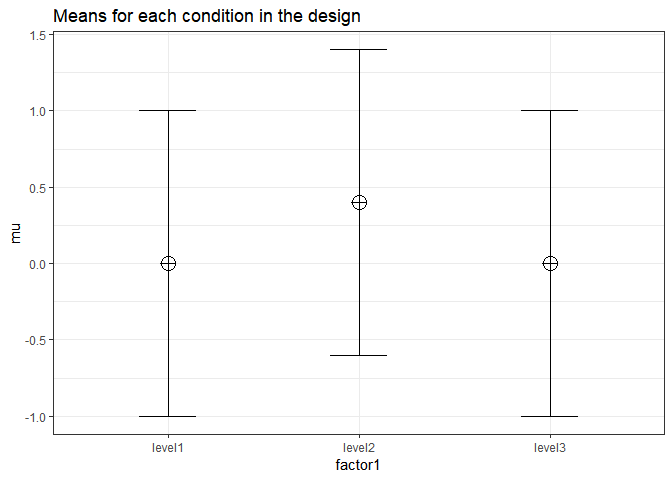
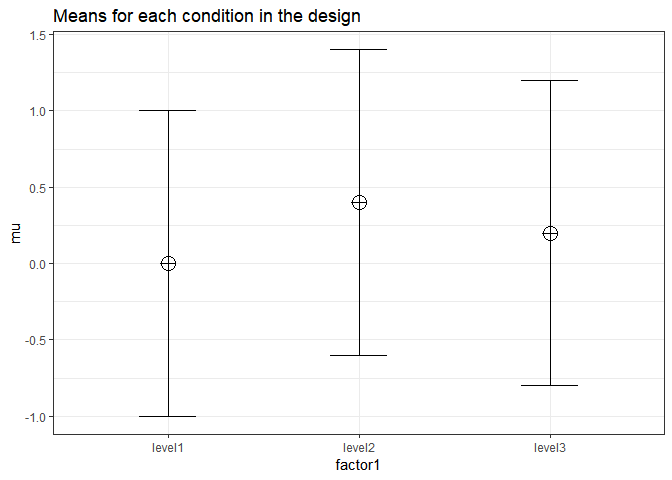

## Validation of effect size estimates for One-Way ANOVA

We first repeat the simulation by
Brysbaert:

``` r
# Simulations to estimate the power of an ANOVA with three unrelated groups
# the effect between the two extreme groups is set to d = .4, the effect for the third group is d = .4 (see below for other situations)
# we use the built-in aov-test command

# give sample sizes (all samples sizes are equal)
N = 90

# give effect size d
d1 = .4 #difference between the extremes
d2 = .4 #third condition goes with the highest extreme

# give number of simulations
nSim = nsims

# give alpha levels
alpha1 = .05 #alpha level for the omnibus ANOVA
alpha2 = .05 #alpha level for three post hoc one-tailed t-tests Bonferroni correction

# create progress bar in case it takes a while
#pb <- winProgressBar(title = "progress bar", min = 0, max = nSim, width = 300)

# create vectors to store p-values
p1 <-numeric(nSim) #p-value omnibus ANOVA
p2 <-numeric(nSim) #p-value first post hoc test
p3 <-numeric(nSim) #p-value second post hoc test
p4 <-numeric(nSim) #p-value third post hoc test
pes1 <-numeric(nSim) #partial eta-squared
pes2 <-numeric(nSim) #partial eta-squared two extreme conditions


library(lsr)

for(i in 1:nSim){ #for each simulated experiment
 # setWinProgressBar(pb, i, title=paste(round(i/nSim*100, 1), "% done"))
  x<-rnorm(n = N, mean = 0, sd = 1)
  y<-rnorm(n = N, mean = d1, sd = 1) 
  z<-rnorm(n = N, mean = d2, sd = 1) 
  data = c(x,y,z)
  groups= factor(rep(letters[24:26], each = N))
  test <- aov(data~groups)
  pes1[i] <- etaSquared(test)[1,2]
  p1[i] <- summary(test)[[1]][["Pr(>F)"]][[1]]
  p2[i] <- t.test(x,y)$p.value
  p3[i] <- t.test(x,z)$p.value
  p4[i] <- t.test(y,z)$p.value
  data = c(x,y)
  groups= factor(rep(letters[24:25], each = N))
  test <- aov(data~groups)
  pes2[i] <- etaSquared(test)[1,2]
  }
#close(pb)#close progress bar

# results are as predicted when omnibus ANOVA is significant, t-tests are significant between x and y plus x and z; not significant between y and z
#printing all unique tests (adjusted code by DL)
sum(p1<alpha1)/nSim
```

    ## [1] 0.84

``` r
sum(p2<alpha2)/nSim
```

    ## [1] 0.75

``` r
sum(p3<alpha2)/nSim
```

    ## [1] 0.79

``` r
sum(p4<alpha2)/nSim
```

    ## [1] 0.07

``` r
mean(pes1)
```

    ## [1] 0.04206884

``` r
mean(pes2)
```

    ## [1] 0.04217785

## Installation

We install the functions:

``` r
# Install the two functions from GitHub by running the code below:

source("https://raw.githubusercontent.com/Lakens/ANOVA_power_simulation/master/ANOVA_design.R")
source("https://raw.githubusercontent.com/Lakens/ANOVA_power_simulation/master/ANOVA_power.R")
```

## Three conditions replication

``` r
K <- 3
mu <- c(0, 0.4, 0.4)
n <- 90
sd <- 1
r <- 0
string = paste(K,"b",sep="")
```

``` r
design_result <- ANOVA_design(string = string,
                   n = n, 
                   mu = mu, 
                   sd = sd, 
                   labelnames = c("factor1", "level1", "level2", "level3"))
```

<!-- -->

``` r
ANOVA_power(design_result, nsims = nsims)
```

    ## Power and Effect sizes for ANOVA tests
    ##               power effect size
    ## anova_factor1    85        0.04
    ## 
    ## Power and Effect sizes for contrasts
    ##                                 power effect size
    ## p_factor1_level1_factor1_level2    84      0.4033
    ## p_factor1_level1_factor1_level3    75      0.4022
    ## p_factor1_level2_factor1_level3     8     -0.0035

## Variation 1

``` r
# give sample sizes (all samples sizes are equal)
N = 145

# give effect size d
d1 = .4 #difference between the extremes
d2 = .0 #third condition goes with the highest extreme

# give number of simulations
nSim = nsims

# give alpha levels
alpha1 = .05 #alpha level for the omnibus ANOVA
alpha2 = .05 #alpha level for three post hoc one-tailed t-tests Bonferroni correction

# create progress bar in case it takes a while
#pb <- winProgressBar(title = "progress bar", min = 0, max = nSim, width = 300)

# create vectors to store p-values
p1 <-numeric(nSim) #p-value omnibus ANOVA
p2 <-numeric(nSim) #p-value first post hoc test
p3 <-numeric(nSim) #p-value second post hoc test
p4 <-numeric(nSim) #p-value third post hoc test
pes1 <-numeric(nSim) #partial eta-squared
pes2 <-numeric(nSim) #partial eta-squared two extreme conditions


library(lsr)

for(i in 1:nSim){ #for each simulated experiment
 # setWinProgressBar(pb, i, title=paste(round(i/nSim*100, 1), "% done"))
  x<-rnorm(n = N, mean = 0, sd = 1)
  y<-rnorm(n = N, mean = d1, sd = 1) 
  z<-rnorm(n = N, mean = d2, sd = 1) 
  data = c(x,y,z)
  groups= factor(rep(letters[24:26], each = N))
  test <- aov(data~groups)
  pes1[i] <- etaSquared(test)[1,2]
  p1[i] <- summary(test)[[1]][["Pr(>F)"]][[1]]
  p2[i] <- t.test(x,y)$p.value
  p3[i] <- t.test(x,z)$p.value
  p4[i] <- t.test(y,z)$p.value
  data = c(x,y)
  groups= factor(rep(letters[24:25], each = N))
  test <- aov(data~groups)
  pes2[i] <- etaSquared(test)[1,2]
  }
#close(pb)#close progress bar

# results are as predicted when omnibus ANOVA is significant, t-tests are significant between x and y plus x and z; not significant between y and z
#printing all unique tests (adjusted code by DL)
sum(p1<alpha1)/nSim
```

    ## [1] 0.92

``` r
sum(p2<alpha2)/nSim
```

    ## [1] 0.89

``` r
sum(p3<alpha2)/nSim
```

    ## [1] 0.11

``` r
sum(p4<alpha2)/nSim
```

    ## [1] 0.96

``` r
mean(pes1)
```

    ## [1] 0.04032553

``` r
mean(pes2)
```

    ## [1] 0.04251319

## Three conditions replication

``` r
K <- 3
mu <- c(0, 0.4, 0.0)
n <- 145
sd <- 1
r <- 0
string = paste(K,"b",sep="")
```

``` r
design_result <- ANOVA_design(string = string,
                   n = n, 
                   mu = mu, 
                   sd = sd, 
                   labelnames = c("factor1", "level1", "level2", "level3"))
```

<!-- -->

``` r
ANOVA_power(design_result, nsims = nsims)
```

    ## Power and Effect sizes for ANOVA tests
    ##               power effect size
    ## anova_factor1    93      0.0372
    ## 
    ## Power and Effect sizes for contrasts
    ##                                 power effect size
    ## p_factor1_level1_factor1_level2    89      0.4029
    ## p_factor1_level1_factor1_level3     4     -0.0033
    ## p_factor1_level2_factor1_level3    89     -0.4079

## Variation 2

``` r
# give sample sizes (all samples sizes are equal)
N = 82

# give effect size d
d1 = .4 #difference between the extremes
d2 = .2 #third condition goes with the highest extreme

# give number of simulations
nSim = nsims

# give alpha levels
alpha1 = .05 #alpha level for the omnibus ANOVA
alpha2 = .05 #alpha level for three post hoc one-tailed t-tests Bonferroni correction

# create progress bar in case it takes a while
#pb <- winProgressBar(title = "progress bar", min = 0, max = nSim, width = 300)

# create vectors to store p-values
p1 <-numeric(nSim) #p-value omnibus ANOVA
p2 <-numeric(nSim) #p-value first post hoc test
p3 <-numeric(nSim) #p-value second post hoc test
p4 <-numeric(nSim) #p-value third post hoc test
pes1 <-numeric(nSim) #partial eta-squared
pes2 <-numeric(nSim) #partial eta-squared two extreme conditions


library(lsr)

for(i in 1:nSim){ #for each simulated experiment
 # setWinProgressBar(pb, i, title=paste(round(i/nSim*100, 1), "% done"))
  x<-rnorm(n = N, mean = 0, sd = 1)
  y<-rnorm(n = N, mean = d1, sd = 1) 
  z<-rnorm(n = N, mean = d2, sd = 1) 
  data = c(x,y,z)
  groups= factor(rep(letters[24:26], each = N))
  test <- aov(data~groups)
  pes1[i] <- etaSquared(test)[1,2]
  p1[i] <- summary(test)[[1]][["Pr(>F)"]][[1]]
  p2[i] <- t.test(x,y)$p.value
  p3[i] <- t.test(x,z)$p.value
  p4[i] <- t.test(y,z)$p.value
  data = c(x,y)
  groups= factor(rep(letters[24:25], each = N))
  test <- aov(data~groups)
  pes2[i] <- etaSquared(test)[1,2]
  }
#close(pb)#close progress bar

# results are as predicted when omnibus ANOVA is significant, t-tests are significant between x and y plus x and z; not significant between y and z
#printing all unique tests (adjusted code by DL)
sum(p1<alpha1)/nSim
```

    ## [1] 0.56

``` r
sum(p2<alpha2)/nSim
```

    ## [1] 0.7

``` r
sum(p3<alpha2)/nSim
```

    ## [1] 0.23

``` r
sum(p4<alpha2)/nSim
```

    ## [1] 0.19

``` r
mean(pes1)
```

    ## [1] 0.03253782

``` r
mean(pes2)
```

    ## [1] 0.0421975

## Three conditions replication

``` r
K <- 3
mu <- c(0, 0.4, 0.2)
n <- 82
sd <- 1
string = paste(K,"b",sep="")
```

``` r
design_result <- ANOVA_design(string = string,
                   n = n, 
                   mu = mu, 
                   sd = sd, 
                   labelnames = c("factor1", "level1", "level2", "level3"))
```

<!-- -->

``` r
ANOVA_power(design_result, nsims = nsims)
```

    ## Power and Effect sizes for ANOVA tests
    ##               power effect size
    ## anova_factor1    59      0.0299
    ## 
    ## Power and Effect sizes for contrasts
    ##                                 power effect size
    ## p_factor1_level1_factor1_level2    75      0.3933
    ## p_factor1_level1_factor1_level3    24      0.1983
    ## p_factor1_level2_factor1_level3    25     -0.1954
