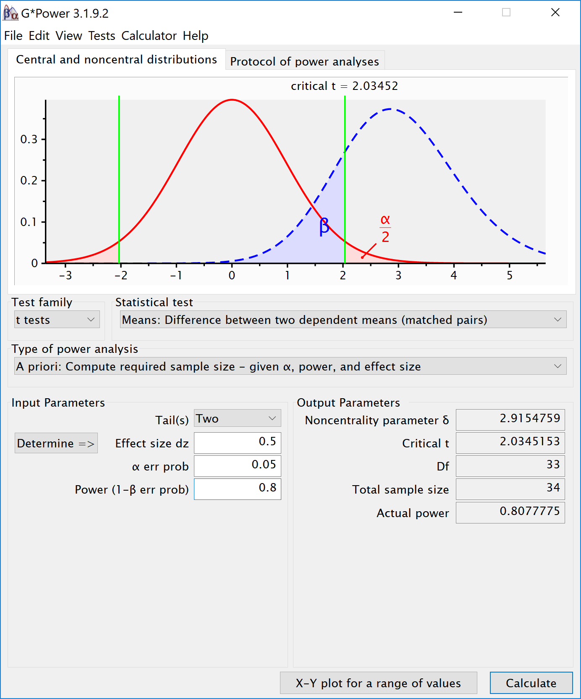
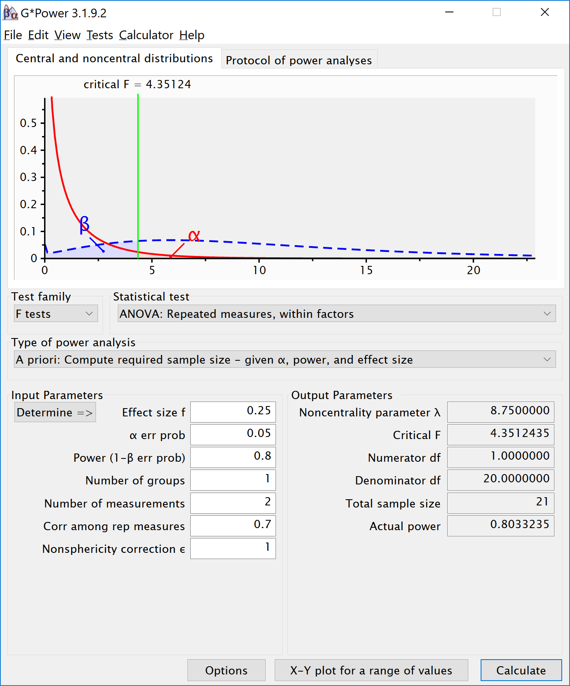

```{r setup, include=FALSE}
knitr::opts_chunk$set(echo = TRUE)
nsims <- 100 #set number of simulations
library(mvtnorm)
library(afex)
library(emmeans)
library(ggplot2)
library(gridExtra)
library(reshape2)
library(pwr)

# Install functions from GitHub by running the code below:
source("https://raw.githubusercontent.com/Lakens/ANOVA_power_simulation/master/ANOVA_design.R")
source("https://raw.githubusercontent.com/Lakens/ANOVA_power_simulation/master/ANOVA_power.R")
source("https://raw.githubusercontent.com/Lakens/ANOVA_power_simulation/master/mu_from_ES.R")

```

## Example of Power in Repeated Measures ANOVA

In a repeated measures design multiple observations are collected from the same participants. In the simplest case, where there are two repeated observations, a repeated measures ANOVA equals a dependent or paired *t*-test. The difference compared to a between subject design is that repeated measures can be correlated, and in psychology, they often are. Let's first explore the impact of this correlation on the power of a repeated measures ANOVA.

## Two conditions, medium effect size

To illustrate the effect of correated observations, we start by simulating data for a medium effect size for a dependent (or paired, or within-subject) *t*-test. Let's first look at G*power. If we want to perform an a-priori power analysis, we are asked to fill in the effect size dz. As Cohen (1988) writes, "The Z subscript is used to emphasize the fact that our raw score unit is no longer X or Y, but Z", where Z are the difference scores of X-Y. 



Within designs can have greater power to detect differences than between designs because the values are correlated, and a within design requires less participants because each participant provides multiple observations. One difference between an independent *t*-test and a dependent *t*-test is that an independent *t*-test has 2(n-1) degrees of freedom, while a dependent *t*-test has (n-1) degrees of freedom. The sample size needed in a two-group within-design (NW) relative to the sample needed in two-group between-designs (NB), assuming normal distributions, and ignoring the difference in degrees of freedom between the two types of tests, is (from Maxwell & Delaney, 2004, p. 561, formula 45): 

$N_{W}=\frac{N_{B}(1-\rho)}{2}$

The division by 2 in the equation is due to the fact that in a two-condition within design every participant provides two data-points. The extent to which this reduces the sample size compared to a between-subject design depends on the correlation (*r*) between the two dependent variables, as indicated by the 1-r part of the equation. If the correlation is 0, a within-subject design needs half as many participants as a between-subject design (e.g., 64 instead 128 participants), simply because every participants provides 2 datapoints. The higher the correlation, the larger the relative benefit of within designs, and whenever the correlation is negative (up to -1) the relative benefit disappears. 

Whereas in an independent *t*-test the two observations are uncorrelated, in a within design the observations are correlated. This has an effect on the standard deviation of the difference scores. In turn, because the standardized effect size is the mean difference divided by the standard deviation of the difference scores, the correlation has an effect on the standardized mean difference in a within design, Cohen's dz. The relation, as Cohen (1988, formula 2.3.7) explains, is:

$\sigma_{z}=\sigma\sqrt{2(1-\rho)}$

Therefore, the relation between dz and d is $\sqrt{2(1-\rho)}$. As Cohen (1988) writes: "In other words, a given difference between population means for matched (dependent) samples is standardized by a value which is $\sqrt{2(1-\rho)}$ as large as would be the case were they independent. If we enter a correlation of 0.5 in the formula, we get $\sqrt{2(0.5)}=1$. In other words, when the correlation is 0.5, d = dz. When there is a strong correlation between dependent variables, for example r = 0.9, we get $d=d_{z}\sqrt{2(1-0.9)}$, and a dz of 1 would be a d = 0.45. Reversely, $d_{z}=\frac{d}{\sqrt{2(1-r)}}$, so with a r = 0.9, a d of 1 would be a dz = 2.24. Some consider this increase in dz compared to d when observations are strongly correlated an 'inflation'when estimating effect sizes, but since the reduction in the standard deviation of the difference scores due to the correlation makes it easier to distinguish signal from noise in a hypothesis test, it leads to a clear power benefit. 

```{r}
# Check sample size formula Maxwell
# Power is pretty similar with n/2, same d (assuming r = 0.5). 
# Small differences due to df = 2(n-1) vs df = n-1
pwr.t.test(d = 0.05,
           n = c(2000, 4000, 8000),
           sig.level = 0.05,
           type = "two.sample",
           alternative = "two.sided")

pwr.t.test(d = 0.05,
           n = c(1000, 2000, 4000),
           sig.level = 0.05,
           type = "paired",
           alternative = "two.sided")


```

There is no equivalent fz for Cohen's f for a within subject ANOVA. For two groups, we can directly compute Cohen's f from Cohen's d for two groups, as Cohen (1988) describes, because f = 1/2d. For a d = 0.5, f = 0.25. In Gpower we can run a 2 group within-subject power analysis for ANOVA. We plan for 80% power, and reproduce the anaysis above for the dependent *t*-test. This works because the correlation is set to 0.5, when d = dz, and thus the transformation of f=1/2d works.  


If we change the correlation to 0.7 and keep all other settings the same, the repeated measure a-priori power analysis yields a sample of 21. The correlation increases the power for the test. 



To reproduce this analysis in Gpower with a dependent *t*-test we need to change dz following the formula above, $d_{z}=\frac{0.5}{\sqrt{2(1-0.7)}}$, which yields dz = `r 0.5/sqrt(2*(1-0.7))`. If we enter this value in Gpower for an a-priori power analysis, we get the exact same results (as we should, since an repeated measures ANOVA with 2 groups equals a dependent *t*-test). This example illustrates that the correlation between dependent variables always factors into a power analysis, both for a dependent *t*-test, and for a repeated measures ANOVA. Because a dependent *t*-test uses dz the correlation might be less visible, but given the relation between d and dz, the correlation is always taken into account and can greatly improve power for within designs compared to between designs.


We can perform both these power analyses using simuations as well. We set groups to 2 for the simulation, n = 34 (which should give 80.777 power, according to the g*power program), a correlation among repeated measures of 0.5, and an alpha of 0.05. In this case, we simulate data with means -0.25  and 0.25, and set the sd to 1. This means we have a mean difference of 0.5, and a Cohen's d of 0.5/1 = 0.5. In the first example, we set the correlation to 0.5, and the result should be 80.77% power, and an effect size estimate of 0.5 for the simple effect. We also calculate partial eta-squared for the ANOVA, which equals $\frac{f^2}{f^2+1}$, or 0.05882353.

```{r}
K <- 2
n <- 34
sd <- 1
r <- 0.5
alpha = 0.05
f <- 0.25
f2 <- f^2
ES <- f2/(f2+1)
ES

mu <- mu_from_ES(K = K, ES = ES)

string = paste(K,"w",sep="")
p_adjust = "none"
labelnames <- c("speed", "fast", "slow")

design_result <- ANOVA_design(string = string,
                   n = n, 
                   mu = mu, 
                   sd = sd, 
                   r = r, 
                   p_adjust = "none",
                   labelnames = labelnames)

alpha_level <- 0.05

ANOVA_power(design_result, nsims = nsims)

```

The results of the simulation are indeed very close to 80.777%. Note that the simulation calculates Cohen's dz effect sizes for paired comparisons - which here given the correlation of 0.5 is also 0.5 for a medium effect size. 

We should see a larger dz if we increase the correlation, keeping the sample size the same, following the example in Gpower above. We repeat the simulation, and the only difference is a correlation between dependent variables of 0.7. This should yield an effect size dz = `r 0.5/sqrt(2*(1-0.7))`.

```{r}
K <- 2
n <- 21
sd <- 1
r <- 0.7
alpha = 0.05
f <- 0.25
f2 <- f^2
ES <- f2/(f2+1)
ES

mu <- mu_from_ES(K = K, ES = ES)

string = paste(K,"w",sep="")
p_adjust = "none"
labelnames <- c("speed", "fast", "slow")

design_result <- ANOVA_design(string = string,
                   n = n, 
                   mu = mu, 
                   sd = sd, 
                   r = r, 
                   p_adjust = "none",
                   labelnames = labelnames)

alpha_level <- 0.05

design_result$sigmatrix

ANOVA_power(design_result, nsims = nsims)

```


```{r}
#relation dz and f for within designs 

f <- 0.5*0.6454972
# Entering this f in G*power, with a correlation of 0.5, yields the same as entering f = 0.25 and correlation = 0.7. 
```

