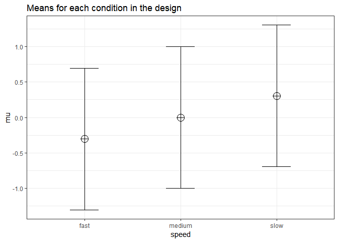
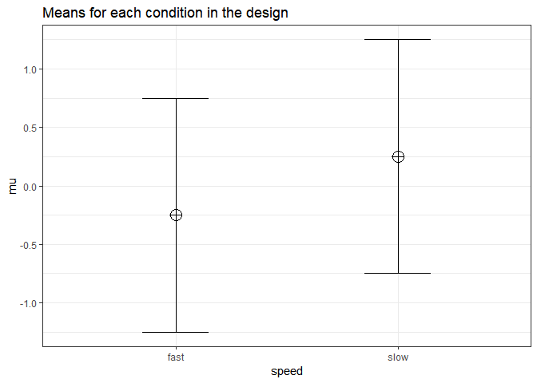

Example of Power in Repeated Measures ANOVA
-------------------------------------------

In a repeated measures design multiple observations are collected from the same participants. Here, we will examine a repeated measures experiment with 3 within-subject conditions, to illustrate how a repeated measures ANOVA extends a dependent *t*-test with 3 groups.

In the example for a two-group within design we provided a specific formula for the sample size benefit for two groups. The sample size needed in within-designs (NW) with more than 2 conditions, relative to the sample needed in between-designs (NB), assuming normal distributions and compound symmetry, and ignoring the difference in degrees of freedom between the two types of tests, is (from Maxwell & Delaney, 2004, p. 562, formula 47):

$N\_{W}=\\frac{N\_{B}(1-\\rho)}{a}$

Where a is the number of within-subject levels.

The relation between Cohen's f and Cohen's d
--------------------------------------------

Whereas in the case of a repeated measures ANOVA with 2 groups we could explain the principles of a power analysis by comparing our test against a *t*-test and Cohen's d, this becomes more difficult when we have more than 2 groups. It is more useful to explain how to directly calculate Cohen's f, the effect size used in power analyses for ANOVA. Cohen's f is calculated following Cohen, 1988, formula 8.2.1 and 8.2.2:

$f = \\sqrt{\\frac{\\frac{\\sum(\\mu-\\overline{\\mu})^2)}N}\\sigma}$

Imagine we have a within-subject experiment with 3 conditions. We ask people what they mood is when their alarm clock wakes them up, when they wake up naturally on a week day, and when they wake up naturally on a weekend day. Based on pilot data, we expect the means (on a 7 point validated mood scale) are 3.8, 4.2, and 4.3. The standard deviation is 0.9, and the correlation between the dependent measurements is 0.7. We can calculate Cohen's f for the ANOVA, and Cohen's dz for the contrasts:

``` r
mu <- c(3.8, 4.2, 4.3)
sd <- 0.9
f <- sqrt(sum((mu-mean(mu))^2)/length(mu))/sd #Cohen, 1988, formula 8.2.1 and 8.2.2
f
```

    ## [1] 0.2400274

``` r
r <- 0.7
(4.2-3.8)/0.9/sqrt(2*(1-r))
```

    ## [1] 0.5737753

``` r
(4.3-3.8)/0.9/sqrt(2*(1-r))
```

    ## [1] 0.7172191

``` r
(4.3-4.2)/0.9/sqrt(2*(1-r))
```

    ## [1] 0.1434438

The relation between Cohen's d or dz and Cohen's f becomes more difficult when there are multiple groups, because the relationship depends on the pattern of the means. Cohen (1988) presents calculations for three patterns, minimal variability (for example, for 5 means: -0.25, 0, 0, 0, 0.25), medium variability (for example, for 5 means: -0.25, -0.25, 0.25, 0.25, 0.25 or -0.25, -0.25, -0.25, 0.25, 0.25). For these three patterns, formula's are available that compute Cohen's f from Cohen's d, where d is the effect size calculated for the difference between the largest and smallest mean (if the largest mean is 0.25 and the smallest mean is -0.25, 0.25 - -0.25 = 0.5, so d is 0.5 divided by the standard deviation of 0.9). In our example, d would be (4.3-3.8)/0.9 = 0.5555556. If we divide this value by sqrt(2\*(1-r)) we have dz = 0.5555556/0.7745967 = 0.7172191.

I have created a custom function that will calculate f from d, based on a specification of one of the three patterns of means. Our pattern is most similar (but not identical) to a maximum variability pattern (two means are high, one is lower). So we could attempt to calculate f from d (0.5555556), by calculating d from the largest and smallest mean:

``` r
source("https://raw.githubusercontent.com/Lakens/ANOVA_power_simulation/master/calc_f_d_eta.R")

res <- calc_f_d_eta(mu = mu, sd = sd, variability = "maximum")
res$f
```

    ## [1] 0.2618914

``` r
res$d
```

    ## [1] 0.5555556

We see the Cohen's f value is 0.2618914 and d = 0.5555556. The Cohen's f is not perfectly accurate - it is assuming the pattern of means is 3.8, 4.3, 4.3, and not 3.8, 4.2, 4.3. If the means and sd is known, it is best to calculate Cohen's f directly from these values.

Three within conditions, medium effect size
-------------------------------------------

We can perform power analyses for within designs using simuations. We set groups to 3 for the simulation, n = 20, and the correlation between dependent variables to 0.8. If the true effect size is f = 0.25, and the alpha level is 0.05, the power is 85.5%.

In this case, we simulate data with means -0.25 and 0.25, and set the sd to 1. This means we have a mean difference of 0.5, and a Cohen's d of 0.5/1 = 0.5. In the first example, we set the correlation to 0.5, and the result should be 80.77% power, and an effect size estimate of 0.5 for the simple effect. We also calculate partial eta-squared for the ANOVA, which equals $\\frac{f^2}{f^2+1}$, or 0.05882353 (this calculation also assumes between designs, and thus is only true when )

``` r
K <- 3
n <- 20
sd <- 1
r <- 0.8
alpha = 0.05
f <- 0.25
f2 <- f^2
ES <- f2/(f2+1)
ES
```

    ## [1] 0.05882353

``` r
mu <- mu_from_ES(K = K, ES = ES)
sqrt(sum((mu-mean(mu))^2)/length(mu))/sd #Cohen, 1988, formula 8.2.1 and 8.2.2
```

    ## [1] 0.25

``` r
string = paste(K,"w",sep="")
p_adjust = "none"
labelnames <- c("speed", "fast", "medium", "slow")

design_result <- ANOVA_design(string = string,
                   n = n, 
                   mu = mu, 
                   sd = sd, 
                   r = r, 
                   p_adjust = "none",
                   labelnames = labelnames)
```



``` r
alpha_level <- 0.05

ANOVA_power(design_result, nsims = nsims)
```

    ## Power and Effect sizes for ANOVA tests
    ##             power effect size
    ## anova_speed  96.4      0.3475
    ## 
    ## Power and Effect sizes for contrasts
    ##                           power effect size
    ## p_speed_fast_speed_medium  54.1      0.5018
    ## p_speed_fast_speed_slow    98.2      1.0187
    ## p_speed_medium_speed_slow  55.0      0.5092

The results of the simulation are indeed very close to 96.9%.

``` r
K <- 2
n <- 21
sd <- 1
r <- 0.7
alpha = 0.05
f <- 0.25
f2 <- f^2
ES <- f2/(f2+1)
ES
```

    ## [1] 0.05882353

``` r
mu <- mu_from_ES(K = K, ES = ES)

string = paste(K,"w",sep="")
p_adjust = "none"
labelnames <- c("speed", "fast", "slow")

design_result <- ANOVA_design(string = string,
                   n = n, 
                   mu = mu, 
                   sd = sd, 
                   r = r, 
                   p_adjust = "none",
                   labelnames = labelnames)
```



``` r
alpha_level <- 0.05

design_result$sigmatrix
```

    ##    X1  X2
    ## 1 1.0 0.7
    ## 2 0.7 1.0

``` r
ANOVA_power(design_result, nsims = nsims)
```

    ## Power and Effect sizes for ANOVA tests
    ##             power effect size
    ## anova_speed    79      0.3036
    ## 
    ## Power and Effect sizes for contrasts
    ##                         power effect size
    ## p_speed_fast_speed_slow    79      0.6571

We can see this is in line with the power estimate from Gpower:


We can also validate this by creating the code to do a power analysis in R from scratch:

``` r
# Power analysis in R

#Formula used by G*Power for within design
f <- 0.25 #Cohen's f
k <- 1 #number of groups
m <- 3 #number of measures
n <- 20 #total sample size
e <- 1 #non-spericity correction
r <- 0.8 #correlation between dependent variables
alpha <- 0.05 #alpha level

df1 <- (m - 1) * e #calculate degrees of freedom 1
df2 <- (n - k) * (m - 1) * e #calculate degrees of freedom 2

lambda <- (n * m * f^2) / (1 - r) # lambda for within ANOVA

F_critical <- qf(alpha, # critical F-vaue
                 df1,
                 df2, 
                 lower.tail=FALSE) 

pow <- pf(qf(alpha, #power 
             df1, 
             df2, 
             lower = FALSE), 
          df1, 
          df2, 
          lambda, 
          lower = FALSE)
pow
```

    ## [1] 0.9691634
