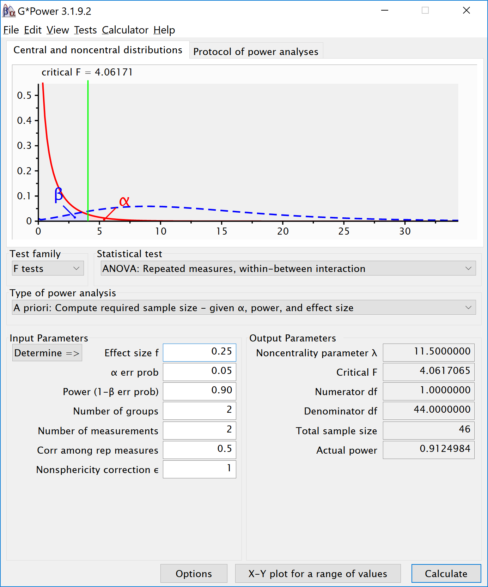

``` r
knitr::opts_chunk$set(echo = TRUE)
nsims <- 100000 #set number of simulations
library(mvtnorm)
library(afex)
library(emmeans)
library(ggplot2)
library(gridExtra)
library(reshape2)
```

Validation of Power in Mixed ANOVA
----------------------------------

We install the functions:

``` r
# Install the two functions from GitHub by running the code below:

source("https://raw.githubusercontent.com/Lakens/ANOVA_power_simulation/master/ANOVA_design.R")
source("https://raw.githubusercontent.com/Lakens/ANOVA_power_simulation/master/ANOVA_power.R")
```

Two by two ANOVA, within-between design
---------------------------------------

We can simulate a Two-Way ANOVA with a specific alpha, sample size and effect size, to achieve a specified statistical power. We wil try to reproduce the power analysis by g\*power for an F-test, ANOVA: Repeated measures, within-between interaction.



For the 2-way interaction, the result should be a power of 91.25% is we have a total samplesize of 46. Since we have 2 groups in the between factor that means the sample size per group is 2 (and both these groups collect 2 repeated measures).

``` r
mu <- c(-0.25, 0.25, 0.25, -0.25)
n <- 23
sd <- 1
r <- 0.5
string = "2w*2b"
alpha_level <- 0.05
p_adjust = "none"
labelnames = c("age", "old", "young", "color", "blue", "red")
design_result <- ANOVA_design(string = string,
                              n = n, 
                              mu = mu, 
                              sd = sd, 
                              r = r, 
                              p_adjust = p_adjust,
                              labelnames = labelnames)
```


``` r
simulation_result <- ANOVA_power(design_result, alpha = 0.05, nsims = nsims)
```

    ## Power and Effect sizes for ANOVA tests
    ##                  power effect size
    ## anova_color      5.013      0.0103
    ## anova_age        4.916      0.0104
    ## anova_color:age 91.241      0.2090
    ## 
    ## Power and Effect sizes for contrasts
    ##                                             power effect size
    ## p_age_old_color_blue_age_old_color_red     38.098      0.5089
    ## p_age_old_color_blue_age_young_color_blue  62.968      0.5171
    ## p_age_old_color_blue_age_young_color_red    5.044      0.0001
    ## p_age_old_color_red_age_young_color_blue    4.990     -0.0013
    ## p_age_old_color_red_age_young_color_red    63.011     -0.5182
    ## p_age_young_color_blue_age_young_color_red 38.032     -0.5075

Two by two ANOVA, within-between design Variation 1
---------------------------------------------------

We can simulate the same Two-Way ANOVA increasing the correlation to 0.7.


``` r
mu <- c(-0.25, 0.25, 0.25, -0.25)
n <- 23
sd <- 1
r <- 0.7
string = "2w*2b"
alpha_level <- 0.05
p_adjust = "none"
labelnames = c("age", "old", "young", "color", "blue", "red")
design_result <- ANOVA_design(string = string,
                              n = n, 
                              mu = mu, 
                              sd = sd, 
                              r = r, 
                              p_adjust = p_adjust,
                              labelnames = labelnames)
```


``` r
simulation_result <- ANOVA_power(design_result, alpha = 0.05, nsims = nsims)
```

    ## Power and Effect sizes for ANOVA tests
    ##                  power effect size
    ## anova_color      4.866      0.0103
    ## anova_age        4.970      0.0104
    ## anova_color:age 98.956      0.3058
    ## 
    ## Power and Effect sizes for contrasts
    ##                                             power effect size
    ## p_age_old_color_blue_age_old_color_red     38.342      0.5093
    ## p_age_old_color_blue_age_young_color_blue  83.978      0.6679
    ## p_age_old_color_blue_age_young_color_red    4.831      0.0014
    ## p_age_old_color_red_age_young_color_blue    4.972     -0.0004
    ## p_age_old_color_red_age_young_color_red    84.032     -0.6679
    ## p_age_young_color_blue_age_young_color_red 37.815     -0.5072
