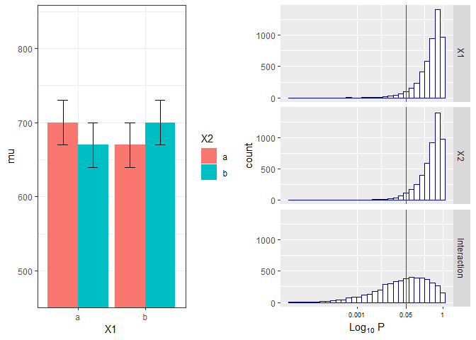
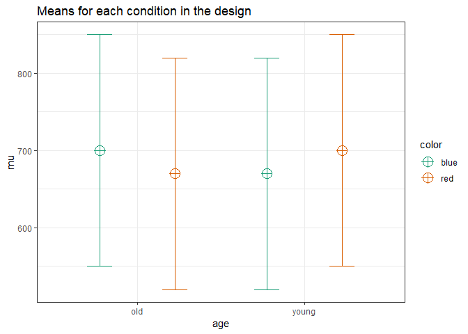

``` r
knitr::opts_chunk$set(echo = TRUE)
nsims <- 10000 #set number of simulations
library(mvtnorm)
library(afex)
```

    ## Warning: package 'afex' was built under R version 3.5.3

    ## Loading required package: lme4

    ## Warning: package 'lme4' was built under R version 3.5.3

    ## Loading required package: Matrix

    ## ************
    ## Welcome to afex. For support visit: http://afex.singmann.science/

    ## - Functions for ANOVAs: aov_car(), aov_ez(), and aov_4()
    ## - Methods for calculating p-values with mixed(): 'KR', 'S', 'LRT', and 'PB'
    ## - 'afex_aov' and 'mixed' objects can be passed to emmeans() for follow-up tests
    ## - NEWS: library('emmeans') now needs to be called explicitly!
    ## - Get and set global package options with: afex_options()
    ## - Set orthogonal sum-to-zero contrasts globally: set_sum_contrasts()
    ## - For example analyses see: browseVignettes("afex")
    ## ************

    ## 
    ## Attaching package: 'afex'

    ## The following object is masked from 'package:lme4':
    ## 
    ##     lmer

``` r
library(emmeans)
```

    ## Warning: package 'emmeans' was built under R version 3.5.3

``` r
library(ggplot2)
library(gridExtra)
library(reshape2)
```

Validation of Power in Mixed ANOVA
----------------------------------

We install the functions:

``` r
# Install the two functions from GitHub by running the code below:

source("https://raw.githubusercontent.com/Lakens/ANOVA_power_simulation/master/ANOVA_design.R")
source("https://raw.githubusercontent.com/Lakens/ANOVA_power_simulation/master/ANOVA_power.R")
```

Two by two ANOVA, within-between design
---------------------------------------

We can simulate a 2x2 ANOVA, both factors manipulated within participants, with a specific sample size and effect size, to achieve a desired statistical power.

As Potvin & Schutz (2000) explain, analytic procedures for a two-factor repeated measures ANOVA do not seem to exist. The main problem is quantifying the error variance (the denominator when calculating lambda or Cohen's f). Simulation based aproaches provide a solution.

We can reproduce the simulation coded by [Ben Amsel](https://cognitivedatascientist.com/2015/12/14/power-simulation-in-r-the-repeated-measures-anova-5/)

``` r
knitr::opts_chunk$set(echo=TRUE, warning=FALSE, message=FALSE)
 
# define the parameters
mu = c(700, 670, 670, 700) # true effects (in this case, a double dissociation)
sigma = 150  # population standard deviation
rho = 0.75 # correlation between repeated measures
nsubs = 25 # how many subjects?
nsims = 5000 # how many simulation replicates?
 
# create 2 factors representing the 2 independent variables
cond = data.frame(
  X1 = rep(factor(letters[1:2]), nsubs * 2),
  X2 = rep(factor(letters[1:2]), nsubs, each=2))
 
# create a subjects factor
subject = factor(sort(rep(1:nsubs, 4)))
 
# combine above into the design matrix
dm = data.frame(subject, cond)
```

Build Sigma: the population variance-covariance matrix

``` r
# create k x k matrix populated with sigma
sigma.mat <- rep(sigma, 4)
S <- matrix(sigma.mat, ncol=length(sigma.mat), nrow=length(sigma.mat))
 
# compute covariance between measures
Sigma <- t(S) * S * rho  
 
# put the variances on the diagonal 
diag(Sigma) <- sigma^2  
```

Run the simulation

``` r
# stack 'nsims' individual data frames into one large data frame
df = dm[rep(seq_len(nrow(dm)), nsims), ]
 
# add an index column to track the simulation run
df$simID = sort(rep(seq_len(nsims), nrow(dm)))
 
# sample the observed data from a multivariate normal distribution
# using MASS::mvrnorm with the parameters mu and Sigma created earlier
# and bind to the existing df
 
require(MASS)
make.y = expression(as.vector(t(mvrnorm(nsubs, mu, Sigma))))
df$y = as.vector(replicate(nsims, eval(make.y)))             
 
# use do(), the general purpose complement to the specialized data 
# manipulation functions available in dplyr, to run the ANOVA on
# each section of the grouped data frame created by group_by
 
require(dplyr)
require(car)
require(broom)
 
mods <- df %>% 
  group_by(simID) %>% 
    do(model = aov(y ~ X1 * X2 + Error(subject / (X1*X2)), qr=FALSE, data = .)) 
 
# extract p-values for each effect and store in a data frame
p = data.frame(
  mods %>% do(as.data.frame(tidy(.$model[[3]])$p.value[1])),
  mods %>% do(as.data.frame(tidy(.$model[[4]])$p.value[1])),
  mods %>% do(as.data.frame(tidy(.$model[[5]])$p.value[1])))
colnames(p) = c('X1','X2','Interaction')
```

The empirical power is easy to compute, it's just the proportion of simulation runs where p &lt;. 05.

``` r
power.res = apply(as.matrix(p), 2, 
  function(x) round(mean(ifelse(x < .05, 1, 0) * 100),2))
power.res
```

    ##          X1          X2 Interaction 
    ##        4.50        4.56       50.00

Visualize the distributions of p-values

``` r
# plot the known effects
require(ggplot2)
require(gridExtra)
 
means = data.frame(cond[1:4, ], mu, SE = sigma / sqrt(nsubs))
plt1 = ggplot(means, aes(y = mu, x = X1, fill=X2)) +
  geom_bar(position = position_dodge(), stat="identity") +
  geom_errorbar(aes(ymin = mu-SE, ymax = mu+SE), 
    position = position_dodge(width=0.9), size=.6, width=.3) +
  coord_cartesian(ylim=c((.7*min(mu)), 1.2*max(mu))) +
  theme_bw()
 
# melt the data into a ggplot friendly 'long' format
require(reshape2)
plotData <- melt(p, value.name = 'p')
 
# plot each of the p-value distributions on a log scale
options(scipen = 999) # 'turn off' scientific notation
plt2 = ggplot(plotData, aes(x = p)) +
    scale_x_log10(breaks=c(1, 0.05, 0.001), 
                  labels=c(1, 0.05, 0.001)) +
    geom_histogram(colour = "darkblue", fill = "white") +
    geom_vline(xintercept = 0.05, colour='red') +
    facet_grid(variable ~ .) +
    labs(x = expression(Log[10]~P)) +
    theme(axis.text.x = element_text(color='black', size=7))
 
# arrange plots side by side and print
grid.arrange(plt1, plt2, nrow=1)
```



We can reproduce this simulation:

``` r
mu = c(700, 670, 670, 700) # true effects (in this case, a double dissociation)
sigma = 150  # population standard deviation
rho = 0.75 # correlation between repeated measures
n <- 25
sd <- 150
r <- 0.75
string = "2w*2w"
alpha_level <- 0.05
p_adjust = "none"
labelnames = c("age", "old", "young", "color", "blue", "red")
design_result <- ANOVA_design(string = string,
                              n = n, 
                              mu = mu, 
                              sd = sd, 
                              r = r, 
                              p_adjust = p_adjust,

                                                            labelnames = labelnames)
```



``` r
simulation_result <- ANOVA_power(design_result, alpha = 0.05, nsims = nsims)
```

    ## Power and Effect sizes for ANOVA tests
    ##                 power effect size
    ## anova_age        5.16      0.0209
    ## anova_color      5.04      0.0193
    ## anova_age:color 49.10      0.1468
    ## 
    ## Power and Effect sizes for contrasts
    ##                                            power effect size
    ## p_age_old_color_blue_age_old_color_red     27.30     -0.2926
    ## p_age_old_color_blue_age_young_color_blue  28.06     -0.2966
    ## p_age_old_color_blue_age_young_color_red    5.30     -0.0012
    ## p_age_old_color_red_age_young_color_blue    4.66     -0.0039
    ## p_age_old_color_red_age_young_color_red    26.86      0.2918
    ## p_age_young_color_blue_age_young_color_red 28.90      0.2980
