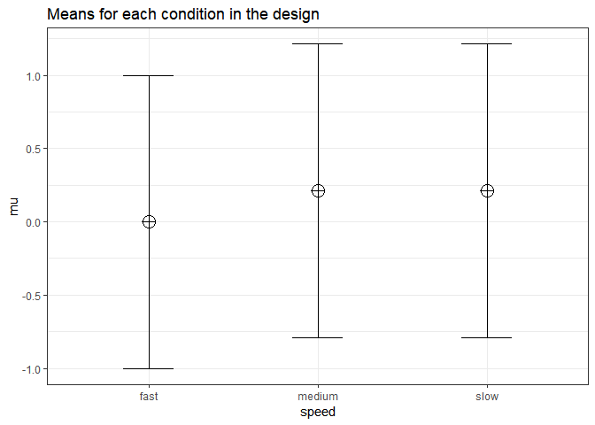

Partial eta-squared in SPSS and GPower
--------------------------------------

We can simulate within designs and calculate eta-squared. We set groups to 3 for the simulation, n = 20, and the correlation between dependent variables to 0.8. If the true effect size is f = 0.1, and the alpha level is 0.05, the power is 80.16%.

``` r
K <- 3
n <- 66
sd <- 1
r <- 0.8
alpha = 0.05
f <- 0.1
f2 <- f^2
ES <- f2/(f2+1)
ES
```

    ## [1] 0.00990099

``` r
mu <- mu_from_ES(K = K, ES = ES)

mu <- c(0, 0.2121321, 0.2121321)
sqrt(sum((mu-mean(mu))^2)/length(mu))/sd #Cohen, 1988, formula 8.2.1 and 8.2.2
```

    ## [1] 0.1

``` r
string = paste(K,"w",sep="")
p_adjust = "none"
labelnames <- c("speed", "fast", "medium", "slow")

design_result <- ANOVA_design(string = string,
                   n = n, 
                   mu = mu, 
                   sd = sd, 
                   r = r, 
                   p_adjust = "none",
                   labelnames = labelnames)
```



``` r
alpha_level <- 0.05

ANOVA_power(design_result, nsims = nsims)
```

    ## Power and Effect sizes for ANOVA tests
    ##             power effect size
    ## anova_speed    80      0.0843
    ## 
    ## Power and Effect sizes for contrasts
    ##                           power effect size
    ## p_speed_fast_speed_medium    77      0.3552
    ## p_speed_fast_speed_slow      75      0.3308
    ## p_speed_medium_speed_slow     8     -0.0217

``` r
#medium variability w 1000
#79.3
#79.6
#maximum variability w 1000
#80.5
#81.2
#maximum variability w 10000
#80.46
```

The results of the simulation are indeed very close to 80.16%.

If we take a look at the eta-squared effect size estimate, we see it is XX.XX. This illustrates the formula $f=\\sqrt{\\frac{(\\eta}{(1-\\eta)}}$ does not hold for within designs.

``` r
eta <- 0.1
f <- sqrt(eta/(1-eta))
f
```

    ## [1] 0.3333333

$f{G\*Power}^{2}=f\_{SPSS^{2}\\times\\frac{{N-k}{N}\\times\\frac{(m-1)}{m}\\times(1-\\rho)$
