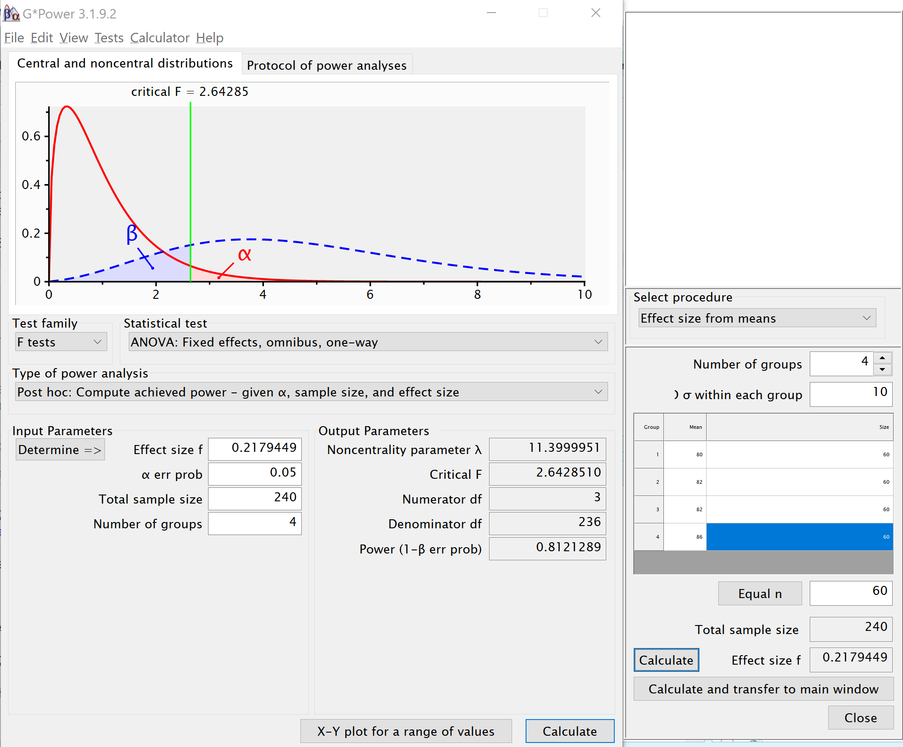
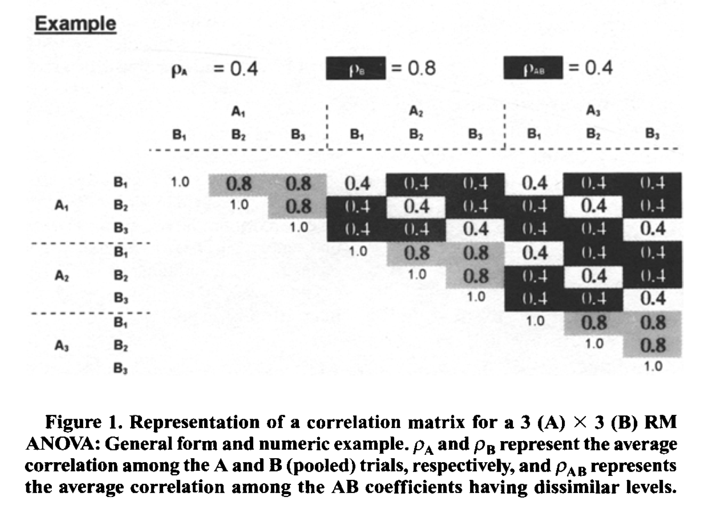

---
editor_options:
  chunk_output_type: console
output:
  pdf_document: default
---

```{r setup, include=TRUE}
knitr::opts_chunk$set(echo = TRUE)
nsims <- 100000 #set number of simulations
require(mvtnorm, quietly = TRUE)
require(MASS, quietly = TRUE)
require(afex, quietly = TRUE)
require(emmeans, quietly = TRUE)
require(ggplot2, quietly = TRUE)
require(gridExtra, quietly = TRUE)
require(reshape2, quietly = TRUE)
require(pwr, quietly = TRUE)

# Install functions from GitHub by running the code below:
source("https://raw.githubusercontent.com/Lakens/ANOVA_power_simulation/master/ANOVA_design.R")
source("https://raw.githubusercontent.com/Lakens/ANOVA_power_simulation/master/ANOVA_power.R")
source("https://raw.githubusercontent.com/chrisaberson/pwr2ppl/master/R/anova1f_4.R")
source("https://raw.githubusercontent.com/chrisaberson/pwr2ppl/master/R/anova2x2.R")
source("https://raw.githubusercontent.com/chrisaberson/pwr2ppl/master/R/win2F.R")
source("https://raw.githubusercontent.com/Lakens/ANOVA_power_simulation/master/helper_functions/power_oneway_between.R")
source("https://raw.githubusercontent.com/Lakens/ANOVA_power_simulation/master/helper_functions/power_twoway_between.R")
source("https://raw.githubusercontent.com/Lakens/ANOVA_power_simulation/master/helper_functions/power_2x2_within.R")

```

## Analytic power functions

For some designs it is possible to calculate power analytically, using closed functions. 

# One-Way Between Subject ANOVA

```{r}
string <- "4b"
n <- 60
mu <- c(80, 82, 82, 86) #All means are equal - so there is no real difference.
# Enter means in the order that matches the labels below.
sd <- 10
labelnames <- c("Factor_A", "a1", "a2", "a3", "a4") #
# the label names should be in the order of the means specified above.

design_result <- ANOVA_design(string = string,
                   n = n, 
                   mu = mu, 
                   sd = sd, 
                   labelnames = labelnames)

power_result <- ANOVA_power(design_result, alpha_level = 0.05, nsims = nsims)

```

We can also calculate power analytically with our own function.

```{r}

power_oneway_between(design_result)$power #using default alpha level of .05

```

This is a generalized function for One-Way ANOVA's for any number of groups. It is in part based on code provided with the excellent book by Aberson (2019) Applied Power Analysis for the Behavioral Sciences (but Aberson's code allows for different n per condition, and different sd per condition).

```{r}
anova1f_4(m1=80, m2=82, m3=82, m4=86,
          s1=10, s2=10, s3=10, s4=10, 
          n1=60, n2=60, n3=60, n4=60,
          alpha=.05)
```

We can also use the function in the pwr package. Note that we need to calculate f to use this function, which is based on the means and sd, as illustrated in the formulas above. 

```{r}
pwr.anova.test(n = 60,
               k = 4,
               f <- 0.2179449,
               sig.level = 0.05)
```

Finally, G*Power provides the option to calculate f from the means, sd and n for the cells. It can then be used to calculate power.



# Two-way Between Subject Interaction

```{r}
string <- "2b*2b"
n <- 20
mu <- c(20, 20, 20, 25) 
# Enter means in the order that matches the labels below.
sd <- 5
labelnames <- c("A", "a1", "a2", "B", "b1", "b2") #
# the label names should be in the order of the means specified above.

design_result <- ANOVA_design(string = string,
                   n = n, 
                   mu = mu, 
                   sd = sd, 
                   labelnames = labelnames)

power_result <- ANOVA_power(design_result, alpha_level = 0.05, nsims = nsims)

```

```{r}

power_res <- power_twoway_between(design_result) #using default alpha level of .05

power_res$power_A
power_res$power_B
power_res$power_AB

```

We can use the function by Aberson, 2019, as well. 

```{r}

anova2x2(m1.1=20,
         m1.2=20,
         m2.1=20,
         m2.2=25, 
         s1.1=5,
         s1.2=5,
         s2.1=5,
         s2.2=5,
         n1.1=20,
         n1.2=20,
         n2.1=20,
         n2.2=20, 
         alpha=.05, 
         all="OFF")
```

# 3x3 Between Subject ANOVA

```{r}
string <- "3b*3b"
n <- 20
mu <- c(20, 20, 20, 20, 20, 20, 20, 20, 25) #All means are equal - so there is no real difference.
# Enter means in the order that matches the labels below.
sd <- 5
labelnames <- c("Factor_A", "a1", "a2", "a3", "Factor_B", "b1", "b2", "b3") #
# the label names should be in the order of the means specified above.

design_result <- ANOVA_design(string = string,
                   n = n, 
                   mu = mu, 
                   sd = sd, 
                   labelnames = labelnames)

power_result <- ANOVA_power(design_result, alpha_level = 0.05, nsims = nsims)

```

```{r}

power_res <- power_twoway_between(design_result) #using default alpha level of .05

power_res$power_A
power_res$power_B
power_res$power_AB

```

## Two by two ANOVA, within design

Potvin & Schutz (2000) simulate a wide range of repeated measure designs. The give an example of a 3x3 design, with the following correlation matrix:



Variances were set to 1 (so all covariance matrices in their simulations were identical). In this specific example, the white fields are related to the correlation for the A main effect (these cells have the same level for B, but different levels of A). The grey cells are related to the main effect of B (the cells have the same level of A, but different levels of B). Finally, the black cells are related to the AxB interaction (they have different levels of A and B). The diagonal (all 1) relate to cells with the same levels of A and B. 

Potvin & Schulz (2000) examine power for 2x2 within ANOVA designs and develop approximations of the error variance. For a design with 2 within factors (A and B) these are: 

For the main effect of A:
$\sigma _ { e } ^ { 2 } = \sigma ^ { 2 } ( 1 - \overline { \rho } _ { A } ) + \sigma ^ { 2 } ( q - 1 ) ( \overline { \rho } _ { B } - \overline { \rho } _ { AB } )$

For the main effectof B:
$\sigma _ { e } ^ { 2 } = \sigma ^ { 2 } ( 1 - \overline { \rho } _ { B } ) + \sigma ^ { 2 } ( p - 1 ) ( \overline { \rho } _ { A } - \overline { \rho } _ { A B } )$

For the interaction between A and B:
$\sigma _ { e } ^ { 2 } = \sigma ^ { 2 } ( 1 - \rho _ { \max } ) - \sigma ^ { 2 } ( \overline { \rho } _ { \min } - \overline { \rho } _ { AB } )$
 
We first simulate a within subjects 2x2 ANOVA design.

```{r}
mu = c(2,1,4,2) 
n <- 20
sd <- 5
r <- c(
  0.8, 0.5, 0.4,
       0.4, 0.5,
            0.8
  )

string = "2w*2w"
labelnames = c("A", "a1", "a2", "B", "b1", "b2")
design_result <- ANOVA_design(string = string,
                              n = n, 
                              mu = mu, 
                              sd = sd, 
                              r = r, 
                              labelnames = labelnames)

simulation_result <- ANOVA_power(design_result, alpha = 0.05, nsims = nsims)
```

We can use the analytic solution based on the formula in Potvin & Schutz (2000). 

```{r}

power_res <- power_2x2_within(design_result = design_result)

power_res$power_A
power_res$power_B
power_res$power_AB

```

We see the 26.9 and 64.2, and 26.9 correspond to the results of the simulation quite closely. We can use the code by Abelson (2019) to produce the same results.

```{r}
win2F(m1.1=2, m2.1=1, m1.2=4, m2.2=2, 
      s1.1=5, s2.1=5, s1.2=5, s2.2=5, 
      r12=0.8, r13=0.5, r14=0.4, 
               r23=0.4, r24=0.5, 
                        r34=0.8,
      n=20)
```

