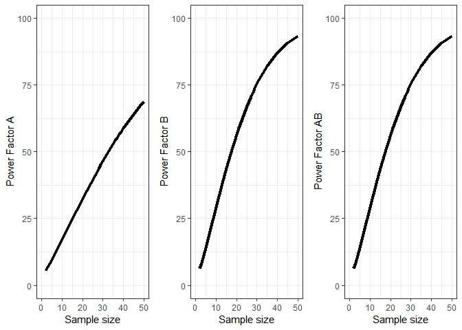
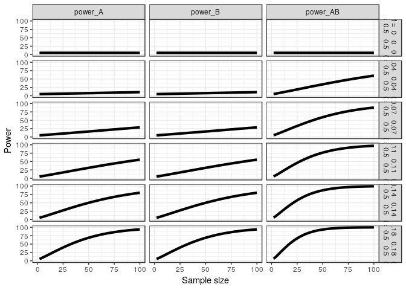
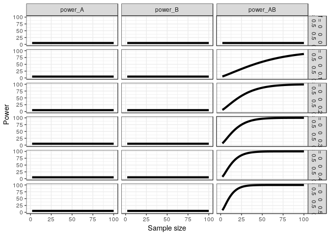
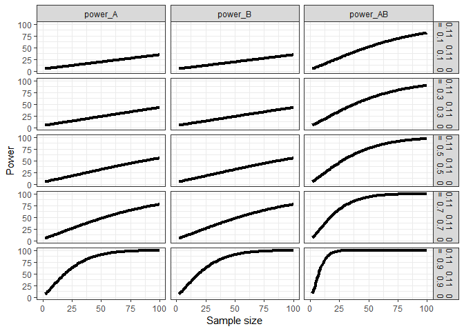
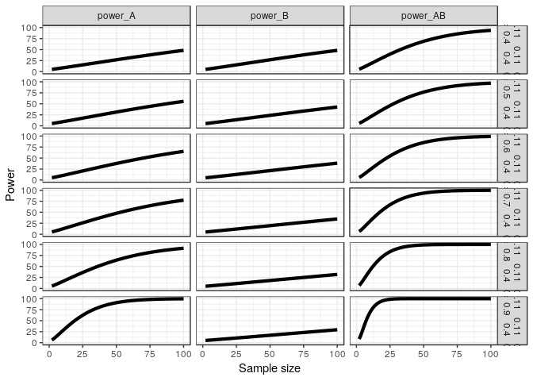

``` r
knitr::opts_chunk$set(echo = TRUE)

library(mvtnorm)
library(afex)
library(emmeans)
library(ggplot2)
library(gridExtra)
library(reshape2)
library(pwr)

# Install functions from GitHub by running the code below:
source("https://raw.githubusercontent.com/Lakens/ANOVA_power_simulation/master/helper_functions/plot_power_2x2_within.R")
```

Power curves
------------

Power is calculated for a specific value of an effect size, alpha level, and sample size. Because you often do not know the true effect size, it often makes more sense to think of the power curve as a function of the size of the effect. Although power curves can be calculated based on simulations for any design, we will use the analytic solution to calculate the power of ANOVA designs because these calculations are much faster. The basic approach is to calculate power for a specific pattern of means, a specific effect size, a given alpha level, and a specific pattern of correlations. This is one example:

``` r
#2x2 design
mu = c(0,0,0,0.5)
m_A = 2 # 2 levels of factor A
m_B = 2  # 2 levels of factor B
sigma = 1 
n = 20
rho_A = 0.5
rho_B = 0.5
rho_AB = 0.5
alpha = 0.05

power_res <- power_2x2_within(mu = mu, 
                              m_A = m_A, 
                              m_B = m_B, 
                              sigma = sigma, 
                              n = n, 
                              rho_A = rho_A, 
                              rho_B = rho_B, 
                              rho_AB = rho_AB, 
                              alpha = alpha)

power_res$pow_A
```

    ## [1] 0.3235926

``` r
power_res$pow_B
```

    ## [1] 0.3235926

``` r
power_res$pow_AB
```

    ## [1] 0.5645044

We can make these calculations for a range of sample sizes, to get a power curve. We created a simple function that performs these calculations across a range of sample sizes (from n = 2 to max\_, a variable you can specify in the function).

``` r
p_a <- plot_power_2x2_within(mu = c(0,0,0,0.5), 
                      m_A = 2, 
                      m_B = 2, 
                      sigma = 1, 
                      rho_A = 0.5, 
                      rho_B = 0.5, 
                      rho_AB = 0.5, 
                      alpha = 0.05,
                      max_n <- 50)

grid.arrange(p_a$p1, p_a$p2, p_a$p3, nrow = 1)
```



Explore increase in effect size for moderated interactions.
===========================================================

The design has means 0, 0, 0, 0, with one cell increasing by 0.1, up to 0, 0, 0, 0.5. The standard deviation is set to 1. The correlation between all variables is 0.5.

``` r
p_a <- plot_power_2x2_within(mu = c(0,0,0,0.0), 
                      m_A = 2, 
                      m_B = 2, 
                      sigma = 1, 
                      rho_A = 0.5, 
                      rho_B = 0.5, 
                      rho_AB = 0.5, 
                      alpha = 0.05,
                      max_n <- 100)

p_b <- plot_power_2x2_within(mu = c(0,0,0,0.1), 
                      m_A = 2, 
                      m_B = 2, 
                      sigma = 1, 
                      rho_A = 0.5, 
                      rho_B = 0.5, 
                      rho_AB = 0.5, 
                      alpha = 0.05,
                      max_n <- 100)

p_c <- plot_power_2x2_within(mu = c(0,0,0,0.2), 
                      m_A = 2, 
                      m_B = 2, 
                      sigma = 1, 
                      rho_A = 0.5, 
                      rho_B = 0.5, 
                      rho_AB = 0.5, 
                      alpha = 0.05,
                      max_n <- 100)

p_d <- plot_power_2x2_within(mu = c(0,0,0,0.3), 
                      m_A = 2, 
                      m_B = 2, 
                      sigma = 1, 
                      rho_A = 0.5, 
                      rho_B = 0.5, 
                      rho_AB = 0.5, 
                      alpha = 0.05,
                      max_n <- 100)

p_e <- plot_power_2x2_within(mu = c(0,0,0,0.4), 
                      m_A = 2, 
                      m_B = 2, 
                      sigma = 1, 
                      rho_A = 0.5, 
                      rho_B = 0.5, 
                      rho_AB = 0.5, 
                      alpha = 0.05,
                      max_n <- 100)

p_f <- plot_power_2x2_within(mu = c(0,0,0,0.5), 
                      m_A = 2, 
                      m_B = 2, 
                      sigma = 1, 
                      rho_A = 0.5, 
                      rho_B = 0.5, 
                      rho_AB = 0.5, 
                      alpha = 0.05,
                      max_n <- 100)

# Create long format dataframe 
zzz <- rbind(p_a$power_df, p_b$power_df, p_c$power_df, p_d$power_df, p_e$power_df, p_f$power_df)
zzz <- cbind(zzz,seq(1,length(zzz$design)))
colnames(zzz)[1] <- "design"
colnames(zzz)[6] <- "ID"
zzz <- melt(zzz, id.vars = c("ID", "design", "n_vec"), measure.vars = c("power_A", "power_B", "power_AB"))

# Plot data using facets, split by factors and interaction, and design
ggplot(data=zzz, aes(x = n_vec, y = value)) +
  geom_line( size=1.5) +
  scale_x_continuous(limits = c(0, max(zzz$n_vec))) + 
  scale_y_continuous(limits = c(0, 100)) +
  theme_bw() +
  labs(x="Sample size", y = "Power") +
  facet_grid(design~variable)
```



Explore increase in effect size for cross-over interactions.
============================================================

The design has means 0, 0, 0, 0, with two cells increasing by 0.1, up to 0.5, 0, 0, 0.5. The standard deviation is set to 1. The correlation between all variables is 0.5.

``` r
p_a <- plot_power_2x2_within(mu = c(0,0,0,0.0), 
                      m_A = 2, 
                      m_B = 2, 
                      sigma = 1, 
                      rho_A = 0.5, 
                      rho_B = 0.5, 
                      rho_AB = 0.5, 
                      alpha = 0.05,
                      max_n <- 100)

p_b <- plot_power_2x2_within(mu = c(0.1,0,0,0.1), 
                      m_A = 2, 
                      m_B = 2, 
                      sigma = 1, 
                      rho_A = 0.5, 
                      rho_B = 0.5, 
                      rho_AB = 0.5, 
                      alpha = 0.05,
                      max_n <- 100)

p_c <- plot_power_2x2_within(mu = c(0.2,0,0,0.2), 
                      m_A = 2, 
                      m_B = 2, 
                      sigma = 1, 
                      rho_A = 0.5, 
                      rho_B = 0.5, 
                      rho_AB = 0.5, 
                      alpha = 0.05,
                      max_n <- 100)

p_d <- plot_power_2x2_within(mu = c(0.3,0,0,0.3), 
                      m_A = 2, 
                      m_B = 2, 
                      sigma = 1, 
                      rho_A = 0.5, 
                      rho_B = 0.5, 
                      rho_AB = 0.5, 
                      alpha = 0.05,
                      max_n <- 100)

p_e <- plot_power_2x2_within(mu = c(0.4,0,0,0.4), 
                      m_A = 2, 
                      m_B = 2, 
                      sigma = 1, 
                      rho_A = 0.5, 
                      rho_B = 0.5, 
                      rho_AB = 0.5, 
                      alpha = 0.05,
                      max_n <- 100)

p_f <- plot_power_2x2_within(mu = c(0.5,0,0,0.5), 
                      m_A = 2, 
                      m_B = 2, 
                      sigma = 1, 
                      rho_A = 0.5, 
                      rho_B = 0.5, 
                      rho_AB = 0.5, 
                      alpha = 0.05,
                      max_n <- 100)

# Create long format dataframe 
zzz <- rbind(p_a$power_df, p_b$power_df, p_c$power_df, p_d$power_df, p_e$power_df, p_f$power_df)
zzz <- cbind(zzz,seq(1,length(zzz$design)))
colnames(zzz)[1] <- "design"
colnames(zzz)[6] <- "ID"
zzz <- melt(zzz, id.vars = c("ID", "design", "n_vec"), measure.vars = c("power_A", "power_B", "power_AB"))

# Plot data using facets, split by factors and interaction, and design
ggplot(data=zzz, aes(x = n_vec, y = value)) +
  geom_line( size=1.5) +
  scale_x_continuous(limits = c(0, max(zzz$n_vec))) + 
  scale_y_continuous(limits = c(0, 100)) +
  theme_bw() +
  labs(x="Sample size", y = "Power") +
  facet_grid(design~variable)
```



Explore increase in correlation in moderated interactions.
==========================================================

The design has means 0, 0, 0, 0.3. The standard deviation is set to 1. The correlation between all variables increases from 0.5 to 0.9.

``` r
p_a <- plot_power_2x2_within(mu = c(0,0,0,0.3), 
                      m_A = 2, 
                      m_B = 2, 
                      sigma = 1, 
                      rho_A = 0.1, 
                      rho_B = 0.1, 
                      rho_AB = 0.1, 
                      alpha = 0.05,
                      max_n <- 100)

p_b <- plot_power_2x2_within(mu = c(0,0,0,0.3), 
                      m_A = 2, 
                      m_B = 2, 
                      sigma = 1, 
                      rho_A = 0.3, 
                      rho_B = 0.3, 
                      rho_AB = 0.3, 
                      alpha = 0.05,
                      max_n <- 100)

p_c <- plot_power_2x2_within(mu = c(0,0,0,0.3), 
                      m_A = 2, 
                      m_B = 2, 
                      sigma = 1, 
                      rho_A = 0.5, 
                      rho_B = 0.5, 
                      rho_AB = 0.5, 
                      alpha = 0.05,
                      max_n <- 100)

p_d <- plot_power_2x2_within(mu = c(0,0,0,0.3), 
                      m_A = 2, 
                      m_B = 2, 
                      sigma = 1, 
                      rho_A = 0.7, 
                      rho_B = 0.7, 
                      rho_AB = 0.7, 
                      alpha = 0.05,
                      max_n <- 100)

p_e <- plot_power_2x2_within(mu = c(0,0,0,0.3), 
                      m_A = 2, 
                      m_B = 2, 
                      sigma = 1, 
                      rho_A = 0.9, 
                      rho_B = 0.9, 
                      rho_AB = 0.9, 
                      alpha = 0.05,
                      max_n <- 100)

p_f <- plot_power_2x2_within(mu = c(0,0,0,0.3), 
                      m_A = 2, 
                      m_B = 2, 
                      sigma = 1, 
                      rho_A = 0.5, 
                      rho_B = 0.5, 
                      rho_AB = 0.5, 
                      alpha = 0.05,
                      max_n <- 100)

# Create long format dataframe 
zzz <- rbind(p_a$power_df, p_b$power_df, p_c$power_df, p_d$power_df, p_e$power_df, p_f$power_df)
zzz <- cbind(zzz,seq(1,length(zzz$design)))
colnames(zzz)[1] <- "design"
colnames(zzz)[6] <- "ID"
zzz <- melt(zzz, id.vars = c("ID", "design", "n_vec"), measure.vars = c("power_A", "power_B", "power_AB"))

# Plot data using facets, split by factors and interaction, and design
ggplot(data=zzz, aes(x = n_vec, y = value)) +
  geom_line( size=1.5) +
  scale_x_continuous(limits = c(0, max(zzz$n_vec))) + 
  scale_y_continuous(limits = c(0, 100)) +
  theme_bw() +
  labs(x="Sample size", y = "Power") +
  facet_grid(design~variable)
```



``` r
p_a <- plot_power_2x2_within(mu = c(0,0,0,0.3), 
                      m_A = 2, 
                      m_B = 2, 
                      sigma = 1, 
                      rho_A = 0.4, 
                      rho_B = 0.4, 
                      rho_AB = 0.4, 
                      alpha = 0.05,
                      max_n <- 100)

p_b <- plot_power_2x2_within(mu = c(0,0,0,0.3), 
                      m_A = 2, 
                      m_B = 2, 
                      sigma = 1, 
                      rho_A = 0.5, 
                      rho_B = 0.4, 
                      rho_AB = 0.4, 
                      alpha = 0.05,
                      max_n <- 100)

p_c <- plot_power_2x2_within(mu = c(0,0,0,0.3), 
                      m_A = 2, 
                      m_B = 2, 
                      sigma = 1, 
                      rho_A = 0.6, 
                      rho_B = 0.4, 
                      rho_AB = 0.4, 
                      alpha = 0.05,
                      max_n <- 100)

p_d <- plot_power_2x2_within(mu = c(0,0,0,0.3), 
                      m_A = 2, 
                      m_B = 2, 
                      sigma = 1, 
                      rho_A = 0.7, 
                      rho_B = 0.4, 
                      rho_AB = 0.4, 
                      alpha = 0.05,
                      max_n <- 100)

p_e <- plot_power_2x2_within(mu = c(0,0,0,0.3), 
                      m_A = 2, 
                      m_B = 2, 
                      sigma = 1, 
                      rho_A = 0.8, 
                      rho_B = 0.4, 
                      rho_AB = 0.4, 
                      alpha = 0.05,
                      max_n <- 100)

p_f <- plot_power_2x2_within(mu = c(0,0,0,0.3), 
                      m_A = 2, 
                      m_B = 2, 
                      sigma = 1, 
                      rho_A = 0.9, 
                      rho_B = 0.4, 
                      rho_AB = 0.4, 
                      alpha = 0.05,
                      max_n <- 100)

# Create long format dataframe 
zzz <- rbind(p_a$power_df, p_b$power_df, p_c$power_df, p_d$power_df, p_e$power_df, p_f$power_df)
zzz <- cbind(zzz,seq(1,length(zzz$design)))
colnames(zzz)[1] <- "design"
colnames(zzz)[6] <- "ID"
zzz <- melt(zzz, id.vars = c("ID", "design", "n_vec"), measure.vars = c("power_A", "power_B", "power_AB"))

# Plot data using facets, split by factors and interaction, and design
ggplot(data=zzz, aes(x = n_vec, y = value)) +
  geom_line( size=1.5) +
  scale_x_continuous(limits = c(0, max(zzz$n_vec))) + 
  scale_y_continuous(limits = c(0, 100)) +
  theme_bw() +
  labs(x="Sample size", y = "Power") +
  facet_grid(design~variable)
```


