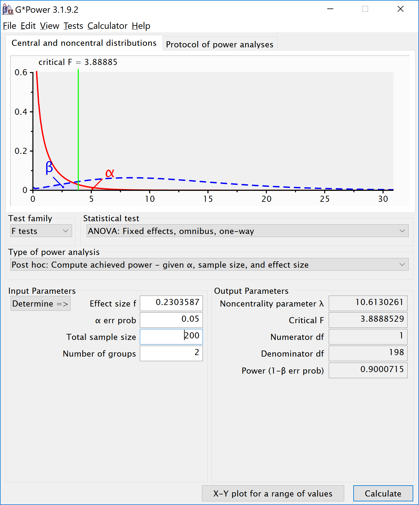

```{r setup, include=TRUE}
knitr::opts_chunk$set(echo = TRUE)
nsims <- 100000 #set number of simulations
library(mvtnorm, quietly = TRUE)
library(MASS, quietly = TRUE)
library(afex, quietly = TRUE)
library(emmeans, quietly = TRUE)
library(ggplot2, quietly = TRUE)
library(gridExtra, quietly = TRUE)
library(reshape2, quietly = TRUE)
library(pwr, quietly = TRUE)

# Install functions from GitHub by running the code below:
source("https://raw.githubusercontent.com/Lakens/ANOVA_power_simulation/master/ANOVA_design.R")
source("https://raw.githubusercontent.com/Lakens/ANOVA_power_simulation/master/ANOVA_power.R")
source("https://raw.githubusercontent.com/Lakens/ANOVA_power_simulation/master/helper_functions/power_oneway_between.R")
source("https://raw.githubusercontent.com/Lakens/ANOVA_power_simulation/master/helper_functions/power_twoway_between.R")
source("https://raw.githubusercontent.com/Lakens/ANOVA_power_simulation/master/helper_functions/power_threeway_between.R")
```

## Power for Three-way Interactions

There are almost no software solutions that allow researchers to perform power anaysis for more complex designs. Through simulation, it is relatively straightforward to examine the power for designs with multiple factors with many levels. 

Let's start with a 2x2x2 between subjects design. We collect 50 participants in each between participant condition (so 400 participants in total - 50x2x2x2). 

```{r}
# With 2x2x2 designs, the names for paired comparisons can become very long. 
# So here I abbreviate terms: Size, Color, and Cognitive Load, have values:
# b = big, s = small, g = green, r = red, pres = present, abs = absent.  
labelnames <- c("Size", "b", "s", "Color", "g", "r", 
                "Load", "pres", "abs") #

design_result <- ANOVA_design(string = "2b*2b*2b", #describe the design
                              n = 50, #sample size per group 
                              mu = c(2, 2, 6, 1, 6, 6, 1, 8), #pattern of means
                              sd = 10, #standard deviation
                              labelnames = labelnames) #names of labels

# Power based on simulations
ANOVA_power(design_result, nsims = nsims)

#Analytical power calculation
power_analytic <- power_threeway_between(design_result)

power_analytic$power_A
power_analytic$power_B
power_analytic$power_C
power_analytic$power_AB
power_analytic$power_AC
power_analytic$power_BC
power_analytic$power_ABC

power_analytic$eta_p_2_A
power_analytic$eta_p_2_B
power_analytic$eta_p_2_C
power_analytic$eta_p_2_AB
power_analytic$eta_p_2_AC
power_analytic$eta_p_2_BC
power_analytic$eta_p_2_ABC

```

We can also confirm the power analysis in GPower. GPower allows you to compute the power for a three-way interaction - if you know the Cohen's f value to enter. Cohen's f is calculated based on the means for the interaction, the sum of squares of the effect, and the sum of squares of the errors. This is quite a challenge by hand, but we can simulate the results, or use the analytical solution we programmed to get Cohen's f for the pattern of means that we specified. 

```{r}
# The power for the AC interaction (Size x Load) is 0.873535. 
power_analytic$power_AC
# We can enter the Cohen's f for this interaction. 
power_analytic$Cohen_f_AC
# We can double check the calculated lambda
power_analytic$lambda_AC
# We can double check the critical F value
power_analytic$F_critical_AC
```



A Three-Way ANOVA builds on the same principles as a One_Way ANOVA. We look at whether the differences between groups are large, compared to the standard deviation. For the main effects we simply have 2 groups of 200 participants, and 2 means. If the population standard deviations are identical across groups, this is not in any way different from a One-Way ANOVA. Indeed, we can show this by simulating a One-Way ANOVA, where instead of 8 conditions, we have two conditions, and we average over the 4 groups of the other two factors. For example, for the main effect of size above can be computed analytically. There might be a small difference in the degrees of freedom of the two tests, or it is just random variation (And it will disappear when repeating the simulation 1000.000 times instead of 100.000. 

```{r}
string <- "2b"
n <- 200
mu <- c(mean(c(2, 2, 6, 1)), mean(c(6, 6, 1, 8)))
sd <- 10
labelnames <- c("Size", "big", "small")

design_result <- ANOVA_design(string = string,
                   n = n, 
                   mu = mu, 
                   sd = sd, 
                   labelnames = labelnames)

# Power based on simulations
ANOVA_power(design_result, nsims = nsims)

# Power based on analytical solution
power_oneway_between(design_result)$power #using default alpha level of .05

```

Similarly, we can create a 2 factor design where we average over the third factor, and recreate the power analysis for the Two-Way interaction. For example, we can group over the Cognitive Load condition, and look at the Size by Color Interaction:

```{r}
string <- "2b*2b"
n <- 100
mu <- c(mean(c(1, 1)), mean(c(6, 1)), mean(c(6, 6)), mean(c(1, 6)))
sd <- 10
labelnames <- c("Size", "big", "small", "Color", "green", "red")

design_result <- ANOVA_design(string = string,
                   n = n, 
                   mu = mu, 
                   sd = sd, 
                   labelnames = labelnames)

# Power based on simulations
ANOVA_power(design_result, nsims = nsims)

# Power based on analytical solution
power_res <- power_twoway_between(design_result) #using default alpha level of .05

power_res$power_A
power_res$power_B
power_res$power_AB

```


```{r}
string <- "2b*2b*2b"
n <- 50
mu <- c(5, 3, 2, 6, 1, 4, 3, 1) 
sd <- 10
r <- 0.0
labelnames <- c("Size", "big", "small", "Color", "green", "red", 
                "CognitiveLoad", "present", "absent") #

design_result <- ANOVA_design(string = string,
                   n = n, 
                   mu = mu, 
                   sd = sd, 
                   labelnames = labelnames)

# Power for the given N in the design_result
ANOVA_power(design_result, nsims = nsims)

#Analytical power calculation
power_analytic <- power_threeway_between(design_result)

power_analytic$power_A
power_analytic$power_B
power_analytic$power_C
power_analytic$power_AB
power_analytic$power_AC
power_analytic$power_BC
power_analytic$power_ABC

power_analytic$eta_p_2_A
power_analytic$eta_p_2_B
power_analytic$eta_p_2_C
power_analytic$eta_p_2_AB
power_analytic$eta_p_2_AC
power_analytic$eta_p_2_BC
power_analytic$eta_p_2_ABC

```

