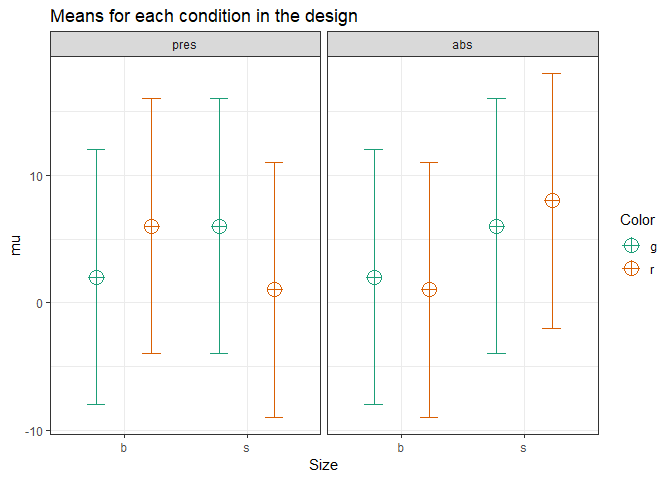
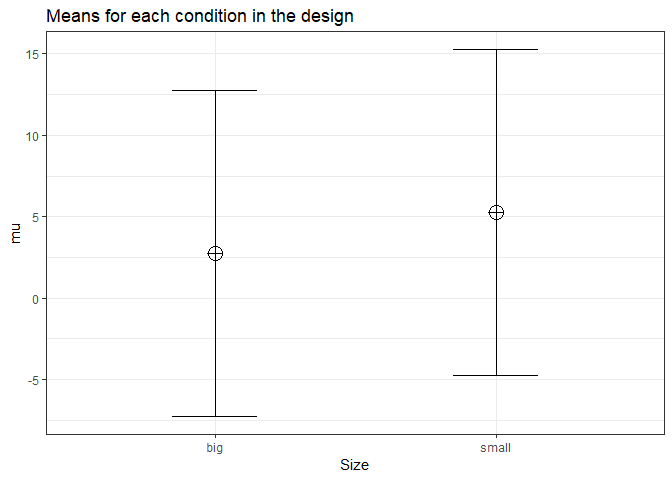
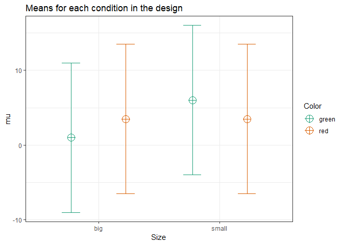
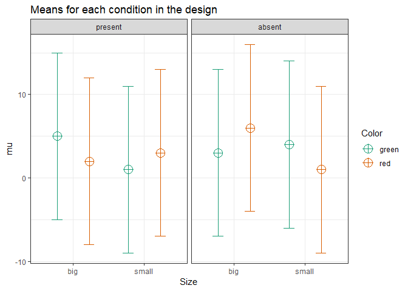

``` r
knitr::opts_chunk$set(echo = TRUE)
nsims <- 100000 #set number of simulations
library(mvtnorm, quietly = TRUE)
library(MASS, quietly = TRUE)
library(afex, quietly = TRUE)
```

    ## Warning: package 'afex' was built under R version 3.5.3

    ## Warning: package 'lme4' was built under R version 3.5.3

    ## ************
    ## Welcome to afex. For support visit: http://afex.singmann.science/

    ## - Functions for ANOVAs: aov_car(), aov_ez(), and aov_4()
    ## - Methods for calculating p-values with mixed(): 'KR', 'S', 'LRT', and 'PB'
    ## - 'afex_aov' and 'mixed' objects can be passed to emmeans() for follow-up tests
    ## - NEWS: library('emmeans') now needs to be called explicitly!
    ## - Get and set global package options with: afex_options()
    ## - Set orthogonal sum-to-zero contrasts globally: set_sum_contrasts()
    ## - For example analyses see: browseVignettes("afex")
    ## ************

    ## 
    ## Attaching package: 'afex'

    ## The following object is masked from 'package:lme4':
    ## 
    ##     lmer

``` r
library(emmeans, quietly = TRUE)
```

    ## Warning: package 'emmeans' was built under R version 3.5.3

``` r
library(ggplot2, quietly = TRUE)
library(gridExtra, quietly = TRUE)
library(reshape2, quietly = TRUE)
library(pwr, quietly = TRUE)

# Install functions from GitHub by running the code below:
source("https://raw.githubusercontent.com/Lakens/ANOVA_power_simulation/master/ANOVA_design.R")
source("https://raw.githubusercontent.com/Lakens/ANOVA_power_simulation/master/ANOVA_power.R")
source("https://raw.githubusercontent.com/Lakens/ANOVA_power_simulation/master/helper_functions/power_oneway_between.R")
source("https://raw.githubusercontent.com/Lakens/ANOVA_power_simulation/master/helper_functions/power_twoway_between.R")
source("https://raw.githubusercontent.com/Lakens/ANOVA_power_simulation/master/helper_functions/power_threeway_between.R")
```

Power for Three-way Interactions
--------------------------------

There are almost no software solutions that allow researchers to perform power anaysis for more complex designs. Through simulation, it is relatively straightforward to examine the power for designs with multiple factors with many levels.

Let's start with a 2x2x2 between subjects design. We collect 50 participants in each between participant condition (so 400 participants in total - 50x2x2x2).

``` r
# With 2x2x2 designs, the names for paired comparisons can become very long. 
# So here I abbreviate terms: Size, Color, and Cognitive Load, have values:
# b = big, s = small, g = green, r = red, pres = present, abs = absent.  
labelnames <- c("Size", "b", "s", "Color", "g", "r", 
                "Load", "pres", "abs") #

design_result <- ANOVA_design(string = "2b*2b*2b", #describe the design
                              n = 50, #sample size per group 
                              mu = c(2, 2, 6, 1, 6, 6, 1, 8), #pattern of means
                              sd = 10, #standard deviation
                              labelnames = labelnames) #names of labels
```



``` r
# Power based on simulations
ANOVA_power(design_result, nsims = nsims)
```

    ## Power and Effect sizes for ANOVA tests
    ##                        power effect size
    ## anova_Size            70.246      0.0157
    ## anova_Color            4.959      0.0011
    ## anova_Load             7.815      0.0015
    ## anova_Size:Color      32.177      0.0058
    ## anova_Size:Load       84.710      0.0224
    ## anova_Color:Load       7.943      0.0015
    ## anova_Size:Color:Load 84.981      0.0226
    ## 
    ## Power and Effect sizes for contrasts
    ##                                                      power effect size
    ## p_Size_b_Color_g_Load_pres_Size_b_Color_g_Load_abs   5.118      0.0007
    ## p_Size_b_Color_g_Load_pres_Size_b_Color_r_Load_pres 50.807      0.4035
    ## p_Size_b_Color_g_Load_pres_Size_b_Color_r_Load_abs   7.933     -0.1005
    ## p_Size_b_Color_g_Load_pres_Size_s_Color_g_Load_pres 50.979      0.4046
    ## p_Size_b_Color_g_Load_pres_Size_s_Color_g_Load_abs  50.883      0.4029
    ## p_Size_b_Color_g_Load_pres_Size_s_Color_r_Load_pres  8.060     -0.1012
    ## p_Size_b_Color_g_Load_pres_Size_s_Color_r_Load_abs  84.275      0.6046
    ## p_Size_b_Color_g_Load_abs_Size_b_Color_r_Load_pres  50.694      0.4028
    ## p_Size_b_Color_g_Load_abs_Size_b_Color_r_Load_abs    7.767     -0.1012
    ## p_Size_b_Color_g_Load_abs_Size_s_Color_g_Load_pres  50.889      0.4039
    ## p_Size_b_Color_g_Load_abs_Size_s_Color_g_Load_abs   50.699      0.4023
    ## p_Size_b_Color_g_Load_abs_Size_s_Color_r_Load_pres   7.920     -0.1020
    ## p_Size_b_Color_g_Load_abs_Size_s_Color_r_Load_abs   84.382      0.6040
    ## p_Size_b_Color_r_Load_pres_Size_b_Color_r_Load_abs  69.746     -0.5040
    ## p_Size_b_Color_r_Load_pres_Size_s_Color_g_Load_pres  4.947      0.0009
    ## p_Size_b_Color_r_Load_pres_Size_s_Color_g_Load_abs   4.962     -0.0005
    ## p_Size_b_Color_r_Load_pres_Size_s_Color_r_Load_pres 69.869     -0.5048
    ## p_Size_b_Color_r_Load_pres_Size_s_Color_r_Load_abs  16.768      0.2010
    ## p_Size_b_Color_r_Load_abs_Size_s_Color_g_Load_pres  69.821      0.5052
    ## p_Size_b_Color_r_Load_abs_Size_s_Color_g_Load_abs   69.585      0.5036
    ## p_Size_b_Color_r_Load_abs_Size_s_Color_r_Load_pres   5.081     -0.0007
    ## p_Size_b_Color_r_Load_abs_Size_s_Color_r_Load_abs   93.388      0.7052
    ## p_Size_s_Color_g_Load_pres_Size_s_Color_g_Load_abs   5.058     -0.0015
    ## p_Size_s_Color_g_Load_pres_Size_s_Color_r_Load_pres 70.019     -0.5058
    ## p_Size_s_Color_g_Load_pres_Size_s_Color_r_Load_abs  16.554      0.2000
    ## p_Size_s_Color_g_Load_abs_Size_s_Color_r_Load_pres  69.698     -0.5043
    ## p_Size_s_Color_g_Load_abs_Size_s_Color_r_Load_abs   16.758      0.2015
    ## p_Size_s_Color_r_Load_pres_Size_s_Color_r_Load_abs  93.333      0.7060

``` r
#Analytical power calculation
power_analytic <- power_threeway_between(design_result)

power_analytic$power_A
```

    ## [1] 0.7043808

``` r
power_analytic$power_B
```

    ## [1] 0.05

``` r
power_analytic$power_C
```

    ## [1] 0.07902683

``` r
power_analytic$power_AB
```

    ## [1] 0.3223971

``` r
power_analytic$power_AC
```

    ## [1] 0.8499987

``` r
power_analytic$power_BC
```

    ## [1] 0.07902683

``` r
power_analytic$power_ABC
```

    ## [1] 0.8499987

``` r
power_analytic$eta_p_2_A
```

    ## [1] 0.01542258

``` r
power_analytic$eta_p_2_B
```

    ## [1] 0

``` r
power_analytic$eta_p_2_C
```

    ## [1] 0.0006261741

``` r
power_analytic$eta_p_2_AB
```

    ## [1] 0.005607477

``` r
power_analytic$eta_p_2_AC
```

    ## [1] 0.02205882

``` r
power_analytic$eta_p_2_BC
```

    ## [1] 0.0006261741

``` r
power_analytic$eta_p_2_ABC
```

    ## [1] 0.02205882

We can also confirm the power analysis in GPower. GPower allows you to compute the power for a three-way interaction - if you know the Cohen's f value to enter. Cohen's f is calculated based on the means for the interaction, the sum of squares of the effect, and the sum of squares of the errors. This is quite a challenge by hand, but we can simulate the results, or use the analytical solution we programmed to get Cohen's f for the pattern of means that we specified.

``` r
# The power for the AC interaction (Size x Load) is 0.873535. 
power_analytic$power_AC
```

    ## [1] 0.8499987

``` r
# We can enter the Cohen's f for this interaction. 
power_analytic$Cohen_f_AC
```

    ## [1] 0.1501879

``` r
# We can double check the calculated lambda
power_analytic$lambda_AC
```

    ## [1] 9.022556

``` r
# We can double check the critical F value
power_analytic$F_critical_AC
```

    ## [1] 3.86529


A Three-Way ANOVA builds on the same principles as a One\_Way ANOVA. We look at whether the differences between groups are large, compared to the standard deviation. For the main effects we simply have 2 groups of 200 participants, and 2 means. If the population standard deviations are identical across groups, this is not in any way different from a One-Way ANOVA. Indeed, we can show this by simulating a One-Way ANOVA, where instead of 8 conditions, we have two conditions, and we average over the 4 groups of the other two factors. For example, for the main effect of size above can be computed analytically. There might be a small difference in the degrees of freedom of the two tests, or it is just random variation (And it will disappear when repeating the simulation 1000.000 times instead of 100.000.

``` r
string <- "2b"
n <- 200
mu <- c(mean(c(2, 2, 6, 1)), mean(c(6, 6, 1, 8)))
sd <- 10
labelnames <- c("Size", "big", "small")

design_result <- ANOVA_design(string = string,
                   n = n, 
                   mu = mu, 
                   sd = sd, 
                   labelnames = labelnames)
```



``` r
# Power based on simulations
ANOVA_power(design_result, nsims = nsims)
```

    ## Power and Effect sizes for ANOVA tests
    ##             power effect size
    ## anova_Size 70.228      0.0155
    ## 
    ## Power and Effect sizes for contrasts
    ##                        power effect size
    ## p_Size_big_Size_small 70.228      0.2502

``` r
# Power based on analytical solution
power_oneway_between(design_result)$power #using default alpha level of .05
```

    ## [1] 0.7033333

Similarly, we can create a 2 factor design where we average over the third factor, and recreate the power analysis for the Two-Way interaction. For example, we can group over the Cognitive Load condition, and look at the Size by Color Interaction:

``` r
string <- "2b*2b"
n <- 100
mu <- c(mean(c(1, 1)), mean(c(6, 1)), mean(c(6, 6)), mean(c(1, 6)))
sd <- 10
labelnames <- c("Size", "big", "small", "Color", "green", "red")

design_result <- ANOVA_design(string = string,
                   n = n, 
                   mu = mu, 
                   sd = sd, 
                   labelnames = labelnames)
```



``` r
# Power based on simulations
ANOVA_power(design_result, nsims = nsims)
```

    ## Power and Effect sizes for ANOVA tests
    ##                   power effect size
    ## anova_Size       70.318      0.0155
    ## anova_Color       5.061      0.0012
    ## anova_Size:Color 70.351      0.0156
    ## 
    ## Power and Effect sizes for contrasts
    ##                                                power effect size
    ## p_Size_big_Color_green_Size_big_Color_red     42.000      0.2506
    ## p_Size_big_Color_green_Size_small_Color_green 94.051      0.5016
    ## p_Size_big_Color_green_Size_small_Color_red   41.963      0.2505
    ## p_Size_big_Color_red_Size_small_Color_green   42.053      0.2510
    ## p_Size_big_Color_red_Size_small_Color_red      5.019      0.0000
    ## p_Size_small_Color_green_Size_small_Color_red 42.006     -0.2510

``` r
# Power based on analytical solution
power_res <- power_twoway_between(design_result) #using default alpha level of .05

power_res$power_A
```

    ## [1] 0.7033228

``` r
power_res$power_B
```

    ## [1] 0.05

``` r
power_res$power_AB
```

    ## [1] 0.7033228

``` r
string <- "2b*2b*2b"
n <- 50
mu <- c(5, 3, 2, 6, 1, 4, 3, 1) 
sd <- 10
r <- 0.0
labelnames <- c("Size", "big", "small", "Color", "green", "red", 
                "CognitiveLoad", "present", "absent") #

design_result <- ANOVA_design(string = string,
                   n = n, 
                   mu = mu, 
                   sd = sd, 
                   labelnames = labelnames)
```



``` r
# Power for the given N in the design_result
ANOVA_power(design_result, nsims = nsims)
```

    ## Power and Effect sizes for ANOVA tests
    ##                                 power effect size
    ## anova_Size                     41.082      0.0077
    ## anova_Color                     5.669      0.0012
    ## anova_CognitiveLoad            11.566      0.0020
    ## anova_Size:Color                5.740      0.0012
    ## anova_Size:CognitiveLoad        5.679      0.0012
    ## anova_Color:CognitiveLoad       5.697      0.0012
    ## anova_Size:Color:CognitiveLoad 78.410      0.0190
    ## 
    ## Power and Effect sizes for contrasts
    ##                                                                                             power
    ## p_Size_big_Color_green_CognitiveLoad_present_Size_big_Color_green_CognitiveLoad_absent     16.909
    ## p_Size_big_Color_green_CognitiveLoad_present_Size_big_Color_red_CognitiveLoad_present      31.653
    ## p_Size_big_Color_green_CognitiveLoad_present_Size_big_Color_red_CognitiveLoad_absent        7.850
    ## p_Size_big_Color_green_CognitiveLoad_present_Size_small_Color_green_CognitiveLoad_present  50.773
    ## p_Size_big_Color_green_CognitiveLoad_present_Size_small_Color_green_CognitiveLoad_absent    7.739
    ## p_Size_big_Color_green_CognitiveLoad_present_Size_small_Color_red_CognitiveLoad_present    16.640
    ## p_Size_big_Color_green_CognitiveLoad_present_Size_small_Color_red_CognitiveLoad_absent     50.726
    ## p_Size_big_Color_green_CognitiveLoad_absent_Size_big_Color_red_CognitiveLoad_present        7.803
    ## p_Size_big_Color_green_CognitiveLoad_absent_Size_big_Color_red_CognitiveLoad_absent        32.066
    ## p_Size_big_Color_green_CognitiveLoad_absent_Size_small_Color_green_CognitiveLoad_present   16.784
    ## p_Size_big_Color_green_CognitiveLoad_absent_Size_small_Color_green_CognitiveLoad_absent     7.974
    ## p_Size_big_Color_green_CognitiveLoad_absent_Size_small_Color_red_CognitiveLoad_present      4.943
    ## p_Size_big_Color_green_CognitiveLoad_absent_Size_small_Color_red_CognitiveLoad_absent      16.569
    ## p_Size_big_Color_red_CognitiveLoad_present_Size_big_Color_red_CognitiveLoad_absent         50.797
    ## p_Size_big_Color_red_CognitiveLoad_present_Size_small_Color_green_CognitiveLoad_present     7.798
    ## p_Size_big_Color_red_CognitiveLoad_present_Size_small_Color_green_CognitiveLoad_absent     16.861
    ## p_Size_big_Color_red_CognitiveLoad_present_Size_small_Color_red_CognitiveLoad_present       7.981
    ## p_Size_big_Color_red_CognitiveLoad_present_Size_small_Color_red_CognitiveLoad_absent        7.685
    ## p_Size_big_Color_red_CognitiveLoad_absent_Size_small_Color_green_CognitiveLoad_present     69.866
    ## p_Size_big_Color_red_CognitiveLoad_absent_Size_small_Color_green_CognitiveLoad_absent      16.674
    ## p_Size_big_Color_red_CognitiveLoad_absent_Size_small_Color_red_CognitiveLoad_present       31.768
    ## p_Size_big_Color_red_CognitiveLoad_absent_Size_small_Color_red_CognitiveLoad_absent        69.535
    ## p_Size_small_Color_green_CognitiveLoad_present_Size_small_Color_green_CognitiveLoad_absent 31.805
    ## p_Size_small_Color_green_CognitiveLoad_present_Size_small_Color_red_CognitiveLoad_present  16.703
    ## p_Size_small_Color_green_CognitiveLoad_present_Size_small_Color_red_CognitiveLoad_absent    4.948
    ## p_Size_small_Color_green_CognitiveLoad_absent_Size_small_Color_red_CognitiveLoad_present    7.913
    ## p_Size_small_Color_green_CognitiveLoad_absent_Size_small_Color_red_CognitiveLoad_absent    31.704
    ## p_Size_small_Color_red_CognitiveLoad_present_Size_small_Color_red_CognitiveLoad_absent     16.727
    ##                                                                                            effect size
    ## p_Size_big_Color_green_CognitiveLoad_present_Size_big_Color_green_CognitiveLoad_absent         -0.2025
    ## p_Size_big_Color_green_CognitiveLoad_present_Size_big_Color_red_CognitiveLoad_present          -0.3022
    ## p_Size_big_Color_green_CognitiveLoad_present_Size_big_Color_red_CognitiveLoad_absent            0.1013
    ## p_Size_big_Color_green_CognitiveLoad_present_Size_small_Color_green_CognitiveLoad_present      -0.4025
    ## p_Size_big_Color_green_CognitiveLoad_present_Size_small_Color_green_CognitiveLoad_absent       -0.0999
    ## p_Size_big_Color_green_CognitiveLoad_present_Size_small_Color_red_CognitiveLoad_present        -0.2008
    ## p_Size_big_Color_green_CognitiveLoad_present_Size_small_Color_red_CognitiveLoad_absent         -0.4022
    ## p_Size_big_Color_green_CognitiveLoad_absent_Size_big_Color_red_CognitiveLoad_present           -0.0999
    ## p_Size_big_Color_green_CognitiveLoad_absent_Size_big_Color_red_CognitiveLoad_absent             0.3038
    ## p_Size_big_Color_green_CognitiveLoad_absent_Size_small_Color_green_CognitiveLoad_present       -0.2002
    ## p_Size_big_Color_green_CognitiveLoad_absent_Size_small_Color_green_CognitiveLoad_absent         0.1026
    ## p_Size_big_Color_green_CognitiveLoad_absent_Size_small_Color_red_CognitiveLoad_present          0.0017
    ## p_Size_big_Color_green_CognitiveLoad_absent_Size_small_Color_red_CognitiveLoad_absent          -0.1998
    ## p_Size_big_Color_red_CognitiveLoad_present_Size_big_Color_red_CognitiveLoad_absent              0.4036
    ## p_Size_big_Color_red_CognitiveLoad_present_Size_small_Color_green_CognitiveLoad_present        -0.1003
    ## p_Size_big_Color_red_CognitiveLoad_present_Size_small_Color_green_CognitiveLoad_absent          0.2023
    ## p_Size_big_Color_red_CognitiveLoad_present_Size_small_Color_red_CognitiveLoad_present           0.1015
    ## p_Size_big_Color_red_CognitiveLoad_present_Size_small_Color_red_CognitiveLoad_absent           -0.1000
    ## p_Size_big_Color_red_CognitiveLoad_absent_Size_small_Color_green_CognitiveLoad_present         -0.5038
    ## p_Size_big_Color_red_CognitiveLoad_absent_Size_small_Color_green_CognitiveLoad_absent          -0.2011
    ## p_Size_big_Color_red_CognitiveLoad_absent_Size_small_Color_red_CognitiveLoad_present           -0.3020
    ## p_Size_big_Color_red_CognitiveLoad_absent_Size_small_Color_red_CognitiveLoad_absent            -0.5034
    ## p_Size_small_Color_green_CognitiveLoad_present_Size_small_Color_green_CognitiveLoad_absent      0.3027
    ## p_Size_small_Color_green_CognitiveLoad_present_Size_small_Color_red_CognitiveLoad_present       0.2017
    ## p_Size_small_Color_green_CognitiveLoad_present_Size_small_Color_red_CognitiveLoad_absent        0.0003
    ## p_Size_small_Color_green_CognitiveLoad_absent_Size_small_Color_red_CognitiveLoad_present       -0.1009
    ## p_Size_small_Color_green_CognitiveLoad_absent_Size_small_Color_red_CognitiveLoad_absent        -0.3023
    ## p_Size_small_Color_red_CognitiveLoad_present_Size_small_Color_red_CognitiveLoad_absent         -0.2014

``` r
#Analytical power calculation
power_analytic <- power_threeway_between(design_result)

power_analytic$power_A
```

    ## [1] 0.4161325

``` r
power_analytic$power_B
```

    ## [1] 0.0571728

``` r
power_analytic$power_C
```

    ## [1] 0.1163476

``` r
power_analytic$power_AB
```

    ## [1] 0.0571728

``` r
power_analytic$power_AC
```

    ## [1] 0.0571728

``` r
power_analytic$power_BC
```

    ## [1] 0.0571728

``` r
power_analytic$power_ABC
```

    ## [1] 0.7842808

``` r
power_analytic$eta_p_2_A
```

    ## [1] 0.007616975

``` r
power_analytic$eta_p_2_B
```

    ## [1] 0.0001566171

``` r
power_analytic$eta_p_2_C
```

    ## [1] 0.00140779

``` r
power_analytic$eta_p_2_AB
```

    ## [1] 0.0001566171

``` r
power_analytic$eta_p_2_AC
```

    ## [1] 0.0001566171

``` r
power_analytic$eta_p_2_BC
```

    ## [1] 0.0001566171

``` r
power_analytic$eta_p_2_ABC
```

    ## [1] 0.01860108
