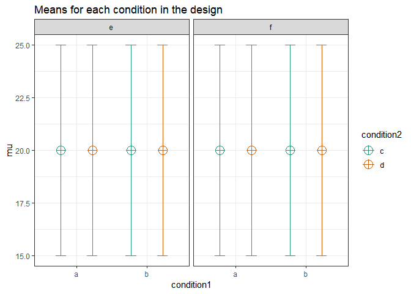

``` r
knitr::opts_chunk$set(echo = TRUE)
nsims <- 5000 #set number of simulations
library(mvtnorm)
library(afex)
```

    ## Loading required package: lme4

    ## Loading required package: Matrix

    ## ************
    ## Welcome to afex. For support visit: http://afex.singmann.science/

    ## - Functions for ANOVAs: aov_car(), aov_ez(), and aov_4()
    ## - Methods for calculating p-values with mixed(): 'KR', 'S', 'LRT', and 'PB'
    ## - 'afex_aov' and 'mixed' objects can be passed to emmeans() for follow-up tests
    ## - NEWS: library('emmeans') now needs to be called explicitly!
    ## - Get and set global package options with: afex_options()
    ## - Set orthogonal sum-to-zero contrasts globally: set_sum_contrasts()
    ## - For example analyses see: browseVignettes("afex")
    ## ************

    ## 
    ## Attaching package: 'afex'

    ## The following object is masked from 'package:lme4':
    ## 
    ##     lmer

``` r
library(emmeans)
library(ggplot2)
library(gridExtra)
library(reshape2)
library(pwr)

# Install functions from GitHub by running the code below:
source("https://raw.githubusercontent.com/Lakens/ANOVA_power_simulation/master/ANOVA_design.R")
source("https://raw.githubusercontent.com/Lakens/ANOVA_power_simulation/master/ANOVA_power.R")
source("https://raw.githubusercontent.com/Lakens/ANOVA_power_simulation/master/mu_from_ES.R")
```

Error Control in Exploratory ANOVA
----------------------------------

In a 2X2X2 design, an ANOVA will give the test results for three main effects, three two-way interactions, and one three-way interaction. That’s 7 statistical tests. The probability of making at least one Type 1 error in a single 2x2x2 ANOVA is 1-(0.95)^7 = 30%.

``` r
string <- "2b*2b*2b"
n <- 50
mu <- c(20, 20, 20, 20, 20, 20, 20, 20) #All means are equal - so there is no real difference.
# Enter means in the order that matches the labels below.
sd <- 5
r <- 0 
# (note that since we simulate a between design, the correlation between variables 
# will be 0, regardless of what you enter here, but the value must be set).
p_adjust = "none"
# "none" means we do not correct for multiple comparisons
labelnames <- c("condition1", "a", "b", "condition2", "c", "d", "condition3", "e", "f") #
# the label names should be in the order of the means specified above.

design_result <- ANOVA_design(string = string,
                   n = n, 
                   mu = mu, 
                   sd = sd, 
                   r = r, 
                   p_adjust = p_adjust,
                   labelnames = labelnames)
```



``` r
alpha_level <- 0.05
#We set the alpha level at 0.05. 

power_result <- ANOVA_power(design_result, alpha_level = alpha_level, nsims = nsims)
```

    ## Power and Effect sizes for ANOVA tests
    ##                                        power effect size
    ## anova_condition1                        5.66      0.0012
    ## anova_condition2                        4.92      0.0011
    ## anova_condition3                        5.16      0.0011
    ## anova_condition1:condition2             4.46      0.0012
    ## anova_condition1:condition3             4.78      0.0011
    ## anova_condition2:condition3             5.26      0.0011
    ## anova_condition1:condition2:condition3  4.78      0.0012
    ## 
    ## Power and Effect sizes for contrasts
    ##                                                                                 power
    ## p_condition1_a_condition2_c_condition3_e_condition1_a_condition2_c_condition3_f  4.62
    ## p_condition1_a_condition2_c_condition3_e_condition1_a_condition2_d_condition3_e  5.08
    ## p_condition1_a_condition2_c_condition3_e_condition1_a_condition2_d_condition3_f  4.58
    ## p_condition1_a_condition2_c_condition3_e_condition1_b_condition2_c_condition3_e  5.10
    ## p_condition1_a_condition2_c_condition3_e_condition1_b_condition2_c_condition3_f  4.88
    ## p_condition1_a_condition2_c_condition3_e_condition1_b_condition2_d_condition3_e  5.48
    ## p_condition1_a_condition2_c_condition3_e_condition1_b_condition2_d_condition3_f  5.16
    ## p_condition1_a_condition2_c_condition3_f_condition1_a_condition2_d_condition3_e  4.84
    ## p_condition1_a_condition2_c_condition3_f_condition1_a_condition2_d_condition3_f  4.56
    ## p_condition1_a_condition2_c_condition3_f_condition1_b_condition2_c_condition3_e  4.86
    ## p_condition1_a_condition2_c_condition3_f_condition1_b_condition2_c_condition3_f  4.90
    ## p_condition1_a_condition2_c_condition3_f_condition1_b_condition2_d_condition3_e  4.78
    ## p_condition1_a_condition2_c_condition3_f_condition1_b_condition2_d_condition3_f  4.66
    ## p_condition1_a_condition2_d_condition3_e_condition1_a_condition2_d_condition3_f  5.40
    ## p_condition1_a_condition2_d_condition3_e_condition1_b_condition2_c_condition3_e  5.16
    ## p_condition1_a_condition2_d_condition3_e_condition1_b_condition2_c_condition3_f  5.36
    ## p_condition1_a_condition2_d_condition3_e_condition1_b_condition2_d_condition3_e  5.82
    ## p_condition1_a_condition2_d_condition3_e_condition1_b_condition2_d_condition3_f  5.24
    ## p_condition1_a_condition2_d_condition3_f_condition1_b_condition2_c_condition3_e  4.78
    ## p_condition1_a_condition2_d_condition3_f_condition1_b_condition2_c_condition3_f  4.94
    ## p_condition1_a_condition2_d_condition3_f_condition1_b_condition2_d_condition3_e  4.94
    ## p_condition1_a_condition2_d_condition3_f_condition1_b_condition2_d_condition3_f  4.92
    ## p_condition1_b_condition2_c_condition3_e_condition1_b_condition2_c_condition3_f  4.68
    ## p_condition1_b_condition2_c_condition3_e_condition1_b_condition2_d_condition3_e  5.18
    ## p_condition1_b_condition2_c_condition3_e_condition1_b_condition2_d_condition3_f  4.68
    ## p_condition1_b_condition2_c_condition3_f_condition1_b_condition2_d_condition3_e  5.06
    ## p_condition1_b_condition2_c_condition3_f_condition1_b_condition2_d_condition3_f  4.56
    ## p_condition1_b_condition2_d_condition3_e_condition1_b_condition2_d_condition3_f  4.96
    ##                                                                                 effect size
    ## p_condition1_a_condition2_c_condition3_e_condition1_a_condition2_c_condition3_f     -0.0004
    ## p_condition1_a_condition2_c_condition3_e_condition1_a_condition2_d_condition3_e      0.0015
    ## p_condition1_a_condition2_c_condition3_e_condition1_a_condition2_d_condition3_f      0.0015
    ## p_condition1_a_condition2_c_condition3_e_condition1_b_condition2_c_condition3_e      0.0007
    ## p_condition1_a_condition2_c_condition3_e_condition1_b_condition2_c_condition3_f      0.0018
    ## p_condition1_a_condition2_c_condition3_e_condition1_b_condition2_d_condition3_e      0.0009
    ## p_condition1_a_condition2_c_condition3_e_condition1_b_condition2_d_condition3_f      0.0006
    ## p_condition1_a_condition2_c_condition3_f_condition1_a_condition2_d_condition3_e      0.0016
    ## p_condition1_a_condition2_c_condition3_f_condition1_a_condition2_d_condition3_f      0.0020
    ## p_condition1_a_condition2_c_condition3_f_condition1_b_condition2_c_condition3_e      0.0013
    ## p_condition1_a_condition2_c_condition3_f_condition1_b_condition2_c_condition3_f      0.0017
    ## p_condition1_a_condition2_c_condition3_f_condition1_b_condition2_d_condition3_e      0.0014
    ## p_condition1_a_condition2_c_condition3_f_condition1_b_condition2_d_condition3_f      0.0010
    ## p_condition1_a_condition2_d_condition3_e_condition1_a_condition2_d_condition3_f      0.0003
    ## p_condition1_a_condition2_d_condition3_e_condition1_b_condition2_c_condition3_e     -0.0005
    ## p_condition1_a_condition2_d_condition3_e_condition1_b_condition2_c_condition3_f      0.0004
    ## p_condition1_a_condition2_d_condition3_e_condition1_b_condition2_d_condition3_e     -0.0003
    ## p_condition1_a_condition2_d_condition3_e_condition1_b_condition2_d_condition3_f     -0.0009
    ## p_condition1_a_condition2_d_condition3_f_condition1_b_condition2_c_condition3_e     -0.0008
    ## p_condition1_a_condition2_d_condition3_f_condition1_b_condition2_c_condition3_f      0.0001
    ## p_condition1_a_condition2_d_condition3_f_condition1_b_condition2_d_condition3_e     -0.0008
    ## p_condition1_a_condition2_d_condition3_f_condition1_b_condition2_d_condition3_f     -0.0009
    ## p_condition1_b_condition2_c_condition3_e_condition1_b_condition2_c_condition3_f      0.0008
    ## p_condition1_b_condition2_c_condition3_e_condition1_b_condition2_d_condition3_e      0.0002
    ## p_condition1_b_condition2_c_condition3_e_condition1_b_condition2_d_condition3_f     -0.0003
    ## p_condition1_b_condition2_c_condition3_f_condition1_b_condition2_d_condition3_e     -0.0008
    ## p_condition1_b_condition2_c_condition3_f_condition1_b_condition2_d_condition3_f     -0.0010
    ## p_condition1_b_condition2_d_condition3_e_condition1_b_condition2_d_condition3_f     -0.0004

When there is no true effect, we formally do not have 'power' (which is defined as the probability of finding p &lt; *α* if there is a true effect to be found) so the power column should be read as the 'Type 1 error rate'. Because we have saved the power simulation in the 'power\_result' object, we can perform calculations on the 'sim\_data' dataframe that is stored. This dataframe contains the results for the nsims simulations (e.g., 10000 rows if you ran 10000 simulations) and stores the p-values and effect size estimates for each ANOVA. We can look at the first few rows of the sim\_data dataframe, of which the first 7 columns are the p-values for the ANOVA, first the main effects of condition 1, 2, and 3, tthen three two-way interactions, and finally the threeway interaction:

``` r
head(power_result$sim_data)
```

    ##   anova_condition1 anova_condition2 anova_condition3
    ## 1        0.2465512       0.58504603        0.6866832
    ## 2        0.8422236       0.61470909        0.9509757
    ## 3        0.2289669       0.53079162        0.7798772
    ## 4        0.2231777       0.09048565        0.4038818
    ## 5        0.8115504       0.19337982        0.2126455
    ## 6        0.9323750       0.09970518        0.3345507
    ##   anova_condition1:condition2 anova_condition1:condition3
    ## 1                   0.5025463                   0.2654619
    ## 2                   0.7089845                   0.3275856
    ## 3                   0.2336485                   0.5353193
    ## 4                   0.2385454                   0.7353383
    ## 5                   0.2964408                   0.6915298
    ## 6                   0.8014968                   0.8031138
    ##   anova_condition2:condition3 anova_condition1:condition2:condition3
    ## 1                  0.03856801                              0.2698207
    ## 2                  0.35346660                              0.8560047
    ## 3                  0.61621292                              0.4350656
    ## 4                  0.57182558                              0.6282905
    ## 5                  0.90951687                              0.9930215
    ## 6                  0.79943881                              0.3145905
    ##   anova_es_condition1 anova_es_condition2 anova_es_condition3
    ## 1       0.00342385484        0.0007612615      0.000415493130
    ## 2       0.00010119770        0.0006469786      0.000009655087
    ## 3       0.00368989567        0.0010030099      0.000199490938
    ## 4       0.00378291256        0.0072930906      0.001778079465
    ## 5       0.00014519281        0.0043116910      0.003959755310
    ## 6       0.00001839249        0.0068988229      0.002375720890
    ##   anova_es_condition1:condition2 anova_es_condition1:condition3
    ## 1                   0.0011476288                   0.0031624124
    ## 2                   0.0003557305                   0.0024450718
    ## 3                   0.0036167135                   0.0009810863
    ## 4                   0.0035420329                   0.0002918251
    ## 5                   0.0027806373                   0.0004020497
    ## 6                   0.0001614356                   0.0001587615
    ##   anova_es_condition2:condition3 anova_es_condition1:condition2:condition3
    ## 1                  0.01087223086                           0.0031054034154
    ## 2                  0.00219674555                           0.0000841051576
    ## 3                  0.00064149552                           0.0015550146771
    ## 4                  0.00081610920                           0.0005985075599
    ## 5                  0.00003299012                           0.0000001953989
    ## 6                  0.00016487342                           0.0025798168425
    ##   p_condition1_a_condition2_c_condition3_e_condition1_a_condition2_c_condition3_f
    ## 1                                                                      0.03447474
    ## 2                                                                      0.93433087
    ## 3                                                                      0.76407342
    ## 4                                                                      0.61191570
    ## 5                                                                      0.40975991
    ## 6                                                                      0.78289839
    ##   p_condition1_a_condition2_c_condition3_e_condition1_a_condition2_d_condition3_e
    ## 1                                                                       0.3486659
    ## 2                                                                       0.9498277
    ## 3                                                                       0.8861365
    ## 4                                                                       0.8379037
    ## 5                                                                       0.8561099
    ## 6                                                                       0.2483104
    ##   p_condition1_a_condition2_c_condition3_e_condition1_a_condition2_d_condition3_f
    ## 1                                                                       0.7904330
    ## 2                                                                       0.3432388
    ## 3                                                                       0.9094913
    ## 4                                                                       0.3958060
    ## 5                                                                       0.3752839
    ## 6                                                                       0.7200884
    ##   p_condition1_a_condition2_c_condition3_e_condition1_b_condition2_c_condition3_e
    ## 1                                                                       0.8269140
    ## 2                                                                       0.3868114
    ## 3                                                                       0.4939205
    ## 4                                                                       0.4848215
    ## 5                                                                       0.6500224
    ## 6                                                                       0.5746113
    ##   p_condition1_a_condition2_c_condition3_e_condition1_b_condition2_c_condition3_f
    ## 1                                                                       0.9343420
    ## 2                                                                       0.8411730
    ## 3                                                                       0.7078785
    ## 4                                                                       0.3545751
    ## 5                                                                       0.9696963
    ## 6                                                                       0.6710608
    ##   p_condition1_a_condition2_c_condition3_e_condition1_b_condition2_d_condition3_e
    ## 1                                                                       0.4395284
    ## 2                                                                       0.7089372
    ## 3                                                                       0.3475627
    ## 4                                                                       0.9051090
    ## 5                                                                       0.4257611
    ## 6                                                                       0.2853417
    ##   p_condition1_a_condition2_c_condition3_e_condition1_b_condition2_d_condition3_f
    ## 1                                                                       0.6089280
    ## 2                                                                       0.7014474
    ## 3                                                                       0.2266245
    ## 4                                                                       0.3980344
    ## 5                                                                       0.2639440
    ## 6                                                                       0.4053248
    ##   p_condition1_a_condition2_c_condition3_f_condition1_a_condition2_d_condition3_e
    ## 1                                                                       0.3619812
    ## 2                                                                       0.9838916
    ## 3                                                                       0.6535386
    ## 4                                                                       0.7338457
    ## 5                                                                       0.4923725
    ## 6                                                                       0.3264195
    ##   p_condition1_a_condition2_c_condition3_f_condition1_a_condition2_d_condition3_f
    ## 1                                                                      0.02431583
    ## 2                                                                      0.38790912
    ## 3                                                                      0.67262295
    ## 4                                                                      0.73657397
    ## 5                                                                      0.94378457
    ## 6                                                                      0.93644344
    ##   p_condition1_a_condition2_c_condition3_f_condition1_b_condition2_c_condition3_e
    ## 1                                                                      0.05415434
    ## 2                                                                      0.43255128
    ## 3                                                                      0.70382245
    ## 4                                                                      0.19956636
    ## 5                                                                      0.18658179
    ## 6                                                                      0.75742333
    ##   p_condition1_a_condition2_c_condition3_f_condition1_b_condition2_c_condition3_f
    ## 1                                                                      0.04078973
    ## 2                                                                      0.77637238
    ## 3                                                                      0.50330986
    ## 4                                                                      0.13016706
    ## 5                                                                      0.42076491
    ## 6                                                                      0.45558846
    ##   p_condition1_a_condition2_c_condition3_f_condition1_b_condition2_d_condition3_e
    ## 1                                                                       0.2163238
    ## 2                                                                       0.7716481
    ## 3                                                                       0.5256003
    ## 4                                                                       0.6562764
    ## 5                                                                       0.9300048
    ## 6                                                                       0.3804275
    ##   p_condition1_a_condition2_c_condition3_f_condition1_b_condition2_d_condition3_f
    ## 1                                                                       0.0151998
    ## 2                                                                       0.7602279
    ## 3                                                                       0.3796449
    ## 4                                                                       0.7147622
    ## 5                                                                       0.7898321
    ## 6                                                                       0.5327930
    ##   p_condition1_a_condition2_d_condition3_e_condition1_a_condition2_d_condition3_f
    ## 1                                                                       0.2599194
    ## 2                                                                       0.3717039
    ## 3                                                                       0.9747048
    ## 4                                                                       0.4730395
    ## 5                                                                       0.4513861
    ## 6                                                                       0.3434734
    ##   p_condition1_a_condition2_d_condition3_e_condition1_b_condition2_c_condition3_e
    ## 1                                                                       0.4485904
    ## 2                                                                       0.4167884
    ## 3                                                                       0.3998937
    ## 4                                                                       0.3266749
    ## 5                                                                       0.5004019
    ## 6                                                                       0.4590406
    ##   p_condition1_a_condition2_d_condition3_e_condition1_b_condition2_c_condition3_f
    ## 1                                                                       0.3385526
    ## 2                                                                       0.7902210
    ## 3                                                                       0.8092849
    ## 4                                                                       0.2218033
    ## 5                                                                       0.8840298
    ## 6                                                                       0.1157150
    ##   p_condition1_a_condition2_d_condition3_e_condition1_b_condition2_d_condition3_e
    ## 1                                                                       0.8272496
    ## 2                                                                       0.7540657
    ## 3                                                                       0.2704976
    ## 4                                                                       0.9206355
    ## 5                                                                       0.5162417
    ## 6                                                                       0.8519387
    ##   p_condition1_a_condition2_d_condition3_e_condition1_b_condition2_d_condition3_f
    ## 1                                                                       0.1865141
    ## 2                                                                       0.7437989
    ## 3                                                                       0.1634312
    ## 4                                                                       0.4740063
    ## 5                                                                       0.3211489
    ## 6                                                                       0.6999896
    ##   p_condition1_a_condition2_d_condition3_f_condition1_b_condition2_c_condition3_e
    ## 1                                                                       0.6356643
    ## 2                                                                       0.9726152
    ## 3                                                                       0.4126406
    ## 4                                                                       0.0879435
    ## 5                                                                       0.1675738
    ## 6                                                                       0.8085029
    ##   p_condition1_a_condition2_d_condition3_f_condition1_b_condition2_c_condition3_f
    ## 1                                                                      0.86497808
    ## 2                                                                      0.24184366
    ## 3                                                                      0.78378225
    ## 4                                                                      0.05222243
    ## 5                                                                      0.38496665
    ## 6                                                                      0.39427704
    ##   p_condition1_a_condition2_d_condition3_f_condition1_b_condition2_d_condition3_e
    ## 1                                                                       0.3256408
    ## 2                                                                       0.5657646
    ## 3                                                                       0.2792867
    ## 4                                                                       0.3985073
    ## 5                                                                       0.8710721
    ## 6                                                                       0.4015787
    ##   p_condition1_a_condition2_d_condition3_f_condition1_b_condition2_d_condition3_f
    ## 1                                                                       0.8088573
    ## 2                                                                       0.6184464
    ## 3                                                                       0.1687728
    ## 4                                                                       0.9511693
    ## 5                                                                       0.8484662
    ## 6                                                                       0.5648568
    ##   p_condition1_b_condition2_c_condition3_e_condition1_b_condition2_c_condition3_f
    ## 1                                                                       0.7753048
    ## 2                                                                       0.2820826
    ## 3                                                                       0.2932915
    ## 4                                                                       0.8035217
    ## 5                                                                       0.6129602
    ## 6                                                                       0.2932640
    ##   p_condition1_b_condition2_c_condition3_e_condition1_b_condition2_d_condition3_e
    ## 1                                                                       0.5646581
    ## 2                                                                       0.6111404
    ## 3                                                                       0.7973169
    ## 4                                                                       0.3644651
    ## 5                                                                       0.1811577
    ## 6                                                                       0.5438748
    ##   p_condition1_b_condition2_c_condition3_e_condition1_b_condition2_d_condition3_f
    ## 1                                                                      0.47477382
    ## 2                                                                      0.65813093
    ## 3                                                                      0.63613169
    ## 4                                                                      0.10075406
    ## 5                                                                      0.09907163
    ## 6                                                                      0.72319267
    ##   p_condition1_b_condition2_c_condition3_f_condition1_b_condition2_d_condition3_e
    ## 1                                                                       0.4234839
    ## 2                                                                       0.5610191
    ## 3                                                                       0.1927544
    ## 4                                                                       0.2486771
    ## 5                                                                       0.4374441
    ## 6                                                                       0.1254573
    ##   p_condition1_b_condition2_c_condition3_f_condition1_b_condition2_d_condition3_f
    ## 1                                                                      0.68635324
    ## 2                                                                      0.56254217
    ## 3                                                                      0.11031749
    ## 4                                                                      0.06216689
    ## 5                                                                      0.26922515
    ## 6                                                                      0.20042089
    ##   p_condition1_b_condition2_d_condition3_e_condition1_b_condition2_d_condition3_f
    ## 1                                                                       0.2322621
    ## 2                                                                       0.9735679
    ## 3                                                                       0.8445386
    ## 4                                                                       0.4061452
    ## 5                                                                       0.7054757
    ## 6                                                                       0.8243839
    ##   d_condition1_a_condition2_c_condition3_e_condition1_a_condition2_c_condition3_f
    ## 1                                                                      0.42887801
    ## 2                                                                     -0.01652182
    ## 3                                                                      0.06019441
    ## 4                                                                     -0.10179446
    ## 5                                                                     -0.16557248
    ## 6                                                                     -0.05526029
    ##   d_condition1_a_condition2_c_condition3_e_condition1_a_condition2_d_condition3_e
    ## 1                                                                      0.18833841
    ## 2                                                                     -0.01261691
    ## 3                                                                     -0.02871357
    ## 4                                                                     -0.04102404
    ## 5                                                                     -0.03636135
    ## 6                                                                     -0.23227500
    ##   d_condition1_a_condition2_c_condition3_e_condition1_a_condition2_d_condition3_f
    ## 1                                                                     -0.05329509
    ## 2                                                                     -0.19047940
    ## 3                                                                     -0.02279488
    ## 4                                                                     -0.17057584
    ## 5                                                                     -0.17813540
    ## 6                                                                     -0.07187482
    ##   d_condition1_a_condition2_c_condition3_e_condition1_b_condition2_c_condition3_e
    ## 1                                                                       0.0438493
    ## 2                                                                      -0.1738584
    ## 3                                                                       0.1373314
    ## 4                                                                       0.1402459
    ## 5                                                                       0.0910260
    ## 6                                                                      -0.1126322
    ##   d_condition1_a_condition2_c_condition3_e_condition1_b_condition2_c_condition3_f
    ## 1                                                                    -0.016519018
    ## 2                                                                     0.040185175
    ## 3                                                                    -0.075159833
    ## 4                                                                     0.186031510
    ## 5                                                                    -0.007617265
    ## 6                                                                     0.085194826
    ##   d_condition1_a_condition2_c_condition3_e_condition1_b_condition2_d_condition3_e
    ## 1                                                                      0.15523042
    ## 2                                                                     -0.07487418
    ## 3                                                                      0.18877188
    ## 4                                                                     -0.02390376
    ## 5                                                                     -0.15996000
    ## 6                                                                     -0.21485308
    ##   d_condition1_a_condition2_c_condition3_e_condition1_b_condition2_d_condition3_f
    ## 1                                                                     -0.10265102
    ## 2                                                                     -0.07689827
    ## 3                                                                      0.24334847
    ## 4                                                                     -0.16976967
    ## 5                                                                     -0.22471226
    ## 6                                                                     -0.16715135
    ##   d_condition1_a_condition2_c_condition3_f_condition1_a_condition2_d_condition3_e
    ## 1                                                                     -0.18317482
    ## 2                                                                      0.00404838
    ## 3                                                                     -0.09004613
    ## 4                                                                      0.06819677
    ## 5                                                                      0.13782517
    ## 6                                                                     -0.19725806
    ##   d_condition1_a_condition2_c_condition3_f_condition1_a_condition2_d_condition3_f
    ## 1                                                                     -0.45750241
    ## 2                                                                     -0.17345532
    ## 3                                                                     -0.08476481
    ## 4                                                                     -0.06747015
    ## 5                                                                     -0.01413900
    ## 6                                                                     -0.01598915
    ##   d_condition1_a_condition2_c_condition3_f_condition1_b_condition2_c_condition3_e
    ## 1                                                                     -0.38980054
    ## 2                                                                     -0.15761626
    ## 3                                                                      0.07625557
    ## 4                                                                      0.25830105
    ## 5                                                                      0.26601438
    ## 6                                                                     -0.06194616
    ##   d_condition1_a_condition2_c_condition3_f_condition1_b_condition2_c_condition3_f
    ## 1                                                                      -0.4146141
    ## 2                                                                       0.0569668
    ## 3                                                                      -0.1343543
    ## 4                                                                       0.3052513
    ## 5                                                                       0.1616987
    ## 6                                                                       0.1498209
    ##   d_condition1_a_condition2_c_condition3_f_condition1_b_condition2_d_condition3_e
    ## 1                                                                     -0.24887810
    ## 2                                                                     -0.05820479
    ## 3                                                                      0.12740304
    ## 4                                                                      0.08928466
    ## 5                                                                      0.01761298
    ## 6                                                                     -0.17621703
    ##   d_condition1_a_condition2_c_condition3_f_condition1_b_condition2_d_condition3_f
    ## 1                                                                     -0.49419879
    ## 2                                                                     -0.06120680
    ## 3                                                                      0.17650786
    ## 4                                                                     -0.07330535
    ## 5                                                                     -0.05345162
    ## 6                                                                     -0.12519303
    ##   d_condition1_a_condition2_d_condition3_e_condition1_a_condition2_d_condition3_f
    ## 1                                                                     -0.22662832
    ## 2                                                                     -0.17948036
    ## 3                                                                      0.00635784
    ## 4                                                                     -0.14406500
    ## 5                                                                     -0.15122566
    ## 6                                                                      0.19038639
    ##   d_condition1_a_condition2_d_condition3_e_condition1_b_condition2_c_condition3_e
    ## 1                                                                      -0.1521643
    ## 2                                                                      -0.1630914
    ## 3                                                                       0.1690991
    ## 4                                                                       0.1971534
    ## 5                                                                       0.1352731
    ## 6                                                                       0.1486725
    ##   d_condition1_a_condition2_d_condition3_e_condition1_b_condition2_c_condition3_f
    ## 1                                                                     -0.19234587
    ## 2                                                                      0.05335029
    ## 3                                                                     -0.04840024
    ## 4                                                                      0.24591330
    ## 5                                                                      0.02924864
    ## 6                                                                      0.31741684
    ##   d_condition1_a_condition2_d_condition3_e_condition1_b_condition2_d_condition3_e
    ## 1                                                                     -0.04376290
    ## 2                                                                     -0.06283242
    ## 3                                                                      0.22163544
    ## 4                                                                      0.01997806
    ## 5                                                                     -0.13030218
    ## 6                                                                      0.03742776
    ##   d_condition1_a_condition2_d_condition3_e_condition1_b_condition2_d_condition3_f
    ## 1                                                                     -0.26605564
    ## 2                                                                     -0.06555024
    ## 3                                                                      0.28083288
    ## 4                                                                     -0.14374965
    ## 5                                                                     -0.19942941
    ## 6                                                                      0.07729314
    ##   d_condition1_a_condition2_d_condition3_f_condition1_b_condition2_c_condition3_e
    ## 1                                                                      0.09505058
    ## 2                                                                      0.00688326
    ## 3                                                                      0.16455251
    ## 4                                                                      0.34470909
    ## 5                                                                      0.27806894
    ## 6                                                                     -0.04860270
    ##   d_condition1_a_condition2_d_condition3_f_condition1_b_condition2_c_condition3_f
    ## 1                                                                      0.03409754
    ## 2                                                                      0.23550205
    ## 3                                                                     -0.05502949
    ## 4                                                                      0.39303933
    ## 5                                                                      0.17453750
    ## 6                                                                      0.17113057
    ##   d_condition1_a_condition2_d_condition3_f_condition1_b_condition2_d_condition3_e
    ## 1                                                                      0.19757741
    ## 2                                                                      0.11525082
    ## 3                                                                      0.21758949
    ## 4                                                                      0.16959895
    ## 5                                                                      0.03254448
    ## 6                                                                     -0.16849313
    ##   d_condition1_a_condition2_d_condition3_f_condition1_b_condition2_d_condition3_f
    ## 1                                                                     -0.04851094
    ## 2                                                                      0.09992861
    ## 3                                                                      0.27727874
    ## 4                                                                     -0.01227909
    ## 5                                                                     -0.03831636
    ## 6                                                                     -0.11552064
    ##   d_condition1_b_condition2_c_condition3_e_condition1_b_condition2_c_condition3_f
    ## 1                                                                     -0.05724635
    ## 2                                                                      0.21632092
    ## 3                                                                     -0.21132019
    ## 4                                                                      0.04989341
    ## 5                                                                     -0.10149545
    ## 6                                                                      0.21133227
    ##   d_condition1_b_condition2_c_condition3_e_condition1_b_condition2_d_condition3_e
    ## 1                                                                      0.11557972
    ## 2                                                                      0.10201657
    ## 3                                                                      0.05150411
    ## 4                                                                     -0.18222505
    ## 5                                                                     -0.26935581
    ## 6                                                                     -0.12181783
    ##   d_condition1_b_condition2_c_condition3_e_condition1_b_condition2_d_condition3_f
    ## 1                                                                     -0.14349955
    ## 2                                                                      0.08876960
    ## 3                                                                      0.09491896
    ## 4                                                                     -0.33136412
    ## 5                                                                     -0.33303512
    ## 6                                                                     -0.07104279
    ##   d_condition1_b_condition2_c_condition3_f_condition1_b_condition2_d_condition3_e
    ## 1                                                                       0.1607510
    ## 2                                                                      -0.1166636
    ## 3                                                                       0.2622993
    ## 4                                                                      -0.2320938
    ## 5                                                                      -0.1559408
    ## 6                                                                      -0.3090928
    ##   d_condition1_b_condition2_c_condition3_f_condition1_b_condition2_d_condition3_f
    ## 1                                                                      -0.0810019
    ## 2                                                                      -0.1162096
    ## 3                                                                       0.3222720
    ## 4                                                                      -0.3773311
    ## 5                                                                      -0.2222287
    ## 6                                                                      -0.2578067
    ##   d_condition1_b_condition2_d_condition3_e_condition1_b_condition2_d_condition3_f
    ## 1                                                                    -0.240398931
    ## 2                                                                    -0.006643708
    ## 3                                                                     0.039322344
    ## 4                                                                    -0.166858505
    ## 5                                                                    -0.075808662
    ## 6                                                                     0.044500976

We can calculate the number of significant results for each test (which should be 5%) by counting the number of significant p-values in each of the 7 rows:

``` r
apply(as.matrix(power_result$sim_data[(1:7)]), 2, 
    function(x) round(mean(ifelse(x < alpha_level, 1, 0) * 100),4))
```

    ##                       anova_condition1 
    ##                                   5.66 
    ##                       anova_condition2 
    ##                                   4.92 
    ##                       anova_condition3 
    ##                                   5.16 
    ##            anova_condition1:condition2 
    ##                                   4.46 
    ##            anova_condition1:condition3 
    ##                                   4.78 
    ##            anova_condition2:condition3 
    ##                                   5.26 
    ## anova_condition1:condition2:condition3 
    ##                                   4.78

This is the Type 1 error rate for each test. When we talk about error rate inflation due to multiple comparisons, we are talking about the probability that you conclude there is an effect, when there is actually no effect, when there is a significant effect for the main effect of condition 1, or condition 2, or condition 3, or for the two-way interaction between condition 1 and 2, or condition 1 and 3, or condition 2 and 3, or in the threeway interaction.

To calculate this error rate we do not just add the 7 error rates (so 7 \* 5% - 35%). Instead, we calculate the probability that there will be at least one significant result in an ANOVA we perform. Some ANOVA results will have multiple significant results, just due the the Type 1 error rate (e.g., a significant result for the threeway interaction, and for the main effect of condition 1) but such an ANOVA is counted only once. Iwe calculate this percentage from our simulations, we see the number is indeed very close to 1-(0.95)^7 = 30%.

``` r
sum(apply(as.matrix(power_result$sim_data[(1:7)]), 1, 
    function(x) round(mean(ifelse(x < alpha_level, 1, 0) * 100),4)) > 0)/nsims*100
```

    ## [1] 30.48

The question is what we should do about this alpha inflation. It is undesirable if you perform exploratory ANOVA's and are fooled too often by Type 1 errors, which will not replicate if you try to build on them. Therefore, you need to control the Type 1 error rate.

In the simulation code, which relies on the afex package, there is the option to set p\_adjust. In the simulation above, p\_adjust was set to "none". This means no adjustment is mage to which p-values are considered to be significant, and the alpha level is used as it is set in the simulation (above this was 0.05).

``` r
string <- "2b*2b*2b"
n <- 50
mu <- c(20, 20, 20, 20, 20, 20, 20, 20) #All means are equal - so there is no real difference.
# Enter means in the order that matches the labels below.
sd <- 5
r <- 0 
# (note that since we simulate a between design, the correlation between variables 
# will be 0, regardless of what you enter here, but the value must be set).
p_adjust = "holm"
# "none" means we do not correct for multiple comparisons
labelnames <- c("condition1", "a", "b", "condition2", "c", "d", "condition3", "e", "f") #
# the label names should be in the order of the means specified above.

design_result <- ANOVA_design(string = string,
                   n = n, 
                   mu = mu, 
                   sd = sd, 
                   r = r, 
                   p_adjust = p_adjust,
                   labelnames = labelnames)
```


``` r
alpha_level <- 0.05
#We set the alpha level at 0.05. 

power_result <- ANOVA_power(design_result, alpha_level = alpha_level, nsims = nsims)
```

    ## Power and Effect sizes for ANOVA tests
    ##                                        power effect size
    ## anova_condition1                        0.74      0.0011
    ## anova_condition2                        0.78      0.0012
    ## anova_condition3                        0.50      0.0011
    ## anova_condition1:condition2             0.66      0.0012
    ## anova_condition1:condition3             0.70      0.0012
    ## anova_condition2:condition3             0.74      0.0012
    ## anova_condition1:condition2:condition3  0.52      0.0012
    ## 
    ## Power and Effect sizes for contrasts
    ##                                                                                 power
    ## p_condition1_a_condition2_c_condition3_e_condition1_a_condition2_c_condition3_f  4.18
    ## p_condition1_a_condition2_c_condition3_e_condition1_a_condition2_d_condition3_e  4.80
    ## p_condition1_a_condition2_c_condition3_e_condition1_a_condition2_d_condition3_f  4.96
    ## p_condition1_a_condition2_c_condition3_e_condition1_b_condition2_c_condition3_e  5.26
    ## p_condition1_a_condition2_c_condition3_e_condition1_b_condition2_c_condition3_f  4.38
    ## p_condition1_a_condition2_c_condition3_e_condition1_b_condition2_d_condition3_e  5.46
    ## p_condition1_a_condition2_c_condition3_e_condition1_b_condition2_d_condition3_f  4.52
    ## p_condition1_a_condition2_c_condition3_f_condition1_a_condition2_d_condition3_e  5.42
    ## p_condition1_a_condition2_c_condition3_f_condition1_a_condition2_d_condition3_f  4.48
    ## p_condition1_a_condition2_c_condition3_f_condition1_b_condition2_c_condition3_e  5.26
    ## p_condition1_a_condition2_c_condition3_f_condition1_b_condition2_c_condition3_f  4.56
    ## p_condition1_a_condition2_c_condition3_f_condition1_b_condition2_d_condition3_e  4.96
    ## p_condition1_a_condition2_c_condition3_f_condition1_b_condition2_d_condition3_f  4.52
    ## p_condition1_a_condition2_d_condition3_e_condition1_a_condition2_d_condition3_f  4.80
    ## p_condition1_a_condition2_d_condition3_e_condition1_b_condition2_c_condition3_e  5.00
    ## p_condition1_a_condition2_d_condition3_e_condition1_b_condition2_c_condition3_f  5.30
    ## p_condition1_a_condition2_d_condition3_e_condition1_b_condition2_d_condition3_e  4.92
    ## p_condition1_a_condition2_d_condition3_e_condition1_b_condition2_d_condition3_f  5.10
    ## p_condition1_a_condition2_d_condition3_f_condition1_b_condition2_c_condition3_e  4.86
    ## p_condition1_a_condition2_d_condition3_f_condition1_b_condition2_c_condition3_f  4.30
    ## p_condition1_a_condition2_d_condition3_f_condition1_b_condition2_d_condition3_e  4.80
    ## p_condition1_a_condition2_d_condition3_f_condition1_b_condition2_d_condition3_f  4.92
    ## p_condition1_b_condition2_c_condition3_e_condition1_b_condition2_c_condition3_f  4.92
    ## p_condition1_b_condition2_c_condition3_e_condition1_b_condition2_d_condition3_e  5.24
    ## p_condition1_b_condition2_c_condition3_e_condition1_b_condition2_d_condition3_f  4.76
    ## p_condition1_b_condition2_c_condition3_f_condition1_b_condition2_d_condition3_e  4.88
    ## p_condition1_b_condition2_c_condition3_f_condition1_b_condition2_d_condition3_f  4.64
    ## p_condition1_b_condition2_d_condition3_e_condition1_b_condition2_d_condition3_f  4.64
    ##                                                                                 effect size
    ## p_condition1_a_condition2_c_condition3_e_condition1_a_condition2_c_condition3_f     -0.0043
    ## p_condition1_a_condition2_c_condition3_e_condition1_a_condition2_d_condition3_e     -0.0014
    ## p_condition1_a_condition2_c_condition3_e_condition1_a_condition2_d_condition3_f     -0.0047
    ## p_condition1_a_condition2_c_condition3_e_condition1_b_condition2_c_condition3_e     -0.0042
    ## p_condition1_a_condition2_c_condition3_e_condition1_b_condition2_c_condition3_f     -0.0031
    ## p_condition1_a_condition2_c_condition3_e_condition1_b_condition2_d_condition3_e     -0.0064
    ## p_condition1_a_condition2_c_condition3_e_condition1_b_condition2_d_condition3_f     -0.0012
    ## p_condition1_a_condition2_c_condition3_f_condition1_a_condition2_d_condition3_e      0.0029
    ## p_condition1_a_condition2_c_condition3_f_condition1_a_condition2_d_condition3_f     -0.0003
    ## p_condition1_a_condition2_c_condition3_f_condition1_b_condition2_c_condition3_e      0.0000
    ## p_condition1_a_condition2_c_condition3_f_condition1_b_condition2_c_condition3_f      0.0013
    ## p_condition1_a_condition2_c_condition3_f_condition1_b_condition2_d_condition3_e     -0.0021
    ## p_condition1_a_condition2_c_condition3_f_condition1_b_condition2_d_condition3_f      0.0033
    ## p_condition1_a_condition2_d_condition3_e_condition1_a_condition2_d_condition3_f     -0.0031
    ## p_condition1_a_condition2_d_condition3_e_condition1_b_condition2_c_condition3_e     -0.0029
    ## p_condition1_a_condition2_d_condition3_e_condition1_b_condition2_c_condition3_f     -0.0018
    ## p_condition1_a_condition2_d_condition3_e_condition1_b_condition2_d_condition3_e     -0.0048
    ## p_condition1_a_condition2_d_condition3_e_condition1_b_condition2_d_condition3_f      0.0000
    ## p_condition1_a_condition2_d_condition3_f_condition1_b_condition2_c_condition3_e      0.0005
    ## p_condition1_a_condition2_d_condition3_f_condition1_b_condition2_c_condition3_f      0.0018
    ## p_condition1_a_condition2_d_condition3_f_condition1_b_condition2_d_condition3_e     -0.0013
    ## p_condition1_a_condition2_d_condition3_f_condition1_b_condition2_d_condition3_f      0.0034
    ## p_condition1_b_condition2_c_condition3_e_condition1_b_condition2_c_condition3_f      0.0011
    ## p_condition1_b_condition2_c_condition3_e_condition1_b_condition2_d_condition3_e     -0.0020
    ## p_condition1_b_condition2_c_condition3_e_condition1_b_condition2_d_condition3_f      0.0032
    ## p_condition1_b_condition2_c_condition3_f_condition1_b_condition2_d_condition3_e     -0.0028
    ## p_condition1_b_condition2_c_condition3_f_condition1_b_condition2_d_condition3_f      0.0018
    ## p_condition1_b_condition2_d_condition3_e_condition1_b_condition2_d_condition3_f      0.0050

If we now calculate the overall Type 1 error rate:

``` r
sum(apply(as.matrix(power_result$sim_data[(1:7)]), 1, 
    function(x) round(mean(ifelse(x < alpha_level, 1, 0) * 100),4)) > 0)/nsims*100
```

    ## [1] 4.42

We see it is close to 5%.
