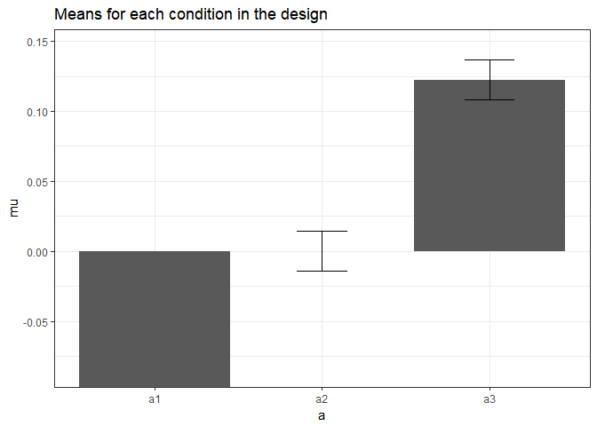
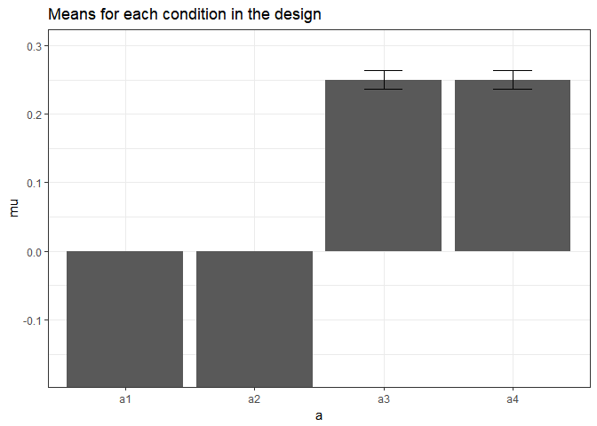
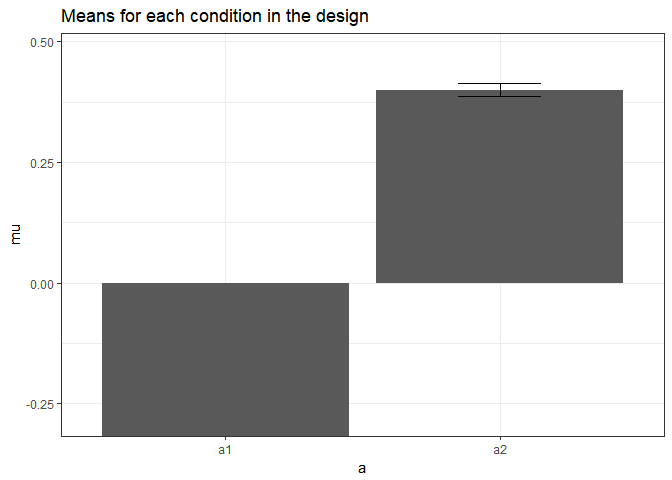

Validation for One-Way ANOVA
----------------------------

Using the formulas below, we can calculate the means for between designs with one factor (One-Way ANOVA). Using the formula also used in Albers & Lakens (2018), we can determine the means that should yield a specified effect sizes (expressed in Cohen's f):

``` r
mu_from_ES <- function(K, ES){ # provides the vector of population means for a given population ES and nr of groups
  f2 <- ES/(1-ES)
  if(K == 2){
    a <- sqrt(f2)
    muvec <- c(-a,a)
  }
  if(K == 3){
    a <- sqrt(3*f2/2)
    muvec <- c(-a, 0, a)
  }
  if(K == 4){
    a <- sqrt(f2)
    muvec <- c(-a, -a, a, a)
  } # note: function gives error when K not 2,3,4. But we don't need other K.
  return(muvec)
}
```

Eta-squared (idential to partial eta-squared for One-Way ANOVA's) has benchmarks of .0099, .0588, and .1379 for small, medium, and large effect sizes (cohen, 1988).

Installation
------------

We install the functions:

``` r
# Install the two functions from GitHub by running the code below:

source("https://raw.githubusercontent.com/Lakens/ANOVA_power_simulation/master/ANOVA_design.R")
source("https://raw.githubusercontent.com/Lakens/ANOVA_power_simulation/master/ANOVA_power.R")
```

Three conditions, small effect size
-----------------------------------

We can simulate a one-factor anova setting means to achieve a certain effect size.

``` r
K <- 3
ES <- .0099
mu <- mu_from_ES(K = K, ES = ES)
n <- 5000
sd <- 1
r <- 0
string = paste(K,"b",sep="")
```

``` r
design_result <- ANOVA_design(string = string,
                   n = n, 
                   mu = mu, 
                   sd = sd, 
                   r = r, 
                   p_adjust = "none")
```



``` r
ANOVA_power(design_result, nsims = nsims)
```

    ## Power and Effect sizes for ANOVA tests
    ##           power effect size
    ## anova_p_a   100        0.01
    ## 
    ## Power and Effect sizes for contrasts
    ##                             power effect size
    ## paired_comparison_p_a1 - a2   100       -0.09
    ## paired_comparison_p_a1 - a3   100       -0.17
    ## paired_comparison_p_a2 - a3   100       -0.09

Results according to pwr package for the ANOVA

``` r
library(pwr)
f2 <- ES/(1-ES)
f <- sqrt(f2)
pwr.anova.test(f=f,k=K,n=n,sig.level=0.05)
```

    ## 
    ##      Balanced one-way analysis of variance power calculation 
    ## 
    ##               k = 3
    ##               n = 5000
    ##               f = 0.09999495
    ##       sig.level = 0.05
    ##           power = 1
    ## 
    ## NOTE: n is number in each group

Four conditions, medium effect size
-----------------------------------

We can simulate a one-factor anova setting means to achieve a certain effect size.

``` r
K <- 4
ES <- .0588
mu <- mu_from_ES(K = K, ES = ES)
n <- 5000
sd <- 1
r <- 0
string = paste(K,"b",sep="")
```

``` r
design_result <- ANOVA_design(string = string,
                   n = n, 
                   mu = mu, 
                   sd = sd, 
                   r = r, 
                   p_adjust = "none")
```



``` r
ANOVA_power(design_result, nsims = nsims)
```

    ## Power and Effect sizes for ANOVA tests
    ##           power effect size
    ## anova_p_a   100       0.059
    ## 
    ## Power and Effect sizes for contrasts
    ##                              power effect size
    ## paired_comparison_p_a1 - a2   4.95        0.00
    ## paired_comparison_p_a1 - a3 100.00       -0.35
    ## paired_comparison_p_a1 - a4 100.00       -0.35
    ## paired_comparison_p_a2 - a3 100.00       -0.35
    ## paired_comparison_p_a2 - a4 100.00       -0.35
    ## paired_comparison_p_a3 - a4   4.55        0.00

Results according to pwr package for the ANOVA

``` r
library(pwr)
f2 <- ES/(1-ES)
f <- sqrt(f2)
pwr.anova.test(f=f,k=K,n=n,sig.level=0.05)
```

    ## 
    ##      Balanced one-way analysis of variance power calculation 
    ## 
    ##               k = 4
    ##               n = 5000
    ##               f = 0.2499469
    ##       sig.level = 0.05
    ##           power = 1
    ## 
    ## NOTE: n is number in each group

Two conditions, large effect size
---------------------------------

We can simulate a one-factor anova setting means to achieve a certain effect size.

``` r
K <- 2
ES <- .1379
mu <- mu_from_ES(K = K, ES = ES)
n <- 5000
sd <- 1
r <- 0
string = paste(K,"b",sep="")
```

``` r
design_result <- ANOVA_design(string = string,
                   n = n, 
                   mu = mu, 
                   sd = sd, 
                   r = r, 
                   p_adjust = "none")
```



``` r
ANOVA_power(design_result, nsims = nsims)
```

    ## Power and Effect sizes for ANOVA tests
    ##           power effect size
    ## anova_p_a   100       0.138
    ## 
    ## Power and Effect sizes for contrasts
    ##                             power effect size
    ## paired_comparison_p_a1 - a2   100       -0.57

Results according to pwr package for the ANOVA

``` r
library(pwr)
f2 <- ES/(1-ES)
f <- sqrt(f2)
pwr.anova.test(f=f,k=K,n=n,sig.level=0.05)
```

    ## 
    ##      Balanced one-way analysis of variance power calculation 
    ## 
    ##               k = 2
    ##               n = 5000
    ##               f = 0.3999478
    ##       sig.level = 0.05
    ##           power = 1
    ## 
    ## NOTE: n is number in each group
