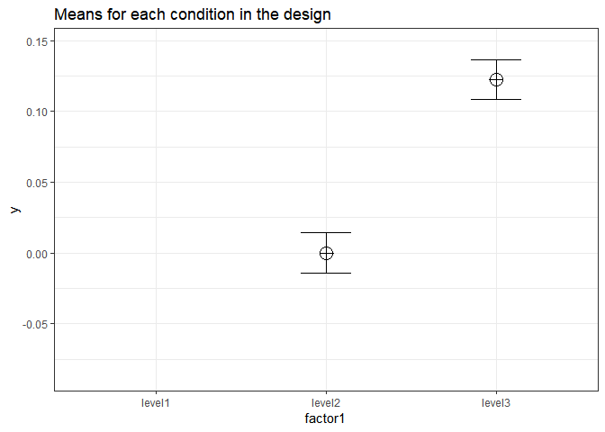
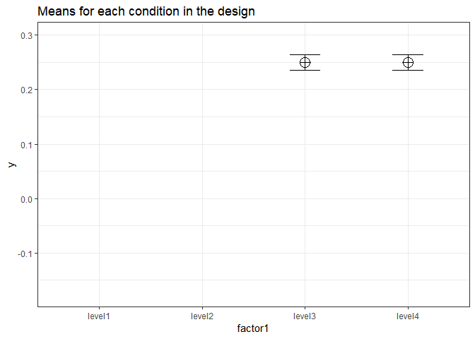

Validation of effect size estimates for One-Way ANOVA
-----------------------------------------------------

Using the formulas below, we can calculate the means for between designs with one factor (One-Way ANOVA). Using the formula also used in Albers & Lakens (2018), we can determine the means that should yield a specified effect sizes (expressed in Cohen's f).

``` r
mu_from_ES <- function(K, ES){ # provides the vector of population means for a given population ES and nr of groups
  f2 <- ES/(1-ES)
  if(K == 2){
    a <- sqrt(f2)
    muvec <- c(-a,a)
  }
  if(K == 3){
    a <- sqrt(3*f2/2)
    muvec <- c(-a, 0, a)
  }
  if(K == 4){
    a <- sqrt(f2)
    muvec <- c(-a, -a, a, a)
  } # note: function gives error when K not 2,3,4. But we don't need other K.
  return(muvec)
}
```

Eta-squared (idential to partial eta-squared for One-Way ANOVA's) has benchmarks of .0099, .0588, and .1379 for small, medium, and large effect sizes (cohen, 1988).

Installation
------------

We install the functions:

``` r
# Install the two functions from GitHub by running the code below:

source("https://raw.githubusercontent.com/Lakens/ANOVA_power_simulation/master/ANOVA_design.R")
source("https://raw.githubusercontent.com/Lakens/ANOVA_power_simulation/master/ANOVA_power.R")
```

Three conditions, small effect size
-----------------------------------

We can simulate a one-factor anova setting means to achieve a certain effect size. Eta-squared is biased. Thus, the eta-squared we calculate based on the observed data overestimates the population effect size. This bias is largest for smaller sample sizes. Thus, to test whether the simulation yields the expected effect size, we use extremele large sample sizes in each between subject condition (n = 5000). This simulation should yield a small effect size (0.099)

``` r
K <- 3
ES <- .0099
mu <- mu_from_ES(K = K, ES = ES)
n <- 5000
sd <- 1
r <- 0
string = paste(K,"b",sep="")
```

``` r
design_result <- ANOVA_design(string = string,
                   n = n, 
                   mu = mu, 
                   sd = sd, 
                   r = r, 
                   p_adjust = "none",
                   labelnames = c("factor1", "level1", "level2", "level3"))
```



``` r
ANOVA_power(design_result, nsims = nsims)
```

    ## Power and Effect sizes for ANOVA tests
    ##               power effect size
    ## anova_factor1   100        0.01
    ## 
    ## Power and Effect sizes for contrasts
    ##                                                   power effect size
    ## paired_comparison_factor1_level1 - factor1_level2   100       -0.12
    ## paired_comparison_factor1_level1 - factor1_level3   100       -0.25
    ## paired_comparison_factor1_level2 - factor1_level3   100       -0.12

The resulting effect size estimate from the simulation is very close to 0.0099

Four conditions, medium effect size
-----------------------------------

This simulation should yield a medium effect size (0.588) across four independent conditions.

``` r
K <- 4
ES <- .0588
mu <- mu_from_ES(K = K, ES = ES)
n <- 5000
sd <- 1
r <- 0
string = paste(K,"b",sep="")
```

``` r
design_result <- ANOVA_design(string = string,
                   n = n, 
                   mu = mu, 
                   sd = sd, 
                   r = r, 
                   p_adjust = "none",
                   labelnames = c("factor1", "level1", "level2", "level3", "level4"))
```



``` r
ANOVA_power(design_result, nsims = nsims)
```

    ## Power and Effect sizes for ANOVA tests
    ##               power effect size
    ## anova_factor1   100       0.059
    ## 
    ## Power and Effect sizes for contrasts
    ##                                                   power effect size
    ## paired_comparison_factor1_level1 - factor1_level2     1         0.0
    ## paired_comparison_factor1_level1 - factor1_level3   100        -0.5
    ## paired_comparison_factor1_level1 - factor1_level4   100        -0.5
    ## paired_comparison_factor1_level2 - factor1_level3   100        -0.5
    ## paired_comparison_factor1_level2 - factor1_level4   100        -0.5
    ## paired_comparison_factor1_level3 - factor1_level4     3         0.0

Results are very close to 0.588.

Two conditions, large effect size
---------------------------------

We can simulate a one-factor anova that should yield a large effect size (0.1379) across two conditions.

``` r
K <- 2
ES <- .1379
mu <- mu_from_ES(K = K, ES = ES)
n <- 5000
sd <- 1
r <- 0
string = paste(K,"b",sep="")
```

``` r
design_result <- ANOVA_design(string = string,
                   n = n, 
                   mu = mu, 
                   sd = sd, 
                   r = r, 
                   p_adjust = "none",
                   labelnames = c("factor1", "level1", "level2"))
```


``` r
ANOVA_power(design_result, nsims = nsims)
```

    ## Power and Effect sizes for ANOVA tests
    ##               power effect size
    ## anova_factor1   100       0.138
    ## 
    ## Power and Effect sizes for contrasts
    ##                                                   power effect size
    ## paired_comparison_factor1_level1 - factor1_level2   100        -0.8

The results are very close to is simulation should yield a small effect size (0.1379)
