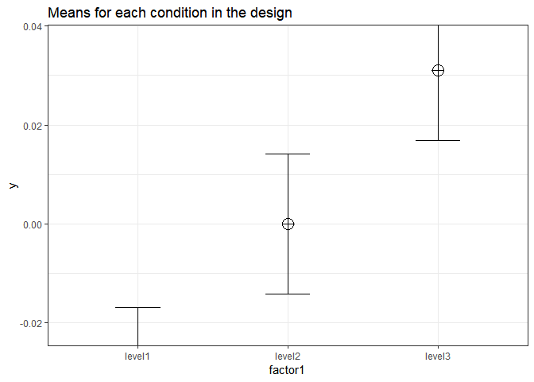
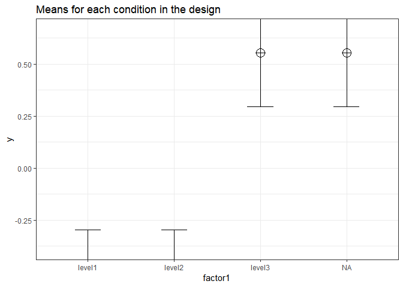
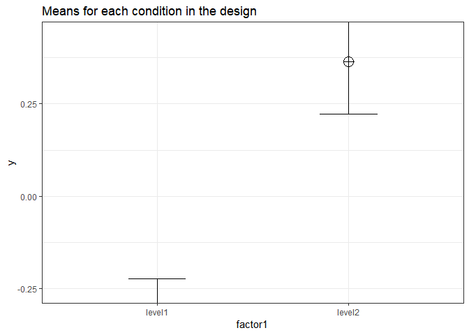
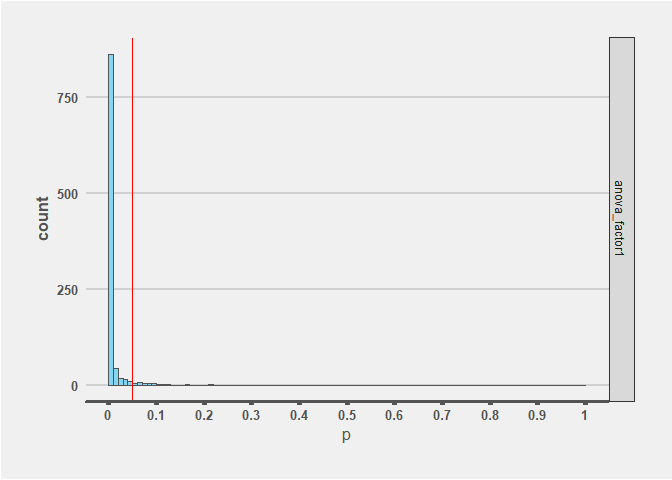

Validation of Power in One-Way ANOVA
------------------------------------

Using the formulas below, we can calculate the means for between designs with one factor (One-Way ANOVA). Using the formula also used in Albers & Lakens (2018), we can determine the means that should yield a specified effect sizes (expressed in Cohen's f).

``` r
mu_from_ES <- function(K, ES){ # provides the vector of population means for a given population ES and nr of groups
  f2 <- ES/(1-ES)
  if(K == 2){
    a <- sqrt(f2)
    muvec <- c(-a,a)
  }
  if(K == 3){
    a <- sqrt(3*f2/2)
    muvec <- c(-a, 0, a)
  }
  if(K == 4){
    a <- sqrt(f2)
    muvec <- c(-a, -a, a, a)
  } # note: function gives error when K not 2,3,4. But we don't need other K.
  return(muvec)
}
```

Eta-squared (identical to partial eta-squared for One-Way ANOVA's) has benchmarks of .0099, .0588, and .1379 for small, medium, and large effect sizes (cohen, 1988).

Installation
------------

We install the functions:

``` r
# Install the two functions from GitHub by running the code below:

source("https://raw.githubusercontent.com/Lakens/ANOVA_power_simulation/master/ANOVA_design.R")
source("https://raw.githubusercontent.com/Lakens/ANOVA_power_simulation/master/ANOVA_power.R")
```

Three conditions, large effect size
-----------------------------------

We can simulate a One-Way ANOVA with a specific alpha, sample size and effect size, to achieve a specified statistical power. Below we forst perform a power analysis for n = 5000 per condition, 3 groups (K), sd = 1, and a desired power of .8, or 80%.

``` r
K <- 3
n <- 5000
sd <- 1
r <- 0

#Calculate f when running simulation with n = 5000
library(pwr)
f <- pwr.anova.test(n=n,k=K,power=0.8,sig.level=0.05)$f
f2 <- f^2
ES <- f2/(f2+1)
ES
```

    ## [1] 0.0006417212

``` r
mu <- mu_from_ES(K = K, ES = ES)

string = paste(K,"b",sep="")
```

Because of the large sample size, we have 80% power for an effect size (eta-squared) of 0.0006417212. We achieve this effect size if we have 3 groups with means of -0.03103546 0.00000000 0.03103546. So let's simulate data with these means, and check if we get 80% power.

``` r
design_result <- ANOVA_design(string = string,
                   n = n, 
                   mu = mu, 
                   sd = sd, 
                   r = r, 
                   p_adjust = "none")
```



``` r
ANOVA_power(design_result, nsims = nsims)
```

    ## Power and Effect sizes for ANOVA tests
    ##            power effect size
    ## anova_p_a 79.958       0.001
    ## 
    ## Power and Effect sizes for contrasts
    ##                             power effect size
    ## paired_comparison_p_a1 - a2 33.98       -0.02
    ## paired_comparison_p_a1 - a3 87.30       -0.04
    ## paired_comparison_p_a2 - a3 34.22       -0.02

The results of the simulation are indeed very close to 80%.

Four conditions, very large effect size
---------------------------------------

We can simulate a One-Way ANOVA with an alpha of 0.05, a sample size of 15 per group for four groups, and an effect size to achieve 95% power.

``` r
K <- 4
n <- 15
sd <- 1
r <- 0

#Calculate f when running simulation with n = 5000
library(pwr)
f <- pwr.anova.test(n=n,k=K,power=0.95,sig.level=0.05)$f
f2 <- f^2
ES <- f2/(f2+1)
ES
```

    ## [1] 0.2349157

``` r
mu <- mu_from_ES(K = K, ES = ES)

string = paste(K,"b",sep="")
```

We have 95% power for an effect size (eta-squared) of 0.2349157. So let's simulate data with this effect size, and check if we get 95% power.

``` r
design_result <- ANOVA_design(string = string,
                   n = n, 
                   mu = mu, 
                   sd = sd, 
                   r = r, 
                   p_adjust = "none")
```



``` r
ANOVA_power(design_result, nsims = nsims)
```

    ## Power and Effect sizes for ANOVA tests
    ##            power effect size
    ## anova_p_a 94.898       0.272
    ## 
    ## Power and Effect sizes for contrasts
    ##                             power effect size
    ## paired_comparison_p_a1 - a2  5.12        0.00
    ## paired_comparison_p_a1 - a3 84.69       -0.79
    ## paired_comparison_p_a1 - a4 84.57       -0.79
    ## paired_comparison_p_a2 - a3 84.59       -0.79
    ## paired_comparison_p_a2 - a4 84.55       -0.79
    ## paired_comparison_p_a3 - a4  4.98        0.00

The result of the simulation is a power that is very close to the intended 95% power. Note that the mean observed effect size is larger than the true effect size (because eta-squared is upwardly biased, see Albers & Lakens, 2018).

Two conditions, medium effect size
----------------------------------

We can simulate a One-Way ANOVA with an alpha of 0.05 sample size of 50 per group, and an effect size to achieve 95% power.

``` r
K <- 2
n <- 50
sd <- 1
r <- 0

#Calculate f when running simulation with n = 5000
library(pwr)
f <- pwr.anova.test(n=n,k=K,power=0.95,sig.level=0.05)$f
f2 <- f^2
ES <- f2/(f2+1)
ES
```

    ## [1] 0.1170461

``` r
mu <- mu_from_ES(K = K, ES = ES)

string = paste(K,"b",sep="")
```

We have 95% power for an effect size (eta-squared) of 0.1170461. So let's simulate data with this effect size, and check if we get 95% power.

``` r
design_result <- ANOVA_design(string = string,
                   n = n, 
                   mu = mu, 
                   sd = sd, 
                   r = r, 
                   p_adjust = "none")
```



``` r
power_result <- ANOVA_power(design_result, nsims = nsims)
```

    ## Power and Effect sizes for ANOVA tests
    ##            power effect size
    ## anova_p_a 94.876       0.125
    ## 
    ## Power and Effect sizes for contrasts
    ##                             power effect size
    ## paired_comparison_p_a1 - a2 94.88       -0.52

The result of the simulation is a power that is very close to the intended 95% power.

We can plot the p-value distribution for the ANOVA:

``` r
power_result$plot
```


