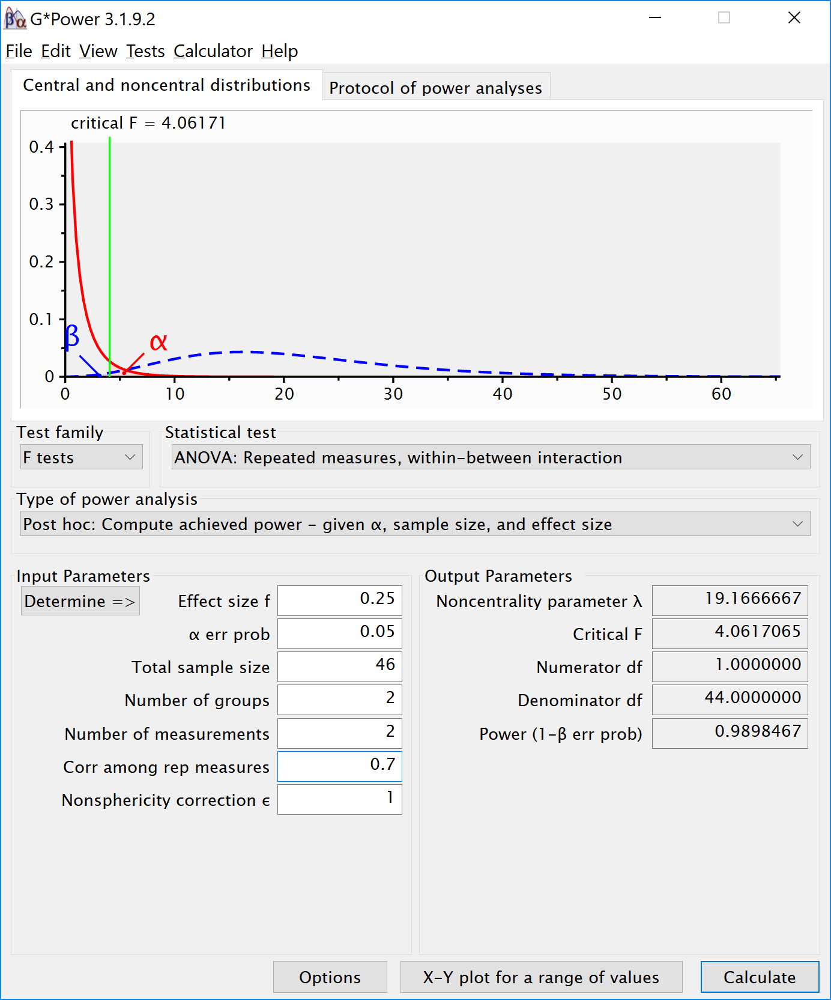

```{r setup, include=TRUE}
knitr::opts_chunk$set(echo = TRUE)
nsims <- 10000 #set number of simulations
library(mvtnorm)
library(afex)
library(emmeans)
library(ggplot2)
library(gridExtra)
library(reshape2)

```

## Validation of Power in Mixed ANOVA

We install the functions:

```{r}
# Install the two functions from GitHub by running the code below:

source("https://raw.githubusercontent.com/Lakens/ANOVA_power_simulation/master/ANOVA_design.R")
source("https://raw.githubusercontent.com/Lakens/ANOVA_power_simulation/master/ANOVA_power.R")
```

## Two by two ANOVA, within-between design

We can simulate a Two-Way ANOVA with a specific alpha, sample size and effect size, to achieve a specified statistical power. We wil try to reproduce the power analysis by g*power for an F-test, ANOVA: Repeated measures, within-between interaction. 


For the 2way interaction, the result should be a power of 91.25% is we have a total samplesize of 46. Since we have 2 groups in the between factor that means the sample size per group is 2 (and both these groups collect 2 repeated measures). 

```{r}
mu <- c(-0.25, 0.25, 0.25, -0.25)
n <- 23
sd <- 1
r <- 0.5
string = "2w*2b"
alpha_level <- 0.05
p_adjust = "none"
labelnames = c("age", "old", "young", "color", "blue", "red")
design_result <- ANOVA_design(string = string,
                              n = n, 
                              mu = mu, 
                              sd = sd, 
                              r = r, 
                              p_adjust = p_adjust,
                              labelnames = labelnames)


simulation_result <- ANOVA_power(design_result, alpha = 0.05, nsims = nsims)

```

## Two by two ANOVA, within-between design Variation 1

We can simulate the same Two-Way ANOVA increasing the correlation to 0.7. 




```{r}
mu <- c(-0.25, 0.25, 0.25, -0.25)
n <- 23
sd <- 1
r <- 0.7
string = "2w*2b"
alpha_level <- 0.05
p_adjust = "none"
labelnames = c("age", "old", "young", "color", "blue", "red")
design_result <- ANOVA_design(string = string,
                              n = n, 
                              mu = mu, 
                              sd = sd, 
                              r = r, 
                              p_adjust = p_adjust,
                              labelnames = labelnames)


simulation_result <- ANOVA_power(design_result, alpha = 0.05, nsims = nsims)

```
