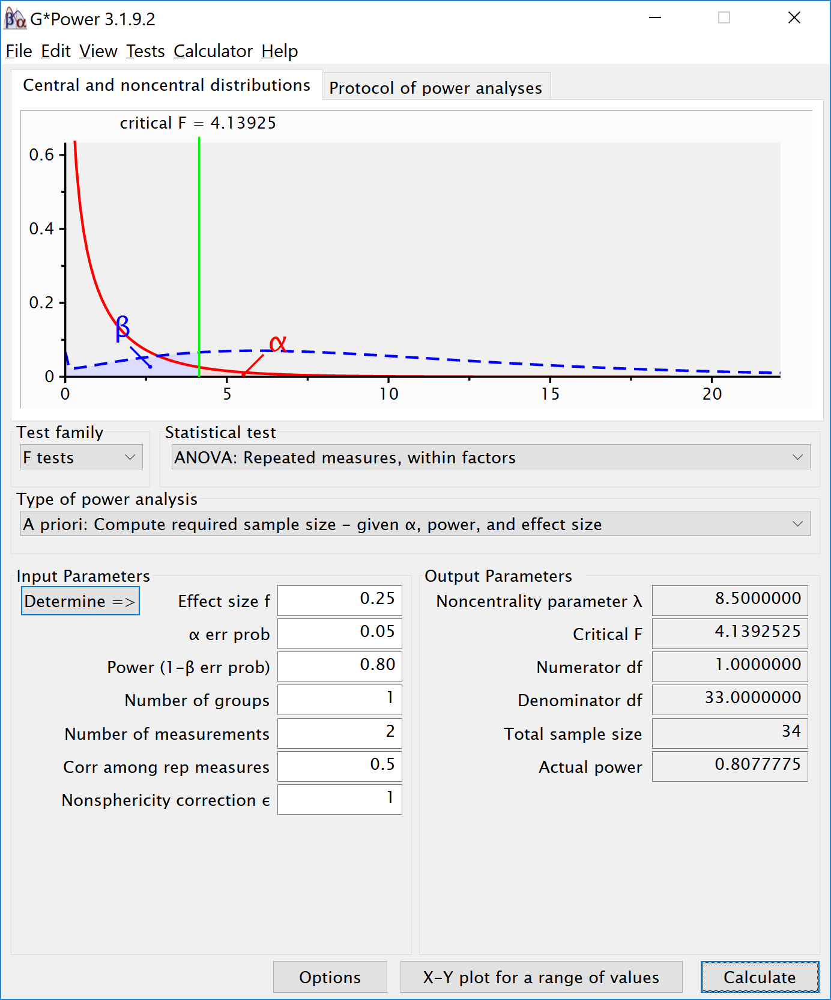

```{r setup, include=FALSE}
knitr::opts_chunk$set(echo = TRUE)
nsims <- 1000 #set number of simulations
library(mvtnorm)
library(afex)
library(emmeans)
library(ggplot2)
library(gridExtra)
library(reshape2)

```

## Validation of Power in Repeated Measures ANOVA

Using the formulas below, we can calculate the means in our design for a given Cohen's f (see Albers & Lakens, 2018).

```{r}
mu_from_ES <- function(K, ES){ # provides the vector of population means for a given population ES and nr of groups
  f2 <- ES/(1-ES)
  if(K == 2){
    a <- sqrt(f2)
    muvec <- c(-a,a)
  }
  if(K == 3){
    a <- sqrt(3*f2/2)
    muvec <- c(-a, 0, a)
  }
  if(K == 4){
    a <- sqrt(f2)
    muvec <- c(-a, -a, a, a)
  } # note: function gives error when K not 2,3,4. But we don't need other K.
  return(muvec)
}

```

## Installation

We install the functions:

```{r}
# Install the two functions from GitHub by running the code below:

source("https://raw.githubusercontent.com/Lakens/ANOVA_power_simulation/master/ANOVA_design.R")
source("https://raw.githubusercontent.com/Lakens/ANOVA_power_simulation/master/ANOVA_power.R")
```

## Two conditions, medium effect size

We can simulate a repeated measures ANOVA with a specific alpha, sample size and effect size, to achieve a specified statistical power. We perform a power analysis in G*Power. 



We set groups to 2 for the simulation, n = 34 (which should give 80.777 power, according to the g*power program), a correlation among repeated measures of 0.5, and an alpha of 0.05. In this case, we simulate data with means -0.25  and 0.25. 

```{r}
K <- 2
n <- 34
sd <- 1
r <- 0.5
alpha = 0.05
f <- 0.25
f2 <- f^2
ES <- f2/(f2+1)
ES

mu <- mu_from_ES(K = K, ES = ES)

string = paste(K,"w",sep="")
p_adjust = "none"
labelnames <- c("speed", "fast", "slow")
```
We create the within design, and run the simulation

```{r, message=FALSE, warning=FALSE}
design_result <- ANOVA_design(string = string,
                   n = n, 
                   mu = mu, 
                   sd = sd, 
                   r = r, 
                   p_adjust = "none",
                   labelnames = labelnames)

ANOVA_power(design_result, nsims = nsims)

```

The results of the simulation are indeed very close to 80.777%. Note that the current version of the program calculates Cohen's dz effect sizes for paired comparisons - which here given the correlation of 0.5 is also 0.5 for a medium effect size. 
