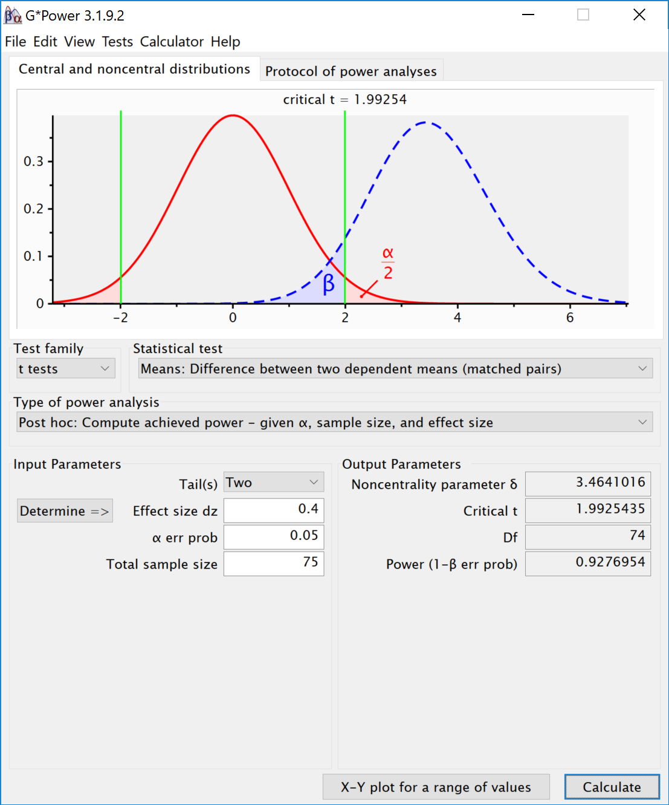
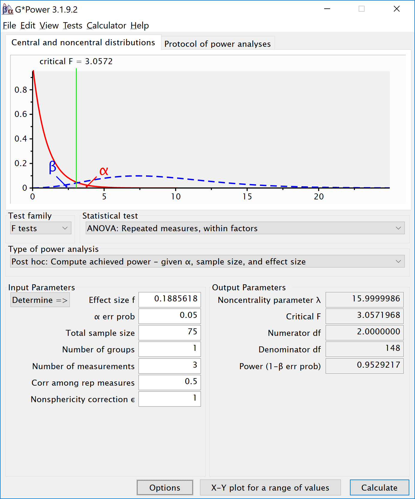
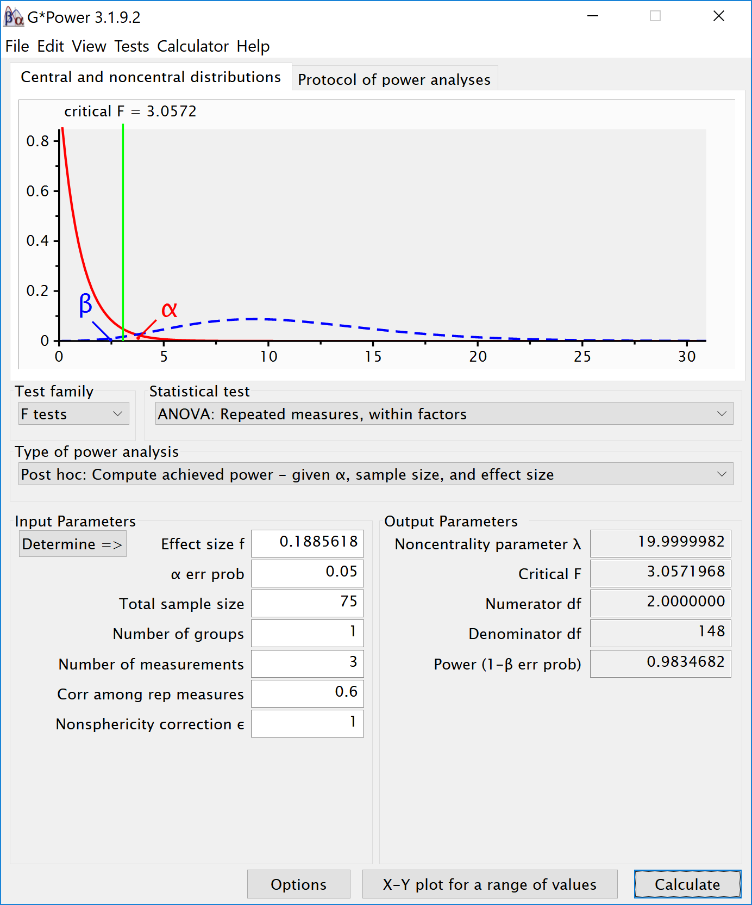

```{r setup, include=FALSE}
knitr::opts_chunk$set(echo = TRUE)
nsims <- 10000 #set number of simulations
library(mvtnorm)
library(afex)
library(emmeans)
library(ggplot2)
library(gridExtra)
library(reshape2)

```

## Validation of Power in Repeated Measures ANOVA

We first repeat the simulation by Brysbaert:

```{r}
# give sample size
N = 75

# give effect size d
d1 = .4 #difference between the extremes
d2 = .4 #third condition goes with the highest extreme

# give the correlation between the conditions
r = .5

# give number of simulations
nSim = nsims

# give alpha levels
alpha1 = .05 #alpha level for the omnibus ANOVA
alpha2 = .05 #also adjusted from original by DL

# create progress bar in case it takes a while
pb <- winProgressBar(title = "progress bar", min = 0, max = nSim, width = 300)

# create vectors to store p-values
p1 <-numeric(nSim) #p-value omnibus ANOVA
p2 <-numeric(nSim) #p-value first post hoc test
p3 <-numeric(nSim) #p-value second post hoc test
p4 <-numeric(nSim) #p-value third post hoc test

# open library MASS
library('MASS')

# define correlation matrix
rho <- cbind(c(1, r, r), c(r, 1, r), c(r, r, 1))

# define participant codes
part <- paste("part",seq(1:N))

for(i in 1:nSim){ #for each simulated experiment
  setWinProgressBar(pb, i, title=paste(round(i/nSim*100, 1), "% done"))
  data = mvrnorm(n=N, mu=c(0, 0, 0), Sigma=rho)
  data[,2] = data[,2]+d1
  data[,3] = data[,3]+d2
  datalong = c(data[,1],data[,2],data[,3])
  conds= factor(rep(letters[24:26], each = N))
  partID = factor(rep(part, times = 3))
  output <-data.frame(partID,conds,datalong)
  test <- aov(datalong~conds + Error(partID/conds), data=output)
  tests <- (summary(test))
  p1[i] <- tests$'Error: partID:conds'[[1]]$'Pr(>F)'[[1]]
  p2[i] <- t.test(data[,1],data[,2], paired=TRUE)$p.value
  p3[i] <- t.test(data[,1],data[,3], paired=TRUE)$p.value
  p4[i] <- t.test(data[,2],data[,3], paired=TRUE)$p.value
  }
close(pb)#close progress bar

#printing all unique tests (adjusted code by DL)
sum(p1<alpha1)/nSim
sum(p2<alpha2)/nSim
sum(p3<alpha2)/nSim
sum(p4<alpha2)/nSim

```

## Installation

We install the functions:

```{r}
# Install the two functions from GitHub by running the code below:

source("https://raw.githubusercontent.com/Lakens/ANOVA_power_simulation/master/ANOVA_design.R")
source("https://raw.githubusercontent.com/Lakens/ANOVA_power_simulation/master/ANOVA_power.R")
```

## Reproducing Brysbaert

We can reproduce the same results as Brysbaeert finds with his code: 


```{r}

string <- "3w"
n <- 75
mu <- c(0, 0.4, 0.4)
sd <- 1
r <- 0.5
p_adjust = "none"
labelnames <- c("speed", "fast", "medium", "slow")

```
We create the within design, and run the simulation

```{r, message=FALSE, warning=FALSE}
design_result <- ANOVA_design(string = string,
                   n = n, 
                   mu = mu, 
                   sd = sd, 
                   r = r, 
                   p_adjust = "none",

                                      labelnames = labelnames)

ANOVA_power(design_result, nsims = nsims)

```

#Results

The results of the simulation are very similar. Power for the ANOVA *F*-test is around 95.2%. For the three paired t-tests, power is around 92.7. This is in line with the a-priori power analysis when using g*power:



We can perform an post-hoc power analysis in G*power. We can calculate Cohen´s f based on the means and sd, using our own custom formula. 

```{r}
# Our simulation is based onthe following means and sd:
# mu <- c(0, 0.4, 0.4)
# sd <- 1

f <- sqrt(sum((mu-mean(mu))^2)/length(mu))/sd #Cohen, 1988, formula 8.2.1 and 8.2.2
# We can see why f = 0.5*d. 
# Imagine 2 group, mu = 1 and 2
# Grand mean is 1.5, we have sqrt(sum(0.5^2 + 0.5^2)/2), or sqrt(0.5/2), = 0.5. 
# For Cohen's d we use the difference, 2-1 = 1. 

```

The Cohen´s f is `r f`. We can enter the f (using the default 'as in G*Power 3.0' in the option window) and enter a sample size of 75, number of groups as 1, number of measurements as 3, correlation as 0.5. This yields: 




## Reproducing Brysbaert Variation 1 Changing Correlation

```{r}
# give sample size
N = 75

# give effect size d
d1 = .4 #difference between the extremes
d2 = .4 #third condition goes with the highest extreme

# give the correlation between the conditions
r = .6 #increased correlation

# give number of simulations
nSim = nsims

# give alpha levels
alpha1 = .05 #alpha level for the omnibus ANOVA
alpha2 = .05 #also adjusted from original by DL

# create progress bar in case it takes a while
pb <- winProgressBar(title = "progress bar", min = 0, max = nSim, width = 300)

# create vectors to store p-values
p1 <-numeric(nSim) #p-value omnibus ANOVA
p2 <-numeric(nSim) #p-value first post hoc test
p3 <-numeric(nSim) #p-value second post hoc test
p4 <-numeric(nSim) #p-value third post hoc test

# open library MASS
library('MASS')

# define correlation matrix
rho <- cbind(c(1, r, r), c(r, 1, r), c(r, r, 1))

# define participant codes
part <- paste("part",seq(1:N))

for(i in 1:nSim){ #for each simulated experiment
  setWinProgressBar(pb, i, title=paste(round(i/nSim*100, 1), "% done"))
  data = mvrnorm(n=N, mu=c(0, 0, 0), Sigma=rho)
  data[,2] = data[,2]+d1
  data[,3] = data[,3]+d2
  datalong = c(data[,1],data[,2],data[,3])
  conds= factor(rep(letters[24:26], each = N))
  partID = factor(rep(part, times = 3))
  output <-data.frame(partID,conds,datalong)
  test <- aov(datalong~conds + Error(partID/conds), data=output)
  tests <- (summary(test))
  p1[i] <- tests$'Error: partID:conds'[[1]]$'Pr(>F)'[[1]]
  p2[i] <- t.test(data[,1],data[,2], paired=TRUE)$p.value
  p3[i] <- t.test(data[,1],data[,3], paired=TRUE)$p.value
  p4[i] <- t.test(data[,2],data[,3], paired=TRUE)$p.value
  }
close(pb)#close progress bar

#printing all unique tests (adjusted code by DL)
sum(p1<alpha1)/nSim
sum(p2<alpha2)/nSim
sum(p3<alpha2)/nSim
sum(p4<alpha2)/nSim

```

```{r}

string <- "3w"
n <- 75
mu <- c(0, 0.4, 0.4)
sd <- 1
r <- 0.6
p_adjust = "none"
labelnames <- c("speed", "fast", "medium", "slow")

```
We create the within design, and run the simulation

```{r, message=FALSE, warning=FALSE}
design_result <- ANOVA_design(string = string,
                   n = n, 
                   mu = mu, 
                   sd = sd, 
                   r = r, 
                   p_adjust = "none",

                                      labelnames = labelnames)

ANOVA_power(design_result, nsims = nsims)

```

Again, this is similar to g*power for the ANOVA:


